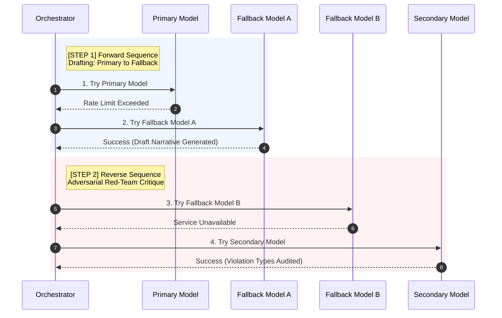
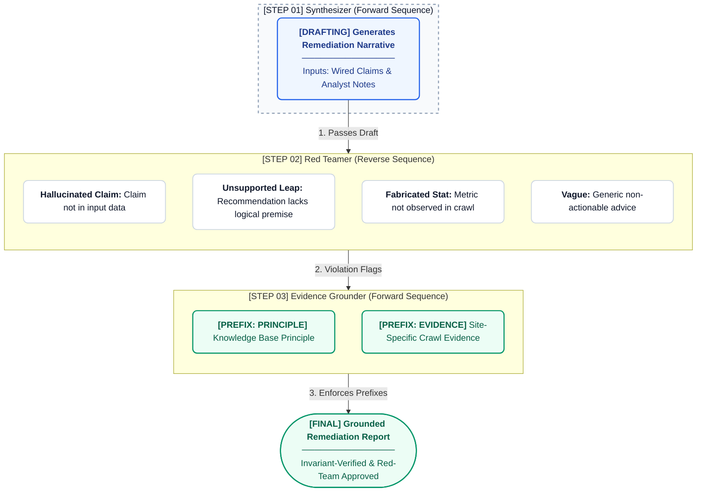
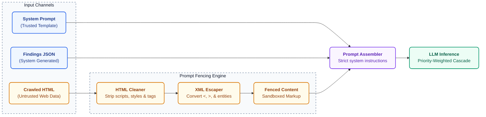
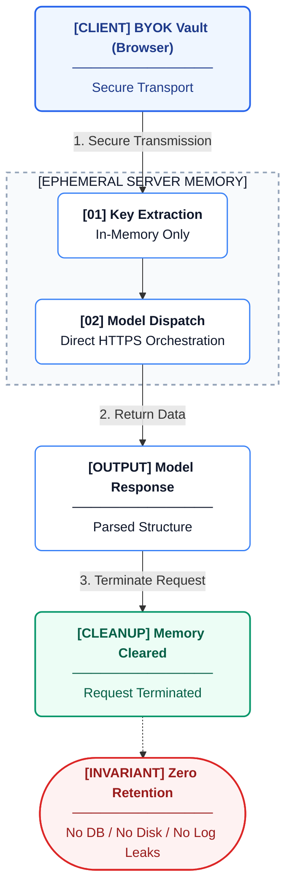

This page details the structural boundaries and architectural safeguards surrounding Citeable's LLM integrations, explaining how the platform manages probabilistic operations alongside deterministic auditing.

## The AI Boundary Principle

Citeable uses LLMs at specific execution paths across the entire codebase. Every other operation — scoring, schema validation, robots parsing, knowledge wiring, QA gating — is deterministic. This is a deliberate architectural choice, not a limitation.

This boundary exists because deterministic operations produce reproducible, auditable results, whereas LLM outputs are inherently probabilistic and non-deterministic. Mixing them creates systems where you can't tell which results are reliable. By design, Citeable keeps them separate: the deterministic pipeline produces structured findings, and AI synthesizes human-readable narrative from those findings.

## Complete LLM Usage Inventory

The following table details every LLM call site within Citeable:

| Call Site | Classification | When Called | Could It Be Deterministic? |
|---|---|---|---|
| Citation frequency sampling | Empirical measurement | Every audit | No — requires querying live AI search engines |
| Extractability judgment | Content evaluation | Only when heuristic is ambiguous | Partially — heuristic fast-path handles clear cases |
| Synthesis draft (Step 1) | Linguistic synthesis | After human review | No — requires language generation |
| Adversarial red-teaming (Step 2) | Verification | After Step 1 | No — requires semantic analysis |
| Narrative grounding (Step 3) | Correction | After Step 2 | No — requires language rewriting |
| Claim extraction from docs | Knowledge discovery | Out-of-band research | No — requires understanding documents |
| Candidate classification | Semantic comparison | KB governance workflow | Partially — but semantic similarity is needed |
| Vector embeddings | Similarity search | RAG fallback (uncommon) | No — requires embedding models |

## Zero-SDK Provider Architecture

All frontier foundation models in Citeable are accessed via a unified, direct HTTP orchestration layer with zero vendor SDKs installed. This eliminates SDK version conflicts, reduces container size, minimizes supply chain attack surface, and completely avoids vendor lock-in. Every provider uses the same HTTP dispatch mechanism with consistent timeout, retry, and error handling.

Citeable orchestrates across multiple frontier foundation models using a priority-weighted failover cascade. If the primary model is unavailable, the system transparently routes to the next available model.

## Forward vs Reverse Sequence — Cognitive Diversity

To prevent same-model self-review failures, Citeable employs a structural invariant based on directional model resolution:

- The drafting phase evaluates models from highest to lowest priority (forward sequence).
- The adversarial red-teaming phase evaluates models from lowest to highest priority (reverse sequence).

The drafting model and the red-team model are structurally guaranteed to be different, preventing self-validation bias. Different model architectures catch different failure modes, ensuring genuine cognitive diversity.

## The Three-Step Synthesis Pipeline

The narrative synthesis generation utilizes a robust three-step pipeline to ensure quality and factual accuracy.

The red-team model audits for hallucinated claims, unsupported logical leaps, fabricated statistics, and vague non-actionable advice.

The Grounder prefixes resolutions with strict evidence markers:
- `[Knowledge Base Principle]`: Recommendation based on general domain knowledge
- `[Site-Specific Evidence]`: Recommendation based on specific observations from this audit

> **Note:** To prevent prompt injection, all crawled content is strictly sandboxed.

## Graceful Degradation

Citeable handles API failures transparently without crashing the deterministic audit pipeline.

| Failure | Handling |
|---|---|
| Step 1 fails (all providers) | No synthesis generated; returns deterministic results only |
| Step 2 fails | Proceeds without flags; Grounder receives unaudited draft |
| Step 3 fails | Falls back to Step 1 draft |
| No BYOK keys configured | Synthesis skipped; deterministic results still available |
| Provider returns rate limit | Exponential backoff with limits, then routes to next provider |
| Provider returns authentication error | Instant skip to next provider |
| Provider returns server error | Limited retries, then routes to next provider |
| Execution time budget exhausted | Cascade terminates cleanly |

## BYOK (Bring Your Own Key)

Citeable allows users to supply their own API keys via a secure, zero-persistence lifecycle:

1. User stores API keys in a browser-side BYOK vault
2. Keys are securely transmitted during requests
3. Keys are processed in-memory only during your request and are never written to any persistent storage
4. Keys are securely passed through to the model orchestration layer
5. After the request completes, memory is immediately cleared
6. **Keys are NEVER written to disk, database, logs, or telemetry**

Client keys natively take priority over server configuration. Custom base URLs are validated against Server-Side Request Forgery (SSRF) before use, SSL verification is never disabled, and users can test configurations securely.

> *Users bear sole responsibility for their third-party API accounts, usage costs, and compliance with each provider's Acceptable Use Policy. See [Legal](legal.md) for details.*

## Citation Sampling Methodology

Citation frequency sampling queries live AI search engines using domain-specific prompt sets.

The process computes:
- Citation frequency
- Share of voice
- Competitor domain presence

A circuit breaker trips after consecutive errors per engine to preserve stability.

> **Note:** These citation results represent OBSERVED FREQUENCY only, not a guaranteed or reproducible measurement. AI engine outputs are probabilistic and vary across runs.

Certain engines are intentionally excluded due to lack of programmatic APIs, Terms of Service restrictions, or absence of structured citation grounding.

## What AI Does NOT Do in Citeable

The negative space of Citeable's AI boundaries is critical. The system deliberately refrains from using AI for tasks that demand precision.

- AI does **NOT** compute scores (deterministic arithmetic)
- AI does **NOT** validate schemas (rule engine)
- AI does **NOT** parse robots.txt (state machine)
- AI does **NOT** wire findings to claims (DB lookup + RAG fallback)
- AI does **NOT** approve knowledge changes (human-only)
- AI does **NOT** determine what wizard questions to show (conditional logic based on fired check codes)
- AI does **NOT** store or log user credentials (ephemeral lifecycle)
