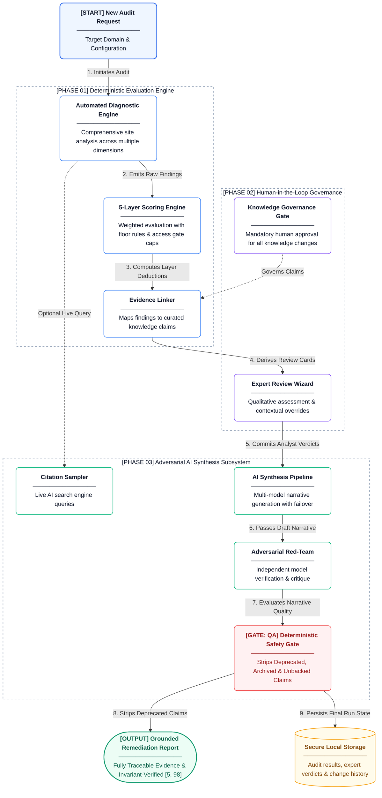

This page covers the architectural boundaries, system design, and responsibility matrix of the Citeable AI readiness platform. It serves as the primary technical entry point for understanding how deterministic auditing, human review, and AI synthesis interact.

## What is Citeable?

Citeable is a secure, local-first application that performs deterministic, evidence-backed audits of how well websites are optimized for citation by AI search engines. It executes automated diagnostic checks across 5 scoring layers (Access, Schema, Content, Citation, Authority), supports human-in-the-loop qualitative review via an expert review wizard, and generates adversarially-verified remediation narratives through an AI synthesis pipeline. All diagnostic findings are wired to a governed knowledge base with source-tiered evidence chains, and every AI-generated recommendation must pass a deterministic QA gate that rejects citations to deprecated or missing knowledge before reaching the user.

> **In 30 seconds:** Deterministic evaluation → Human review → AI synthesis → Governed knowledge.

## System Architecture

## Responsibility Matrix

| Responsibility | Classification | Key Evidence |
|---|---|---|
| Robots/crawler checking | Deterministic | Rule-based parser, zero LLM calls |
| Schema/JSON-LD validation | Deterministic | Schema.org type validation |
| Content format evaluation | Deterministic | Heuristic scoring (word counts, position analysis) |
| Domain authority profiling | Deterministic | API metrics + fallback heuristics |
| Cloaking detection | Deterministic | Dual-fetch text diff (GPTBot vs browser UA) |
| Entity verification | Deterministic | In-memory JSON-LD graph traversal |
| Content freshness | Deterministic | Date parser across 14+ formats |
| Media blindness detection | Deterministic | DOM analysis, regex-based alt-text checking |
| Redirect/access auditing | Deterministic | URL parser, meta tag inspection |
| Sitemap validation | Deterministic | XML parser with validation |
| Multi-page consistency | Deterministic | Crawl + Content similarity analysis |
| JS rendering diff | Deterministic | Browser-based rendering comparison (optional) |
| Extractability judgment | Hybrid | Heuristic fast-path; LLM only when ambiguous |
| Citation frequency sampling | AI-assisted | Live queries to AI search engines |
| Score computation | Deterministic | Mathematical deduction, zero LLM calls |
| Findings-to-claims wiring | Deterministic (primary) | Deterministic mapping with semantic fallback |
| QA gate validation | Deterministic | Rejects deprecated/missing claim citations |
| Manual qualitative review | Human-authorized | Guided wizard with conditional visibility |
| Knowledge base mutations | Human-authorized | Requires explicit human approval |
| Synthesis narrative | AI-assisted | Multi-model pipeline with adversarial verification |
| Adversarial red-teaming | AI-assisted | Reverse waterfall (different model critiques) |

## Design Philosophy

1. **Deterministic-first**: AI is used only where deterministic approaches genuinely cannot work. Automated diagnostic engines use zero LLM calls. Scoring is pure arithmetic.
2. **Evidence-backed**: Every recommendation traces to a governed knowledge claim with source-tiered evidence chains. The QA gate rejects recommendations that cite deprecated or missing knowledge.
3. **Adversarially verified**: The model that critiques a synthesis is structurally guaranteed to be different from the model that generated it (reverse waterfall). Red teaming enforces strict guardrails to ensure narratives are grounded, actionable, and mathematically consistent with findings.
4. **Intellectually honest**: The system explicitly documents what it cannot measure, treats absence of evidence as neutral (not negative), and bounds scores between 5 and 98 — never claiming perfect or zero readiness.

## Start Here (5-Minute Reading Guide)

1. This page (60s) — architecture + boundaries
2. [Audit Lifecycle](lifecycle.md) — Anatomy of a Real Audit section (120s)
3. [AI Architecture](ai-architecture.md) — AI Boundaries + Reverse Waterfall (60s)
4. [Scoring Model](scoring.md) — Layer model + worked example (30s)
5. [Limitations](limitations.md) — Architectural tradeoffs (30s)

## What Citeable Does Not Do

- Continuous monitoring (point-in-time snapshots only)
- Guarantee search rankings or AI citations
- Replace human editorial judgment (synthesis is downstream of human review)
- Predict future AI engine behavior
- Multi-tenant SaaS isolation

## Technical Summary

| Dimension | Value |
|---|---|
| Runtime | Local-first application server |
| Database | Embedded database with write-ahead logging |
| LLM Integration | Multi-model cascade with zero-SDK direct integration |
| Knowledge Base | Curated claims corpus with 7-tier source hierarchy |
| Scoring | 5-layer weighted model with access gate overrides |
| Diagnostic Engines | Automated diagnostic engine with optional browser emulation |
| Manual Review | Expert review wizard |
| Synthesis | Adversarial multi-model pipeline |
| Authentication | Token-based with constant-time verification |
| Key Management | BYOK, zero disk retention |

---

> *Citeable is provided "AS IS" without warranties of any kind. Audit scores measure diagnostic readiness, not commercial outcomes. See [Legal](legal.md) for full disclaimers, acceptable use policy, and privacy notice.*
