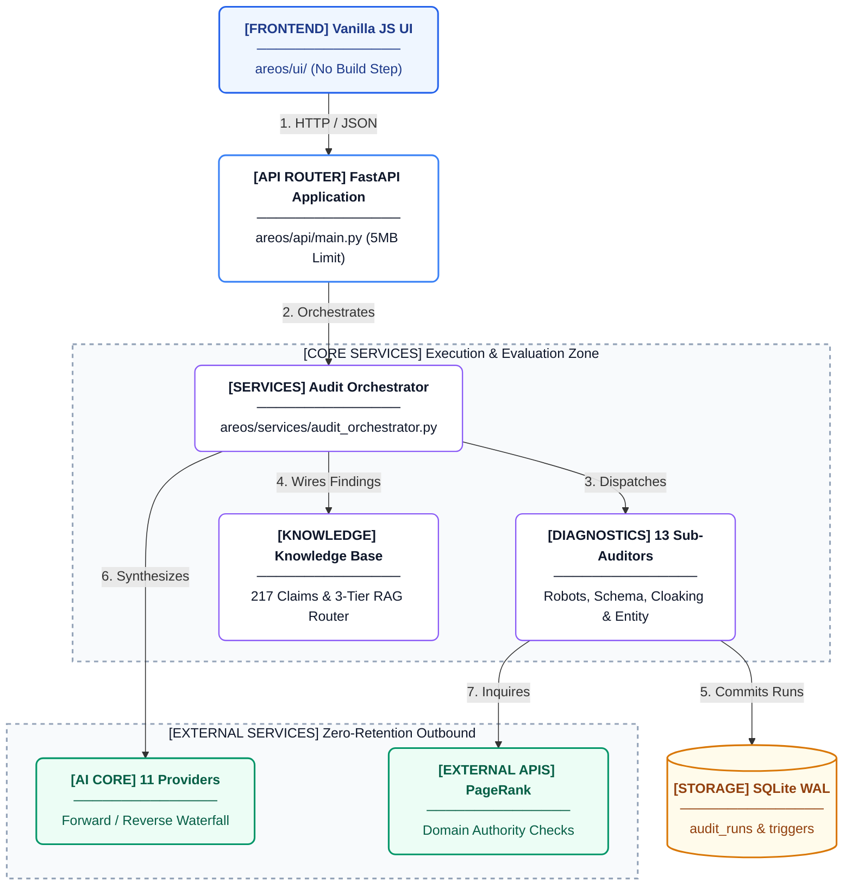

# System Orientation

## System Purpose
Citeable is a single-node FastAPI/SQLite application that performs deterministic, evidence-backed audits of website AI-readiness. It converts a target domain name into a structured, evidence-backed audit report by running a strict pipeline of checks, measuring content extractability, and sampling live LLM citations. Read `areos/api/main.py` for the app definition and router mounts.

## Architecture Overview Diagram



## Major Component Inventory Table

| Component | Directory | Purpose | Key Files |
|-----------|-----------|---------|-----------|
| API Layer | `areos/api/` | FastAPI application, middleware, and routers. | `main.py`, `routers/` |
| Audit Engines | `areos/auditors/` | Evaluates site AI-readiness and scores findings. | `scoring.py` |
| Knowledge Base | `areos/kb/` | Curated declarative claims, guidance, and evidence models. | `models.py` |
| LLM Integration | `areos/llm/` | Zero-dependency HTTP clients for LLMs. | `providers/__init__.py` |
| Services | `areos/services/` | Business logic and audit pipelines. | |
| Database | `areos/db/` | SQLite WAL database and connection pooling. | `connection.py`, `migrate_audit_tables.py` |
| Frontend | `areos/ui/` | Static HTML/JS frontend mounted on FastAPI. | `docs/` |
| Utilities | `areos/util/` | Logging configuration and cross-cutting concerns. | `logging_config.py` |
| CLI Tools | `areos/cli/` | Command line interface for administrative tasks. | |
| Jobs | `areos/jobs/` | Background processes or scheduled tasks. | |
| Scripts | `scripts/` | Deployment and maintenance scripts. | `backup_db.py` |
| Instruction Cards | `areos/instruction_cards/` | Definitions for guided review wizards. | |

## Important Terminology

- **check code**: A unique string identifier for a finding (e.g., `CRAWLER_FULLY_BLOCKED`).
- **finding**: A specific issue or observation during an audit, mapping to a check code.
- **claim**: A single declarative statement in the knowledge base, tracking known AI/SEO behaviors.
- **knowledge record**: The base representation (`KnowledgeRecord` in `areos/kb/models.py`) containing a `kid`, `statement`, and `status`.
- **evidence**: The proof (`EvidenceRecord` in `areos/kb/models.py`) backing a knowledge record via a specific relationship and weight.
- **source tier**: A classification of authority for a `SourceRecord` (e.g., `authority: 'T3'`).
- **wired finding**: A finding linked to a specific knowledge record in the system.
- **remediation plan**: A structured JSON report prioritising fixes for identified findings based on priority scores.
- **access gate**: A scoring circuit breaker defined in `areos/auditors/scoring.py` (e.g., `CRAWLER_FULLY_BLOCKED` caps score at 25).
- **QA gate**: A quality control review step in the audit lifecycle.
- **synthesis**: The process of merging findings and evidence into a resolution report (see `areos.api.routers.synthesis`).
- **BYOK**: Bring Your Own Knowledge. Allows custom rules to be injected via `areos.api.routers.byok`.
- **observation**: A neutral fact found during audit execution.
- **verdict**: The final output decision on a domain's readiness (see `areos.api.routers.verdicts`).
- **wizard card**: Guided steps presented in the UI to walk a user through manual reviews.

## Runtime Topology

Citeable is a strictly single-node system.
- **Web Server**: FastAPI running via Uvicorn.
- **Data Persistence**: Local SQLite file (`areos.db`) running in WAL mode with thread-local connections.
- **Simplicity**: No microservices, no background workers (like Celery), no message queues (like Redis/RabbitMQ).
- **Deployment**: Defined by a single `Dockerfile` and orchestrated via `render.yaml`. Read these files for environment requirements.

## Local Development Quick-Start

1. **Clone the repo**
   ```bash
   git clone <repo_url>
   cd areos
   ```
2. **Install requirements**
   ```bash
   pip install -r requirements.txt
   ```
3. **Set required env vars**
   At a minimum, you must provide:
   ```bash
   export AREOS_API_TOKEN="your_secure_token"
   export AREOS_GEMINI_KEY_1="your_gemini_api_key" # Or OPENAI_API_KEY
   ```
4. **Run the app**
   ```bash
   python -m uvicorn areos.api.main:app --host 0.0.0.0 --port 8000
   ```
5. **Trigger an audit**
   Navigate to `http://localhost:8000/` to use the locally mounted UI.

## Start Here Reading Guide

Ordered reading path through the 18 internal docs pages:

1. **00-orientation.md** (15 mins) - You are here.
2. **01-architecture.md** (20 mins) - High-level system structure.
3. **02-api.md** (15 mins) - FastAPI layer and middleware.
4. **03-scoring.md** (20 mins) - The 5-layer scoring model (Access, Schema, Content, Citation, Authority).
5. **04-knowledge.md** (25 mins) - KB models, claims, and evidence relationships.
6. **05-lifecycle.md** (20 mins) - The 9-phase AEO/GEO audit lifecycle.
7. **06-limitations.md** (10 mins) - Known gaps and non-goals.
8. **07-review.md** (15 mins) - The Manual Review Wizard.
9. **08-security.md** (15 mins) - Content-Security-Policies, rate limits.
10. **09-testing.md** (15 mins) - Unit testing and regression boundaries.
11. **10-llm.md** (15 mins) - Zero-dependency provider model.
12. **11-database.md** (15 mins) - SQLite WAL patterns and migrations.
13. **12-frontend.md** (10 mins) - Plain HTML/JS UI mounted on FastAPI.
14. **13-services.md** (20 mins) - Audit pipelines and business logic.
15. **14-cli.md** (10 mins) - Administrative tools.
16. **15-jobs.md** (10 mins) - Background sync tasks.
17. **16-deploy.md** (15 mins) - Render.com and Docker configuration.
18. **17-contributing.md** (15 mins) - Pull request guidelines.
