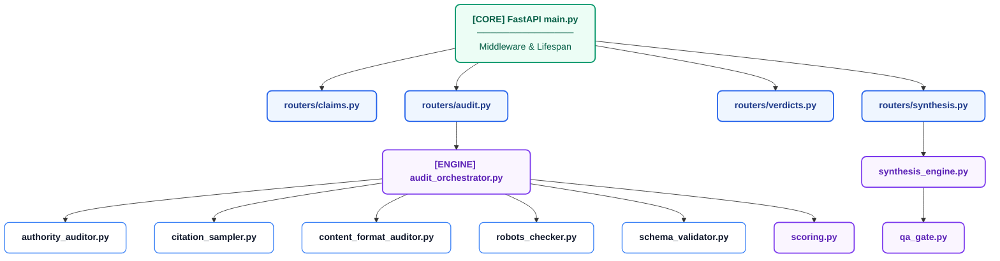

# Architecture Deep Dive

This document details the architectural boundaries, execution flow, state derivation, and persistence models for the AREOS Local UI.

## Component Dependency Diagram

The following diagram maps the router and execution layers of the AREOS API.

## Request Flow

HTTP requests traverse a rigorous middleware stack before hitting business logic. Because AREOS runs locally, this stack protects against payload exhaustion and ensures proper tracing.

1.  **Correlation ID Middleware:** `_correlation_id_middleware` generates a UUID for every request, setting it in the `_error_id_ctx` ContextVar for logging consistency.
2.  **Body Size Limit:** `BodySizeLimitMiddleware` strictly caps incoming request bodies at 5MB. Requests exceeding this trigger a clean ASGI task group abort via the `_PayloadTooLarge` internal sentinel exception, preventing DoS on the local engine.
3.  **CORS:** `CORSMiddleware` is configured, but as noted in `main.py`, its real job is facilitating local dev UIs (`python -m http.server`) during development, not production browser security, since the shipped UI is same-origin.
4.  **Router → Orchestrator:** The HTTP request hits an endpoint (e.g., `POST /api/v1/audit/start`), which delegates to `areos/auditors/audit_orchestrator.py`.
5.  **Auditors & DB:** The orchestrator runs all 6 auditor layers, computes scores via `scoring.py`, and writes findings to the database via `areos/db/connection.py`.

## Data Flow

Data progresses from raw HTML to governed synthesis in a strict pipeline:

1. **Target URL** → Fetched and rendered via `research_service.py` (Jina Reader / raw requests).
2. **HTML** → Evaluated by auditor modules (e.g., `robots_checker.py`, `schema_validator.py`).
3. **Findings** → Mapped to check codes (e.g., `CRAWLER_FULLY_BLOCKED`).
4. **Scores** → `scoring.py` processes findings and generates a `ScorecardResult` containing `overall_score`, `sub_scores` per layer, and a flat `score_breakdown` deduction ledger.
5. **Wired Findings** → Findings are persisted in the `audit_runs` table as JSON (`automated_findings`).
6. **Manual Verdicts** → The UI derives required manual review cards from the stored findings, persisting human decisions to `manual_verdicts`.
7. **Synthesis** → `synthesis_engine.py` builds a `RemediationPlan` from automated findings and manual verdicts.
8. **QA Gate** → `qa_gate.py` filters the plan, rejecting recommendations that cite deprecated, superseded, or archived KB claims.
9. **Report** → Final report is rendered for the user.

## Persistence Model

AREOS governs SQLite connections rigidly through `areos/db/connection.py`. **No component may call `sqlite3.connect()` directly.**

*   **Thread-Local Connection Cache:** Connections are stored in a thread-local dictionary (`_local.conns`) keyed by the resolved absolute database path string. This prevents test contamination where two tests in the same thread need different DB paths.
*   **Transparent Recovery:** If a connection is closed externally, `get_connection()` detects the resulting `sqlite3.ProgrammingError` on a probe query (`SELECT 1`) and reopens it automatically.
*   **Required PRAGMAs:** 
    *   `foreign_keys = ON` (strict relational enforcement)
    *   `journal_mode = WAL` (readers don't block writers)
    *   `synchronous = NORMAL` (safe under WAL)
    *   `busy_timeout = 30000` (wait 30s instead of throwing on contention)
*   **Lifespan Teardown:** `main.py` maintains an `_all_conns` registry. During FastAPI shutdown, `close_all_connections()` iterates and safely closes every pooled connection across all threads.

## External Service Dependencies

| Service | Used For | Calling Module | Failure Behavior |
| :--- | :--- | :--- | :--- |
| **Open PageRank API** | Domain authority calculation (`AUTHORITY_DR_LOW`). | `authority_auditor.py` | Falls back to a hardcoded deterministic dictionary. |
| **Perplexity API** | Citation sampling (Sonar models). | `citation_sampler.py` | Citation extraction collapses without a standard `CITATION_UNAVAILABLE` code if both Perplexity and Gemini fail. |
| **Gemini Search** | Citation sampling (grounded search mode). | `citation_sampler.py` | Same as Perplexity. |
| **Jina Reader** | Clean markdown extraction, handles JS-rendered pages. | `research_service.py` | Falls back to raw `requests` on HTTP 402 quota exceeded or timeout. |
| **11 LLM Providers** | Custom LLM evaluation keys (`openai`, `anthropic`, `claude`, `perplexity`, `xai`, `grok`, `mistral`, `deepseek`, `google`, `gemini`, `groq`). | `api/routers/byok.py` | Latency ping fails; returns `offline` status for invalid keys. |

## Trust Boundaries Diagram

```mermaid
flowchart LR
    classDef ingress fill:#EFF6FF,stroke:#2563EB,stroke-width:2px,color:#1E3A8A,rx:8px,ry:8px;
    classDef gate fill:#FEF2F2,stroke:#DC2626,stroke-width:2px,color:#991B1B,rx:8px,ry:8px;
    classDef safe fill:#FFFFFF,stroke:#3B82F6,stroke-width:1.5px,color:#0F172A,rx:8px,ry:8px;
    classDef out fill:#ECFDF5,stroke:#059669,stroke-width:2px,color:#065F46,rx:8px,ry:8px;
    classDef zone fill:#F8FAFC,stroke:#94A3B8,stroke-width:2px,stroke-dasharray:5 5,color:#0F172A;

    UserReq["<b>[INGRESS] User Input URL</b><br/>───────────────<br/>Untrusted Target Domain"]:::ingress
    SSRF["<b>[SECURITY] SSRF Gate</b><br/>───────────────<br/>RFC1918 Blocklist &amp; DNS Lock"]:::gate
    
    subgraph Safe["[EXECUTION ZONE] Hardened Environment"]
        direction TB
        Auditor["<b>[01] Auditor Sandbox</b><br/>Network Fetches (5MB Cap)"]:::safe
        LLM["<b>[02] LLM Isolation</b><br/>Closure Stack BYOK"]:::safe
        DB["<b>[03] DB Governance</b><br/>write_as() Audit Trail"]:::safe
    end
    class Safe zone
    
    Report(["<b>[OUTPUT] Sanitized Report</b><br/>───────────────<br/>Grounded Remediation Plan"]):::out

    UserReq --> SSRF
    SSRF --> Safe
    Safe --> Report
```

## Synchronous Execution Model

AREOS executes audits synchronously, meaning the HTTP response blocks until the scan completes. 

*   **No Background Queue:** The `areos/jobs/` directory is scaffolded but intentionally empty for v1. 
*   **Rationale:** The application targets single-user local deployment where the overhead and complexity of standing up Redis/Celery (or even a robust SQLite-backed async worker) outweighs the benefit. The user expects to watch the progress bar fill in real-time.

## State Derivation Principle

Per `areos/services/run_state.py`, AREOS does not store a mutable `status` string in the database. Instead, state is derived strictly from ground truth to prevent divergence.

1.  **Expected Cards:** `get_wizard_cards_for_run()` extracts `automated_findings` from the `audit_runs` table and executes `select_triggered_cards()` (the same function the orchestrator used).
2.  **Completed Cards:** Queries `COUNT(DISTINCT card_id)` from `manual_verdicts`.
3.  **Synthesis Exists:** Queries `audit_synthesis` for the `run_id`.
4.  **Derived Status:**
    *   If `has_synthesis` → `complete`.
    *   If `completed >= total` → `ready_for_synthesis`.
    *   Else → `awaiting_review`.

## Major Invariants

*   **Score Bounds [5, 98]:** Enforced in `areos/auditors/scoring.py` (`SCORE_FLOOR`, `SCORE_CEILING`). Overall score is strictly clamped.
*   **Layer Isolation:** Implemented via `LAYERS` in `scoring.py:compute_layered_score()`. Multiple findings in the same layer stack, but deductions floor at 0 *for that layer*, preserving the remaining max score of other layers.
*   **Access Gate Cap:** `scoring.py:ACCESS_GATE` enforces hard caps based on crawler availability (e.g., `CRAWLER_FULLY_BLOCKED` caps the entire overall score at 25, regardless of other layers).
*   **QA Gate Deprecated Rejection:** `areos/auditors/qa_gate.py:run_qa_gate` intercepts recommendations. If the associated `claim_id` has a status in `REJECTED_STATUSES` (`deprecated`, `superseded`, `archived`), it is stripped from the plan and added to `qa_rejected`.
*   **Auto-Apply Hardcoded False:** `areos/services/auto_apply.py:is_auto_apply_eligible` is hardcoded to `return False` for v1.
*   **Semantic Parity Across 77 Check Codes:** Guaranteed by `tests/test_ci_semantic_parity.py` (which runs `scripts/verify_kb_semantic_parity.py`). The script verifies 100% synchronization of check codes across `areos/kb/check_code_to_knowledge_map.json`, `LAYER_DEDUCTIONS` in `scoring.py`, and `ACTION_SNIPPETS` in `audit_orchestrator.py`.
