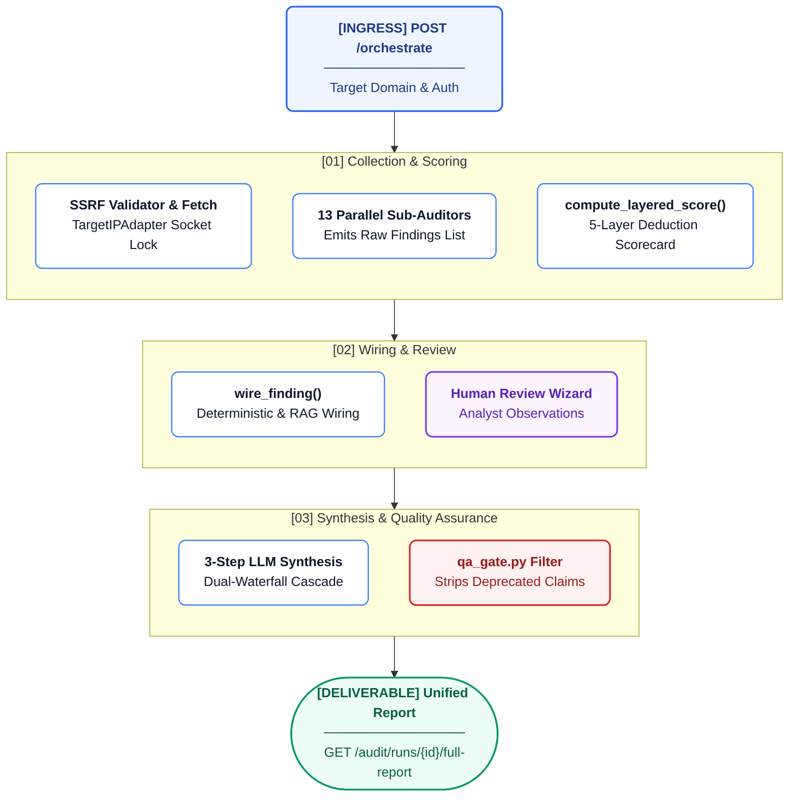

# Audit Engine Lifecycle

The AREOS audit engine executes a multi-layered diagnostic pipeline that evaluates target domains against search engineering principles. This document traces the exact implementation of the audit lifecycle.

## Pipeline Overview

The complete lifecycle of an audit run, from HTTP request to final synthesized report, follows these deterministic stages:



| Stage | Source File | Function | Input | Output | DB Interaction | Error Handling | Tests |
|-------|-------------|----------|-------|--------|----------------|----------------|-------|
| 1. HTTP Request | `areos/api/routers/audit.py` | `execute_orchestrated_audit` (handles `POST /api/v1/audit/orchestrate`) | `OrchestratedAuditPayload` | Triggers orchestrator | Rate limiter checks memory (`_ip_buckets`) | `HTTPException` (429) | - |
| 2. Domain Validation & SSRF | `areos/auditors/audit_orchestrator.py` | `run_orchestrated_audit` | `target_domain` string | Normalised `clean_domain` | None | Raises `ValueError` for bad domains; blocks SSRF IPs | - |
| 3. Page Fetch | `areos/auditors/audit_orchestrator.py` | `_fetch_page` | `clean_domain`, `page_url` | `(html, hop_count, final_url)` | None | Returns `("", 0, page_url)` on network/SSRF failure | - |
| 4. Sub-Audit Dispatch | `areos/auditors/audit_orchestrator.py` | `run_orchestrated_audit` | HTML, domain, `json_ld_blocks` | List of finding dicts | None | Try/except blocks per layer; emits `AUDIT_PHASE_CRASHED` or `*_UNVERIFIABLE` | - |
| 5. Score Computation | `areos/auditors/scoring.py` | `compute_layered_score` | List of raw findings | `ScorecardResult` | None | - | - |
| 6. Findings Persistence | `areos/auditors/audit_orchestrator.py` | `run_orchestrated_audit` | Audit metadata, findings list | DB record | `INSERT INTO audit_runs (run_id, target_domain, run_date, audited_stages, automated_findings, status, overall_score)` | - | - |
| 7. Claims Wiring | `areos/auditors/findings_to_claims.py` | `wire_finding` | Finding dict | `WiredFinding` | Lookups via `kb_check_code_map` & `claims` table | Sets `wiring_status` to `UNMAPPED` or `CLAIM_NOT_FOUND` | - |
| 8. QA Gate Validation | `areos/auditors/qa_gate.py` | `run_qa_gate` | `RemediationPlan` | `QAResult` (passed/rejected) | Selects `status` from `claims` | Rejects missing/deprecated/empty `claim_id` | - |
| 9. Wizard Card Selection | `areos/cli/report.py` | `select_triggered_cards` | `AuditRunSummary` | List of triggered cards | None | Default fallback for missing guidance | - |
| 10. Manual Review | `areos/api/routers/audit.py` | `submit_observation` (`POST /api/v1/audit/runs/{run_id}/observations`) | `ObservationPayload` | Success ACK | `INSERT INTO manual_observations ... ON CONFLICT DO UPDATE` | `HTTPException` (404/400) | - |
| 11. Synthesis Trigger | `areos/api/routers/audit.py` | `synthesize_audit_run` (`POST /api/v1/audit/runs/{run_id}/synthesize`) | `run_id` | Enriched LLM report | Selects `audit_runs`, `manual_observations`, `claims` | Handles missing LLM keys gracefully | - |
| 12. Report Generation | `areos/api/routers/audit.py` | `get_unified_report` (`GET /audit/runs/{run_id}/full-report`) | `run_id` | Unified 6-section JSON report | Selects findings and observations/verdicts | Fallback to legacy `manual_verdicts` | - |

## 13 Diagnostic Engines

The `run_orchestrated_audit` dispatches execution sequentially (single-threaded) to these diagnostic engines:

| Engine | File | Classification | Check Codes Produced | Dependencies | Error Handling |
|--------|------|----------------|----------------------|--------------|----------------|
| AI Crawling & Robots | `robots_checker.py` | Access Layer | `CRAWLER_FULLY_BLOCKED`, `LLMS_TXT_MISSING`, `LLMS_TXT_MISSING_H1` | Network (`robots.txt`, `llms.txt`) | Emits `ROBOTS_UNVERIFIABLE` / `LLMS_UNVERIFIABLE` |
| Schema & JSON-LD | `schema_validator.py` | Content Layer | `SCHEMA_MISSING`, `JSON_PARSE_FAILURE`, `ANSWER_FORMAT_GOOD`, `MISSING_REQUIRED_FIELD`, etc. | Pre-fetched HTML blocks | Emits `SCHEMA_UNVERIFIABLE` on fetch fail |
| AI Extractability | `content_format_auditor.py` | Content Layer | `EXTRACTABILITY_LOW`, `ANSWER_NOT_NEAR_TOP`, `ANSWER_NOT_SELF_CONTAINED`, `NO_LIST_OR_TABLE` | Pre-fetched HTML | Emits `PAGE_FETCH_FAILED` |
| Authority & Backlinks | `authority_auditor.py` | Authority Layer | `AUTHORITY_PROFILE_GOOD`, `AUTHORITY_DR_LOW`, `REFERRING_DOMAINS_CRITICAL` | External API (e.g. OpenPageRank) | Graceful degradation if API unreachable |
| Redirects & Access | `redirect_auditor.py` | Access Layer | `ACCESS_OK`, `REDIRECT_CHAIN_LONG`, `REDIRECT_CHAIN_EXCESSIVE`, `REDIRECT_DOMAIN_CHANGE` | Network hop counts | Emits `AUDIT_PHASE_CRASHED` |
| Content Freshness | `freshness_auditor.py` | Content Layer | `FRESHNESS_OK`, `CONTENT_STALE`, `CONTENT_AGING`, `DATE_MISSING` | HTML & Schema JSON | Emits `AUDIT_PHASE_CRASHED` |
| Entity Verification | `entity_verifier.py` | Authority Layer | `ENTITY_OK`, `SAMEAS_DEAD_LINK`, `SAMEAS_MISSING`, `WIKIDATA_MISSING`, `ENTITY_NAME_MISSING` | HTML & Schema JSON | Emits `AUDIT_PHASE_CRASHED` |
| Media Blindness | `media_blindness_auditor.py` | Content Layer | `MEDIA_OK`, `IFRAME_HEAVY`, `IMAGES_MISSING_ALT`, `ALL_CONTENT_IN_MEDIA`, `VIDEO_NO_TRANSCRIPT` | HTML | Emits `AUDIT_PHASE_CRASHED` |
| Cloaking Detection | `cloaking_detector.py` | Access Layer | `CLOAKING_OK`, `CLOAKING_DETECTED`, `CLOAKING_SUSPECTED`, `CLOAKING_FETCH_FAILED` | Network (Multiple UAs) | Emits `AUDIT_PHASE_CRASHED` |
| Sitemap Audit | `sitemap_auditor.py` | Access Layer | `SITEMAP_OK`, `SITEMAP_MISSING`, `SITEMAP_EMPTY`, `SITEMAP_NO_LASTMOD` | Network (`sitemap.xml`) | Emits `AUDIT_PHASE_CRASHED` |
| Multi-Page Crawl | `multipage_auditor.py` | Content Layer | Multi-page specific findings (e.g., `MULTI_PAGE_SCHEMA_GAPS`) | Network (10 URLs from sitemap) | Emits `AUDIT_PHASE_CRASHED` |
| JS Rendering Diff | `rendering_auditor.py` | Access Layer | `RENDERING_OK`, `JS_CRITICAL_CONTENT_GATED` | Playwright (if available) | Emits `AUDIT_PHASE_CRASHED` |
| Citation Analytics & Competitors | `citation_sampler.py`, `competitor_analyzer.py` | Authority Layer | `CITATION_OBSERVED`, `CITATION_NOT_OBSERVED`, `CITATION_RATE_LOW`, `SHARE_OF_VOICE_LOW` | LLM APIs (Gemini/Groq/etc) | Emits `AUDIT_PHASE_CRASHED` |

*(Note: These run sequentially in a single pass over the site. Network failures inside engines are caught and logged, pushing error check codes to the findings list so the audit completes).*

## Data Structures at Each Stage

### Raw Finding Dict
Produced by diagnostic engines and stored in `audit_runs.automated_findings`:
```python
{
    "code": "CRAWLER_FULLY_BLOCKED",
    "severity": "error",
    "message": "AI Crawler GPTBot is explicitly denied in robots.txt.",
    "page_url": "https://example.com/robots.txt"
}
```

### Wired Finding
Produced by `wire_finding()` in `areos/auditors/findings_to_claims.py`:
```python
@dataclass
class WiredFinding:
    check_code: str
    severity: str
    message: str
    source_auditor: str
    page_url: str
    claim_id: str | None
    claim_status: str | None
    claim_confidence: str | None
    claim_statement: str | None
    claim_scope: str | None
    wiring_status: str # "WIRED" | "CLAIM_NOT_FOUND" | "UNMAPPED"
```

### QA-Validated Finding (Recommendation)
Produced by `areos/auditors/synthesis_engine.py` and filtered by `areos/auditors/qa_gate.py`:
```python
@dataclass
class Recommendation:
    priority: int
    title: str
    description: str
    claim_id: str
    claim_status: Optional[str]
    confidence: Optional[str]
    source: str # "automated" | "manual"
    check_code: str
    page_url: str
    severity: str
    claim_scope: Optional[str]
    claim_statement: Optional[str]
    claim_source_url: Optional[str]
    # V2 Knowledge Router Fields...
    resolution_path: Optional[str]
    evidence_chain: list
```

### Wizard Card
Produced by `select_triggered_cards()` combined with `MANUAL_CARD_GUIDANCE`:
```json
{
    "card_id": "C052",
    "check_name": "Verify Render Asset Accessibility",
    "reason": "Automated layer flagged access restrictions",
    "title": "Verify Render Asset Accessibility",
    "what_to_look_for": "Check if critical JavaScript or CSS stylesheets are blocked...",
    "how_to_fill": "Select 'pass' if the rendered HTML contains full body content..."
}
```

### Synthesis Input
The `synthesise()` function takes:
- `automated_findings: list[dict]` (Raw findings)
- `manual_findings: list[ManualFinding]` (Human observations mapped to `ManualFinding` objects)
And returns a `RemediationPlan` object containing a deduplicated, prioritized list of `Recommendation` objects.

## Action Snippets

The `ACTION_SNIPPETS` dictionary in `areos/auditors/audit_orchestrator.py` maps specific check codes to concrete remediation strings (code snippets or instructions). This ensures reports deliver actionable engineering tasks.

**Examples:**
- `CRAWLER_FULLY_BLOCKED` $\rightarrow$ `# Add to robots.txt: \nUser-agent: GPTBot...`
- `LLMS_TXT_MISSING` $\rightarrow$ `# Create /llms.txt at web root: ...`
- `JSON_PARSE_FAILURE` $\rightarrow$ `<!-- Validate JSON-LD syntax --> <script ...`
- `ANSWER_NOT_NEAR_TOP` $\rightarrow$ `<!-- Move self-contained definition into top 30% ...`

The snippet is injected during synthesis as `action_snippet` into the final remediation plan JSON returned to the client.
