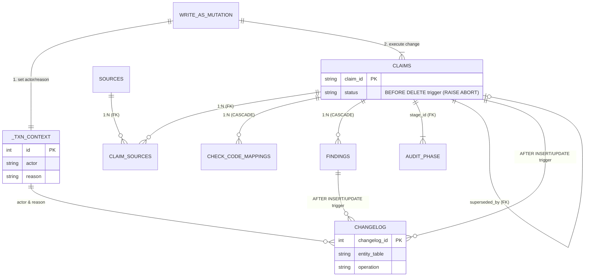

# Database Schema

This document outlines the AREOS SQLite database schema, runtime tables, configuration, and data validation rules. The canonical schema is generated via python definitions (`areos/db/schema/artifacts.py` and `mixins.py`) into `areos/db/schema.sql`.

## Complete Table Inventory

The following tables are defined in `areos/db/schema.sql`.

| Table | Purpose | Key Columns (name, type, constraint) | Relationships |
|-------|---------|--------------------------------------|---------------|
| `_txn_context` | One-row staging table to hold `actor` and `reason` for triggers. | `id` (INTEGER, PRIMARY KEY CHECK (id = 1)), `actor` (TEXT), `reason` (TEXT) | None |
| `changelog` | Polymorphic audit log for tables with `changelog: True`. | `changelog_id` (INTEGER, PRIMARY KEY AUTOINCREMENT), `entity_table` (TEXT, NOT NULL), `entity_id` (TEXT, NOT NULL), `operation` (TEXT, CHECK IN INSERT/UPDATE) | None (Polymorphic via `entity_table` / `entity_id`) |
| `claims` | Core evidence layer. | `claim_id` (TEXT, PRIMARY KEY), `stage_id` (TEXT), `superseded_by` (TEXT) | `stage_id` references `audit_phase`, `superseded_by` references `claims` |
| `audit_phase` | Reference table for audit phases. | `audit_phase_id` (TEXT, PRIMARY KEY), `name` (TEXT, NOT NULL), `automatable` (INTEGER) | Referenced by `claims` |
| `tool_landscape` | Tracks tooling landscape for claims. | `tool_id` (TEXT, PRIMARY KEY), `claim_id` (TEXT, NOT NULL), `statement` (TEXT, NOT NULL) | `claim_id` references `claims` ON DELETE CASCADE |
| `policy_constraints` | Tracks policy constraints for claims. | `policy_id` (TEXT, PRIMARY KEY), `claim_id` (TEXT, NOT NULL), `statement` (TEXT, NOT NULL) | `claim_id` references `claims` ON DELETE CASCADE |
| `findings` | Diagnostics and check findings. | `finding_id` (TEXT, PRIMARY KEY), `claim_id` (TEXT, NOT NULL), `check_type` (TEXT, NOT NULL), `evidence_state` (TEXT, NOT NULL) | `claim_id` references `claims` ON DELETE CASCADE |
| `jobs` | Job queue for background polling. | `job_id` (TEXT, PRIMARY KEY), `task_name` (TEXT, NOT NULL), `status` (TEXT, NOT NULL) | None |
| `sources` | Source registry for citations. | `source_id` (TEXT, PRIMARY KEY), `trust_tier` (TEXT, NOT NULL), `source_type` (TEXT, NOT NULL) | Referenced by `claim_sources` |
| `claim_sources` | Many-to-many join between claims and sources. | `claim_source_id` (TEXT, PRIMARY KEY), `claim_id` (TEXT, NOT NULL), `source_id` (TEXT, NOT NULL) | `claim_id` references `claims`, `source_id` references `sources` |
| `check_code_mappings` | Links auditor check codes to claims. | `mapping_id` (INTEGER, PRIMARY KEY AUTOINCREMENT), `check_code` (TEXT, NOT NULL), `claim_id` (TEXT, NOT NULL) | `claim_id` references `claims` ON DELETE CASCADE |
| `prompt_sets` | Governed prompt queries for AI citation. | `prompt_id` (TEXT, PRIMARY KEY), `label` (TEXT, NOT NULL), `prompt_text` (TEXT, NOT NULL) | None |
| `audit_runs` | Tracks audit run executions. | `run_id` (TEXT, PRIMARY KEY), `target_domain` (TEXT, NOT NULL), `overall_score` (INTEGER) | None |
| `manual_verdicts` | Human verdicts on audit runs. | `id` (INTEGER, PRIMARY KEY AUTOINCREMENT), `run_id` (TEXT, NOT NULL), `card_id` (TEXT, NOT NULL) | None |
| `manual_observations` | Structured observation storage (T-B01). | `id` (INTEGER, PRIMARY KEY AUTOINCREMENT), `run_id` (TEXT, NOT NULL), `question_id` (TEXT, NOT NULL) | None |
| `audit_synthesis` | Persists three-step LLM synthesis result. | `run_id` (TEXT, PRIMARY KEY), `narrative` (TEXT) | None |
| `idempotency_keys` | API request idempotency tracking. | `idempotency_key` (TEXT, PRIMARY KEY), `endpoint` (TEXT, NOT NULL) | None |

> [!NOTE]
> There is a discrepancy in the original request prompt regarding the `jobs` table: it was described as a "Runtime-Only" table created from `artifacts.py`. In reality, because it is defined in `areos/db/schema/artifacts.py`, it is compiled directly into `areos/db/schema.sql` (Line 273) and is not strictly a runtime-only table.

### ER Diagram



## Runtime-Only Tables

The Knowledge Base (KB) architecture uses tables created dynamically by Python code (`areos/kb/build_kb.py`), which drops and recreates them entirely during ingestion.

### `kb_*` and `knowledge` Tables

The exact CREATE TABLE SQL executed by `areos/kb/build_kb.py`:

```sql
CREATE TABLE knowledge (
    kid TEXT PRIMARY KEY,
    type TEXT NOT NULL CHECK(type IN ('FACT','STANDARD','FINDING','UNCERTAINTY','GUIDANCE')),
    scope TEXT,
    statement TEXT NOT NULL,
    context TEXT,
    status TEXT NOT NULL DEFAULT 'active',
    confidence TEXT DEFAULT 'medium',
    support TEXT DEFAULT 'partial',
    uncertainty TEXT,
    contradiction TEXT,
    guidance_json TEXT,
    aeog_phases TEXT,
    check_links TEXT,
    priority_score INTEGER,
    review_due TEXT,
    provenance_json TEXT,
    created_at TEXT,
    last_verified_at TEXT
);

CREATE TABLE kb_sources (
    sid TEXT PRIMARY KEY,
    url TEXT,
    title TEXT,
    publisher TEXT,
    authority TEXT DEFAULT 'T3',
    pub_date TEXT,
    excerpt TEXT,
    notes TEXT
);

CREATE TABLE kb_evidence (
    eid TEXT PRIMARY KEY,
    kid TEXT NOT NULL REFERENCES knowledge(kid),
    sid TEXT NOT NULL REFERENCES kb_sources(sid),
    relationship TEXT DEFAULT 'supports',
    weight TEXT DEFAULT 'primary',
    note TEXT
);

CREATE TABLE kb_check_code_map (
    check_code TEXT NOT NULL,
    kid TEXT NOT NULL REFERENCES knowledge(kid),
    priority_score INTEGER NOT NULL DEFAULT 10,
    PRIMARY KEY (check_code, kid)
);

CREATE TABLE kb_embeddings (
    kid TEXT PRIMARY KEY REFERENCES knowledge(kid),
    vector_json TEXT NOT NULL,
    model TEXT NOT NULL,
    embedded_at TEXT NOT NULL
);

CREATE TABLE IF NOT EXISTS kb_meta (
    id INTEGER PRIMARY KEY CHECK (id = 1),
    kb_version TEXT NOT NULL DEFAULT '2026.01.01.0',
    last_updated TEXT,
    total_claims INTEGER NOT NULL DEFAULT 0,
    updated_by TEXT
);

CREATE TABLE IF NOT EXISTS kb_metrics (
    key TEXT PRIMARY KEY,
    value TEXT
);
```

When KB rebuilding runs, `build_kb.py` also converts the `claims` table into a VIEW on top of `knowledge` if transitioning to the V2 corpus format.

## Schema Drift Analysis

| Table/Column | In schema.sql? | In Runtime? | Source | Status |
|--------------|----------------|-------------|--------|--------|
| `jobs`       | Yes            | Yes         | `artifacts.py` -> `schema.sql` | Documented discrepancy: it's not strictly runtime-only. |
| `kb_*` tables | No            | Yes         | `build_kb.py` | Overwritten entirely upon build. |
| `knowledge`  | No             | Yes         | `build_kb.py` | V2 evidence table. |
| `claims.is_client_evidence` | Yes | Yes | `artifacts.py` / `migrate_audit_tables.py` | Present as a generated virtual column, manually injected in migrations if missing. |

## Migration Strategy

The migration system (`areos/db/migrate_audit_tables.py`) does not use Alembic. It relies on an idempotent-apply strategy using `CREATE TABLE IF NOT EXISTS` via `migrate()`. 

- Runs on startup against the resolved DB path.
- Reads `areos/db/schema.sql` (generated via `python generate_schema.py`).
- Iterates over split SQL statements and executes them individually.
- Specific `ALTER TABLE` safeguards inject backward-compatibility columns when missing:
  - `sources`: Adds `approved_count` and `rejected_count`.
  - `audit_runs`: Adds `overall_score` (SEC-24).
  - `claims`: Adds `is_client_evidence` BOOLEAN GENERATED ALWAYS AS (...) VIRTUAL.
- Seeds `audit_phase` and `kb_meta` data statically to satisfy foreign key rules.
- If `claims` is detected as a VIEW (via `build_kb.py`), it actively filters out schema definitions and drops `REFERENCES claims` statements.

## SQLite Configuration

`areos/db/connection.py` handles connection factory execution, enforcing a single source of truth for DB settings (`get_db_path()` and `get_connection()`).

- **WAL Mode:** Readers do not block writers (ADR D1).
- **PRAGMAs executed:**
  - `PRAGMA foreign_keys = ON;` — (Bible Law 6.5)
  - `PRAGMA journal_mode = WAL;`
  - `PRAGMA synchronous = NORMAL;` — Safe under WAL.
  - `PRAGMA busy_timeout = 30000;` — Waits up to 30 seconds rather than throwing lock exceptions immediately.
- **Pooling:** Connections are cached in a thread-local dict (`_local.conns`) mapped per absolute DB path.
- **Lifecycle:** `close_all_connections()` shuts down the pooled registry.

## Trigger Inventory

Triggers in `schema.sql` provide robust data tracking and integrity mechanisms:

1. **Changelog Triggers (`AFTER INSERT`, `AFTER UPDATE`)**:
   Automatically record historical state modifications into `changelog`. Used by tables with `changelog: True` (e.g., `claims`, `tool_landscape`, `policy_constraints`, `findings`, `prompt_sets`). Extracts `actor` and `reason` dynamically from `_txn_context`.
2. **Hard-Delete Protection (`BEFORE DELETE`)**:
   Enforces Bible Rule 6.3 / INVARIANT-08. Triggers such as `trg_claims_block_hard_delete` call `RAISE(ABORT)` to prevent deletion of evidence records.

## `write_as()` Context Manager

Located in `areos/db/context.py`, the `write_as` pattern bridges application context (who and why) into database mechanical guarantees (triggers).

```python
with write_as(conn, actor="operator:you", reason="approved CLM-042"):
    conn.execute("UPDATE claims SET status = 'active' WHERE claim_id = ?", ("CLM-042",))
```

It updates the `_txn_context` single-row staging table before the body executes:
`UPDATE _txn_context SET actor = ?, reason = ? WHERE id = 1`

This ensures downstream `AFTER INSERT/UPDATE` triggers can capture audit history without needing an ORM context.

## Data Validation (`lint.py`)

`areos/db/lint.py` serves as a pre-insert validator against `claims` inserts.

- `LEGAL_STATUSES`: `{"active", "deprecated", "contested", "superseded"}`
- `LEGAL_CLAIM_SCOPES`: `{"retrieval-pipeline", "audit-workflow", "general-knowledge"}`
- `LEGAL_SOURCE_TIER_VOCABS`: `{"study_a", "study_b", "system_native", "corpus_handbook"}`
- `LEGAL_CLAIM_TYPES`: Extensive list merging Study A, Study B, and Corpus Handbook enums.

Validation rules:
- Statements must be at least 21 characters and must not use forbidden prefixes (e.g. "parent claim for").
- `stage_id` must match `^(STAGE-\d{2}|AP-\d{2})$`.
- `claim_id` must match `^(C|CLM-|M)\d+` and must not begin with `CAND-`.
- Validates the cross-product mapping of `source_tier_vocab` and `source_tier_value` in `LEGAL_SOURCE_TIER_COMBINATIONS`.
- Required `superseded_by` resolution if `status` is `'superseded'`.
