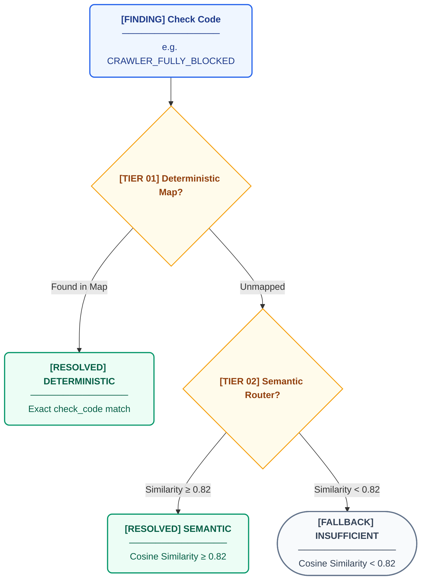

# Evidence, Claims, and Findings Model

This document covers the evidence graph and knowledge resolution mechanics of the Citeable/AREOS system. It details how knowledge is stored, how findings are wired to claims, and how the QA gate validates recommendations.

## Object Type Definitions

All core knowledge graph entities are defined as Pydantic models in `areos/kb/models.py`.

### KnowledgeRecord
The foundational unit of knowledge within the system.
- `kid` (str): Unique knowledge ID (e.g., "KT-001")
- `type` (Literal['FACT', 'STANDARD', 'FINDING', 'UNCERTAINTY', 'GUIDANCE']): Type of claim
- `scope` (str | None): Domain category (e.g., "crawl-access")
- `statement` (str): The atomic claim statement
- `context` (str | None): Additional clarifying context
- `status` (Literal['active', 'contested', 'deprecated', 'archived']): Lifecycle status
- `confidence` (Literal['high', 'medium', 'low']): Confidence rating
- `support` (str): Degree of support (e.g., 'partial', 'strong')
- `aeog_phases` (list[str]): Relevant audit phases
- `check_links` (list[dict]): Associated check code metadata
- `evidence_ids` (list[str]): Linked evidence IDs
- `uncertainty` (str | None): Expressed uncertainty or gaps
- `contradiction` (str | None): Details on conflicting information
- `guidance` (GuidanceDetail | None): Associated remediation guidance
- `relationships` (list[dict]): Related records (e.g., supersedes)
- `provenance` (dict): Origin, last verified dates, and review schedules
- `history` (list | dict): Change history log
- `priority_score` (int | None): Sorting precedence

### EvidenceRecord
Binds a knowledge record to a source.
- `eid` (str): Unique evidence ID (e.g., "EV-001")
- `kid` (str): The knowledge ID it supports/contradicts
- `sid` (str): The source ID it cites
- `relationship` (str): Relationship type (default: 'supports')
- `weight` (str): Evidence weight (default: 'primary')
- `note` (str): Context on how the source relates to the claim

### SourceRecord
The external reference or document.
- `sid` (str): Unique source ID (e.g., "SRC-001")
- `url` (str | None): URL to the source
- `title` (str | None): Source title
- `publisher` (str | None): Publishing entity
- `authority` (str): Tier rating (e.g., 'T1', 'T2', default 'T3')
- `pub_date` (str | None): Publication date
- `excerpt` (str | None): Relevant quote
- `notes` (str | None): Additional context or limitations

### GuidanceDetail
Actionable advice embedded in a record.
- `problem` (str): What goes wrong
- `action` (str): How to fix it
- `rationale` (str): Why to fix it (often references another `kid`)
- `tech_context` (str | list): Technical implementation details
- `examples` (list[str]): Code or configuration examples
- `check_codes` (list[str]): Linked detector codes

### CheckCodeMapping
Explicit map between a detector code and knowledge.
- `check_code` (str): Detector identifier
- `kid` (str): Associated knowledge record
- `priority_score` (int): Precedence when multiple records match

### Resolution
The result returned by the Knowledge Router (`areos/kb/router.py`).
- `path` (Literal['DETERMINISTIC', 'SEMANTIC', 'INSUFFICIENT', 'DEPRECATED']): Routing strategy used
- `primary_kid` (str | None): The main resolved knowledge ID
- `primary_record` (KnowledgeRecord | None): The loaded record
- `guidance` (GuidanceDetail | None): Associated guidance
- `backing_facts` (list[KnowledgeRecord]): Records backing the rationale
- `evidence_chain` (list[EvidenceRecord]): The list of evidence records
- `source_citations` (list[SourceRecord]): The resolved sources
- `enrichment` (list[dict]): Related semantic findings (RAG tier 2)
- `priority_score` (int): Inherited priority
- `is_contested` (bool): True if `status` is 'contested'
- `contested_reason` (str | None): The `contradiction` field
- `is_stale` (bool): True if `review_due` is past
- `stale_since` (str | None): Date it became stale
- `rag_available` (bool): Whether embeddings were available during resolution
- `confidence_score` (float | None): Cosine similarity score for semantic path

## Evidence Chain Diagram


## 3-Tier Knowledge Resolution

The Knowledge Router (`areos/kb/router.py`) maps automated findings (check codes) to backing claims using a 3-tier strategy:



1. **Tier 1: Deterministic Lookup:** Checks `kb_check_code_map` for an explicit link to an active record. If found, returns path `DETERMINISTIC`.
2. **Tier 2: Semantic Search (RAG Primary & Enrichment):** If unmapped, falls back to vector search against `kb_embeddings` using the check code and finding description.
   - Requires similarity `>= THRESHOLD_PRIMARY` (0.82 default, model-calibrated) to select a primary record (`SEMANTIC`).
   - Gathers related records with similarity `>= THRESHOLD_ENRICHMENT` (0.70 default) into the `enrichment` array.
3. **Tier 3: Cross-Phase Search:** (via `cross_phase_search`) Queries `THRESHOLD_CROSS_PHASE` (0.75 default) using combined descriptions of multiple findings to find bridge knowledge.
4. **Fallback:** If no matches meet thresholds or embeddings are unavailable, returns path `INSUFFICIENT`.

Graceful degradation is supported if the BYOK API key is absent (`rag_available=False`).

## Check Code Mapping Format

The deterministic map (`areos/kb/check_code_to_knowledge_map.json`) structures explicit check-to-knowledge relationships:

```json
{
  "AUDIT_PHASE_CRASHED": {
    "guidance_record": "KT-124",
    "backing_records": [
      "KT-033"
    ]
  }
}
```
During the build pipeline (`areos/kb/build_kb.py`), this JSON is parsed to populate `kb_check_code_map`. The `guidance_record` is inserted with high priority, and `backing_records` (TR-202) are given lower priority (max 1, priority - 5).

## QA Gate Logic

The QA Gate (`areos/auditors/qa_gate.py`) is a deterministic, non-LLM safety check that runs before a `RemediationPlan` is presented to a user.

**Checks performed:**
- Ensures every non-manual recommendation maps to a valid `claim_id`.
- Validates the `claim_id` against the live SQLite `claims` table.

**Rejection criteria:**
1. `claim_id` is `None` or empty.
2. The claim does not exist in the database (UNKNOWN_DB_ERROR or not found).
3. The claim `status` is in `REJECTED_STATUSES` (`"deprecated"`, `"superseded"`, `"archived"`).

Any recommendation violating these rules is moved to `qa_rejected`. The QA Gate intentionally fails loudly rather than silently passing bad recommendations.

## Knowledge Governance

Governance is enforced by `areos/kb/GOVERNANCE_RULES.md`:

- **Atomicity:** A knowledge record must assert exactly *one* thing. Records containing multiple independent assertions must be split.
- **Entering Claims:** New records require at least one T1–T3 source. T5 (LLM synthesis) is never acceptable as independent evidence.
- **Contested Knowledge:** If sources disagree, neither is dropped. The `status` is set to `contested`, and the `contradiction` field explicitly describes the conflict.
- **Staleness & Review Due:** `provenance.review_due` specifies the next review date. If past due, the router flags the resolution as `is_stale=True`. Any updates must modify `last_verified_at` and log a note in `history`.

## JSONL Corpus Format

### `knowledge.jsonl` Example
```json
{"kid": "KT-001", "type": "FACT", "scope": "crawl-access", "statement": "Google-Extended is a training-data control token, not a crawler used for Search or AI Overviews, and has zero impact on a site's inclusion or ranking in Google Search or in AI Overviews.", "context": "Directly contradicts the GOOGLE_EXTENDED_MISSING check code...", "aeog_phases": ["AP-03"], "stage_ids": [], "check_links": [{"check_code": "GOOGLE_EXTENDED_MISSING", "relationship": "contradicts", "note": "..."}], "status": "active", "confidence": "high", "support": "strong", "evidence_ids": ["EV-001", "EV-122"], "uncertainty": null, "contradiction": null, "remediation_link": null, "guidance": null, "relationships": [], "legacy_ids": ["CLM-026"], "provenance": {"origin": "phase3_research", "created_at": "2026-08-28", "created_by": "authoritative_review", "last_verified_at": "2026-08-29", "last_verified_by": "authoritative_review", "review_due": "2027-02-28"}, "history": [{"at": "2026-08-28", "by": "authoritative_review", "change": "Created", "prior_statement": null}]}
```

### `evidence.jsonl` Example
```json
{"eid": "EV-001", "kid": "KT-135", "sid": "SRC-003", "relationship": "supports", "weight": "primary", "note": "Direct quote from official Google documentation confirming training-only scope."}
```

### `sources.jsonl` Example
```json
{"sid": "SRC-001", "url": "https://openai.com/bot/", "title": "OpenAI Crawlers Documentation", "publisher": "OpenAI", "type": "official-platform-docs", "authority": "T1", "pub_date": null, "access_date": "2026-08-28", "section": "Bots overview", "excerpt": null, "notes": "Confirmed current canonical path; distinguishes GPTBot (training) from OAI-SearchBot (ChatGPT Search) and ChatGPT-User (user-directed fetch)...", "archived_url": null}
```

## Claim Types and Source Tiers

### Claim Types
From `models.py`:
- `FACT`: Verified technical or platform truths.
- `STANDARD`: Protocol definitions or legal requirements.
- `FINDING`: Empirical observations or research outcomes.
- `UNCERTAINTY`: Documented gaps or absence of information.
- `GUIDANCE`: Actionable remediation instructions.

### Source Tiers
From `GOVERNANCE_RULES.md`:
- **T1**: Official platform documentation (e.g., Google Search Central, OpenAI docs). Authoritative on *stated policy*.
- **T2**: Controlled independent research (e.g., Ahrefs controlled studies). Authoritative on *observed behavior/causation*.
- **T3**: Reputable practitioner research (e.g., Search Engine Land). Authoritative on *patterns*, subject to COI checks.
- **T4**: Vendor blog/marketing material. Acceptable for *product data*, not causal efficacy claims.
- **T5**: LLM synthesis/generated content. *Never* used as independent evidence.
