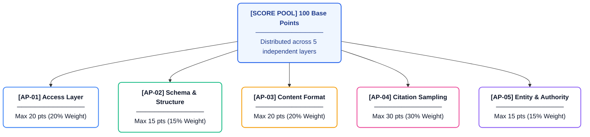
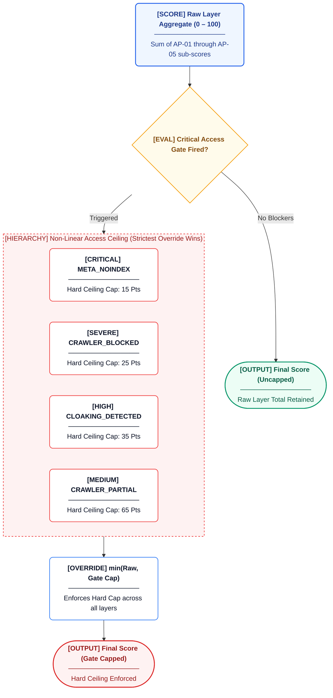
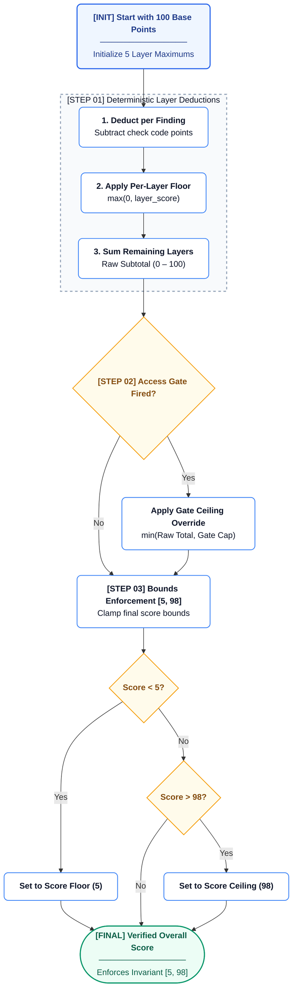

# Scoring Engine (Option B + C)

The AREOS Scoring Engine calculates the final AI Readiness Score using a 5-layer model (Option B) combined with an access gate cap (Option C). This replaces the legacy flat `100 - (errors×18) - (warnings×7)` formula.

## Core Implementation

### `compute_layered_score()`

**File**: [`areos/auditors/scoring.py`](file:///d:/07%20Transfer-20260727T165431Z-1-001/Antigravity%2026-07%20Transfer/AREOS_COMPLETE_WORKSPACE/areos/auditors/scoring.py)

```python
def compute_layered_score(findings: list[dict]) -> ScorecardResult
```

**Parameters:**
- `findings`: `list[dict]` - A list of finding dictionaries. Each dictionary must contain at least a `'code'` key. The `'message'` and `'page_url'` keys are also processed if present.

**Return Value:**
- `ScorecardResult` - A dataclass containing:
  - `overall_score`: `int` (5-98)
  - `sub_scores`: `dict[str, LayerScore]` - Breakdown per layer.
  - `access_gate_applied`: `bool` - True if an access gate capped the score.
  - `access_gate_cap`: `int | None` - The strict cap applied, if any.
  - `raw_layer_total`: `int` - The score before the access gate was applied.

## Layers

The 100 possible points are distributed across 5 layers. Each layer corresponds to a specific stage in the audit process.



| Layer ID | Label | Stage | Max Points | Rationale |
|----------|-------|-------|------------|-----------|
| `access` | Access | AP-01 | 20 | Prerequisite layer — AI crawlers must be able to reach the site. If blocked, all other layers are irrelevant. |
| `schema` | Schema & Structure | AP-02 | 15 | Structured data helps AI engines parse entity type, properties, and relationships. Table stakes — necessary but not sufficient. |
| `content` | Content Format | AP-03 | 20 | The #2 predictor of AI citation. If content cannot be chunked and fact-extracted, AI models cannot form a coherent brand description. |
| `citation` | Citation Sampling | AP-04 | 30 | Ground truth signal. Carries 30/100 because it directly measures the outcome AREOS exists to improve — whether AI models cite the brand. |
| `authority` | Entity & Authority | AP-05 | 15 | The #3 predictor. External consensus (Wikipedia entity, referring domains, brand mentions) is how AI models validate brand legitimacy. |

## Deduction Table (`LAYER_DEDUCTIONS`)

Below are all 59 check codes that deduct points, grouped by their corresponding layer.

### AP-01 Access (Layer: `access`)
| Check Code | Deduction |
|------------|-----------|
| `CRAWLER_FULLY_BLOCKED` | 20 |
| `CLOAKING_DETECTED` | 10 |
| `JS_CRITICAL_CONTENT_GATED` | 10 |
| `PAGE_FETCH_FAILED` | 10 |
| `NOSNIPPET_BLOCKING_AI` | 8 |
| `REDIRECT_CHAIN_EXCESSIVE` | 8 |
| `META_NOINDEX` | 8 |
| `AI_BOT_BLOCKED_HTTP` | 8 |
| `CRAWLER_PARTIAL` | 5 |
| `AUDIT_PHASE_CRASHED` | 5 |
| `CLOAKING_SUSPECTED` | 5 |
| `CLOAKING_FETCH_FAILED` | 5 |
| `REDIRECT_CHAIN_LONG` | 3 |
| `SITEMAP_MISSING` | 3 |
| `SITEMAP_EMPTY` | 2 |
| `SITEMAP_PAGES_UNREACHABLE` | 2 |
| `INVALID_CRAWL_DELAY` | 1 |
| `SITEMAP_NOT_IN_ROBOTS` | 1 |

### AP-02 Schema (Layer: `schema`)
| Check Code | Deduction |
|------------|-----------|
| `SCHEMA_MISSING` | 10 |
| `MISSING_TYPE` | 8 |
| `JSON_PARSE_FAILURE` | 7 |
| `MISSING_REQUIRED_FIELD` | 5 |
| `ENTITY_NAME_MISSING` | 5 |
| `MULTI_PAGE_SCHEMA_GAPS` | 5 |
| `CANONICAL_MISMATCH` | 4 |
| `MISSING_RECOMMENDED_FIELD` | 3 |
| `REDIRECT_DOMAIN_CHANGE` | 3 |
| `SAMEAS_DEAD_LINK` | 3 |
| `COMPETITOR_SCHEMA_ADVANTAGE` | 3 |
| `UNKNOWN_FIELD` | 2 |
| `UNKNOWN_SCHEMA_TYPE` | 2 |
| `CANONICAL_MISSING` | 2 |
| `SAMEAS_MISSING` | 2 |
| `WIKIDATA_MISSING` | 2 |
| `SAMEAS_INCOMPLETE` | 1 |

### AP-03 Content (Layer: `content`)
| Check Code | Deduction |
|------------|-----------|
| `EXTRACTABILITY_NONE` | 20 |
| `EXTRACTABILITY_LOW` | 12 |
| `ALL_CONTENT_IN_MEDIA` | 8 |
| `EXTRACTABILITY_MEDIUM` | 6 |
| `MULTI_PAGE_THIN_CONTENT` | 5 |
| `ANSWER_NOT_NEAR_TOP` | 4 |
| `ANSWER_NOT_SELF_CONTAINED` | 4 |
| `CONTENT_STALE` | 4 |
| `IFRAME_HEAVY` | 4 |
| `NEAR_DUPLICATE_PAGES` | 4 |
| `ANSWER_NOT_FACTUALLY_SPECIFIC` | 3 |
| `IMAGES_MISSING_ALT` | 3 |
| `COMPETITOR_CONTENT_ADVANTAGE` | 3 |
| `NO_LIST_OR_TABLE` | 2 |
| `CONTENT_AGING` | 2 |
| `DATE_MISSING` | 2 |
| `VIDEO_NO_TRANSCRIPT` | 2 |
| `SITEMAP_NO_LASTMOD` | 2 |

### AP-04 Citation (Layer: `citation`)
| Check Code | Deduction |
|------------|-----------|
| `CITATION_NOT_OBSERVED` | 30 |
| `CITATION_RATE_LOW` | 15 |
| `SHARE_OF_VOICE_LOW` | 10 |

### AP-05 Authority (Layer: `authority`)
| Check Code | Deduction |
|------------|-----------|
| `REFERRING_DOMAINS_CRITICAL` | 5 |
| `WIKIPEDIA_ENTITY_MISSING` | 5 |
| `BRAND_MENTIONS_STAGNANT` | 3 |

## Access Gate (`ACCESS_GATE`)

If critical blockers are found, the overall score is hard-capped, regardless of performance in other layers. If multiple gates trigger, the lowest cap (strictest) is applied.



| Check Code | Score Cap |
|------------|-----------|
| `CRAWLER_FULLY_BLOCKED` | 25 |
| `CLOAKING_DETECTED` | 35 |
| `CRAWLER_PARTIAL` | 65 |
| `META_NOINDEX` | 15 |

## Scoring Algorithm

The scoring algorithm operates via the following sequence:



1. Initialize `running_total` to `TOTAL_MAX` (100).
2. Initialize each layer to its maximum potential score.
3. Iterate over each finding in the `findings` list.
   - If the finding's `code` is not in `LAYER_DEDUCTIONS`, silently ignore it.
   - Retrieve the target `layer` and deduction `pts` for the `code`.
   - Calculate the `actual_pts` deducted: `min(pts, layer.score)` (Layer Floor Enforcement).
   - If the layer is already at `0`, continue.
   - Subtract `actual_pts` from the `layer.score` and `running_total`.
   - Record the deduction in the layer's ledger.
   - If the `code` is in `ACCESS_GATE`, compare its cap to the current `gate_cap` and keep the stricter (lower) cap.
4. Enforce Score Bounds: `raw_total = max(SCORE_FLOOR, min(SCORE_CEILING, running_total))` (`SCORE_FLOOR=5`, `SCORE_CEILING=98`).
5. Access Gate Enforcement: If a `gate_cap` was found and `raw_total > gate_cap`, set `overall_score = gate_cap`. Otherwise, `overall_score = raw_total`.

## Precision & Arithmetic

All score calculations use **integer arithmetic**. There is no floating point math and no rounding during the core calculation. Floating point is only used for calculating the percentage `pct` property of a `LayerScore` for display purposes.

## Edge Cases

- **Empty findings:** If no deductions occur, the score resolves to `SCORE_CEILING` (98), not 100.
- **All 59 codes fire:** Deductions would wipe out all layer scores, leading to a raw total of 0. Enforcing the floor results in a score of `SCORE_FLOOR` (5).
- **Multiple gate triggers:** The engine tracks the strictest triggered access gate and enforces the lowest possible cap.
- **Unknown check code:** Check codes not present in `LAYER_DEDUCTIONS` are silently ignored and cause no deductions.
- **Same check code fired twice:** The system processes each finding linearly. If a code fires twice, it deducts twice (assuming the layer has enough remaining points).

## Test Mapping

| Test Function | Test File | Invariant Verified | Source Being Tested |
|---------------|-----------|--------------------|---------------------|
| `test_phase2_codes_in_deductions` | `test_phase3_kb_scoring.py` | All Phase 2 codes mapped to deductions | `scoring.py` |
| `test_deductions_have_valid_layers` | `test_phase3_kb_scoring.py` | Deductions point to valid layers with > 0 pts | `scoring.py` |
| `test_score_floor_enforcement` | `test_phase3_kb_scoring.py` | `overall_score >= SCORE_FLOOR` (5) under max deductions | `scoring.py` |
| `test_cloaking_detected_in_gate` | `test_phase3_kb_scoring.py` | `CLOAKING_DETECTED` cap is 35 | `scoring.py` |
| `test_meta_noindex_in_gate` | `test_phase3_kb_scoring.py` | `META_NOINDEX` cap is 15 | `scoring.py` |
| `test_gate_caps_score` | `test_phase3_kb_scoring.py` | Overall score is capped by `ACCESS_GATE` values | `scoring.py` |
| `test_ci_semantic_parity_gate_passes` | `test_ci_semantic_parity.py` | 100% check codes sync across KB, scoring, snippets | System-wide Parity |

## Scoring Invariants

The following mathematical invariants must always hold true post-computation:

- `5 ≤ score ≤ 98`
- `0 ≤ layer_score ≤ layer_max`
- `∑ LAYERS[*].max = 100`
- `gate_triggered → score ≤ cap`
