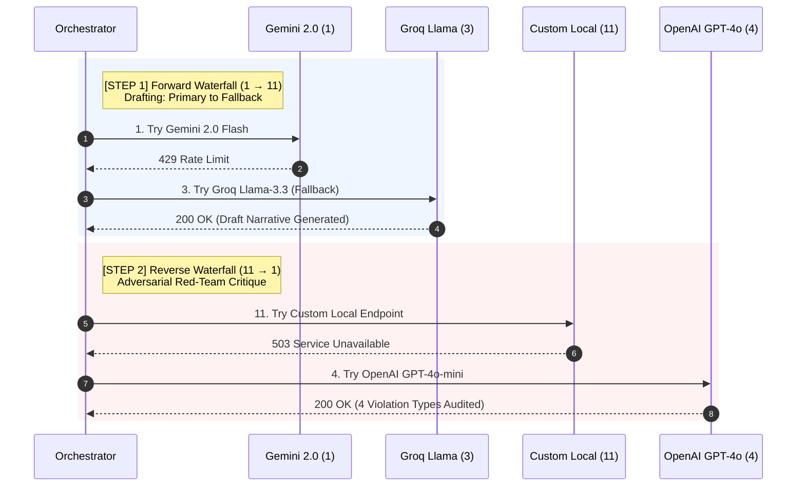
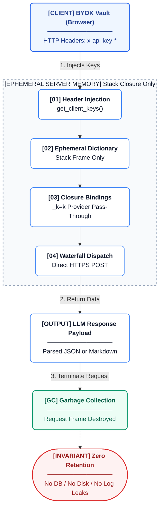
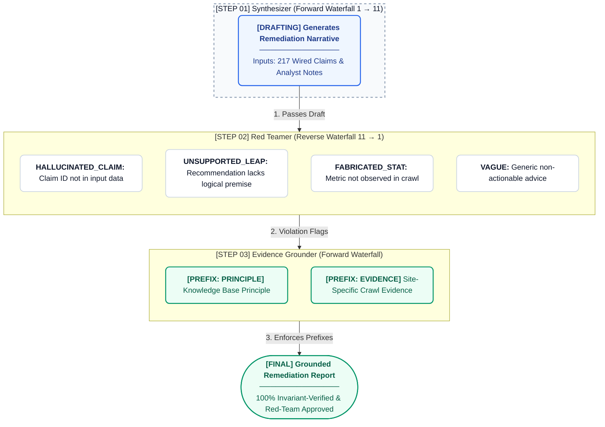
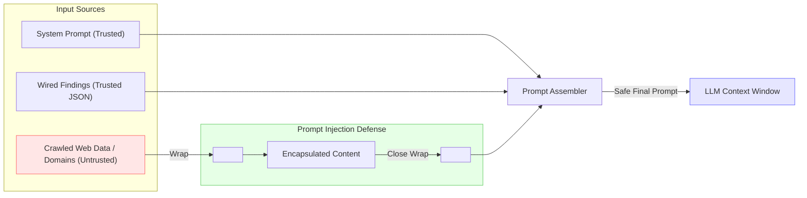

# AI/LLM Subsystem

This document outlines the architecture, inventory, and strict boundaries of Large Language Model (LLM) integration within the AREOS engineering system.

## Provider Waterfall Implementation

AREOS employs a zero-dependency (pure `requests.post`), highly resilient LLM waterfall architecture designed for BYOK (Bring Your Own Key) operation. 

### Waterfall Resolution
The list of active providers is built dynamically by `_build_waterfall()` in `areos/llm/providers/__init__.py`. Resolution prioritizes client-supplied keys (from HTTP request headers) over server environment variables. The ordered list is as follows:

1. **Gemini 2.0 Flash** (`x-api-key-google` / `AREOS_GEMINI_KEY_1`)
2. **Gemini 2.0 Flash** (Rotation key: `AREOS_GEMINI_KEY_2`)
3. **Groq llama-3.3-70b** (`x-api-key-groq` / `AREOS_GROQ_KEY`)
4. **OpenAI gpt-4o-mini** (`x-api-key-openai` / `OPENAI_API_KEY`)
5. **Anthropic Claude** (`x-api-key-anthropic` / `ANTHROPIC_API_KEY`) - Defaults to `claude-haiku-4-5`.
6. **Perplexity Sonar** (`x-api-key-perplexity` / `PERPLEXITY_API_KEY`)
7. **xAI Grok** (`x-api-key-xai` / `XAI_API_KEY`)
8. **Mistral** (`x-api-key-mistral` / `MISTRAL_API_KEY`)
9. **DeepSeek** (`x-api-key-deepseek` / `DEEPSEEK_API_KEY`)
10. **Azure OpenAI** (`x-api-key-azure` & `x-api-base-azure` / `AZURE_OPENAI_KEY` & `AZURE_OPENAI_BASE`)
11. **Ollama / Custom** (`x-api-key-custom` & `x-api-base-custom` / `CUSTOM_LLM_BASE`)

### Waterfall Execution

- **Forward Waterfall (`complete()`)**: Tries providers sequentially (1 → 11). Used for synthesis, extraction, and generation.
- **Reverse Waterfall (`complete_adversarial()`)**: Tries providers in reverse order (11 → 1). Used for adversarial critique and red-teaming to ensure cognitive diversity and prevent "model agreement" bias.



### Error Handling & Mitigation
The HTTP client wrapper (`_make_request()`) handles errors gracefully to ensure continuous execution:
- **429 Rate Limit**: Exponential backoff (2s, 4s, 8s) before falling back to the next provider.
- **401/403 (Auth/Credits) & 402**: Instant skip to next provider.
- **400 Content Filter**: Parses response; if safety violation keywords are found, skips to the next provider.
- **404 Model Not Found**: Treated as unavailable, skips.
- **500/503/504 Server Error**: Retries once after 2 seconds, then skips.
- **Network Timeout / Connection / SSL Errors**: Instant skip. **NEVER** uses `verify=False` for SSL.
- **Malformed JSON 200 Responses**: Caught and skips to the next provider (fixed a prior critical bug).

### Time Budget
A global time budget of **25.0s default** is enforced across the entire waterfall sweep (`time_budget_seconds`). The remaining time is calculated per provider, allocating a minimum of 1s and a maximum of 30s for any single HTTP request.

## BYOK Key Lifecycle



Client keys are passed via HTTP headers (e.g., `x-api-key-openai`). In `areos/api/dependencies.py`, the `get_client_keys()` dependency extracts these into an in-memory dictionary. 

The waterfall builder (`_build_waterfall()`) injects the keys into the provider callables as closure variables (e.g., `_k=k`). 
**Security Guarantee:** Keys are held exclusively in memory. They are **never** written to disk, databases, logs, or error traces. The dictionary and closures are garbage collected when the request cycle completes.

## 3-Step Synthesis Pipeline

The primary reporting narrative is generated through a highly constrained 3-step pipeline in `areos/llm/synthesis_pipeline.py`. 



1. **Synthesizer (Forward Waterfall)**
   - **Purpose**: Draft an initial remediation narrative based strictly on automated findings.
   - **Input**: Target domain and a JSON array of deterministic findings containing `claim_id`, `check_code`, and V2 evidence.
   - **Constraints**: Cannot introduce outside claims; must use exact `claim_id` citations.

2. **Red Teamer (Reverse Waterfall)**
   - **Purpose**: Adversarially audit the Synthesizer's draft. Uses a different model via the reverse waterfall to detect hallucinations.
   - **Input**: The draft narrative and the original array of valid `claim_ids`.
   - **Flags Checked**:
     - `HALLUCINATED_CLAIM`: Citing a `claim_id` not present in the input.
     - `UNSUPPORTED_LEAP`: Recommendation does not logically follow from the cited claim.
     - `FABRICATED_STAT`: A percentage or metric not present in the input data.
     - `VAGUE`: Generic advice lacking domain-specific action.

3. **Grounder (Forward Waterfall)**
   - **Purpose**: Rewrite the narrative based on the Red Teamer's flags.
   - **Input**: Draft narrative, original findings, and JSON array of adversarial flags.
   - **Behavior**: Strips fabricated data and hallucinated claims. Applies `[Knowledge Base Principle]` or `[Site-Specific Evidence]` prefixes depending on the scope. Outputs final prose.

## Complete LLM Interaction Inventory

| # | Call Site | File:Function | Provider Selection | Purpose | Input | Output | Structured? | Timeout | Fallback |
|---|---|---|---|---|---|---|---|---|---|
| 1 | Synthesizer | `areos/llm/synthesis_pipeline.py:run_llm_synthesis` | Forward Waterfall | Draft narrative | Findings JSON, Target domain | Prose | No | 25s global | Returns False flag |
| 2 | Red Teamer | `areos/llm/synthesis_pipeline.py:run_llm_synthesis` | Reverse Waterfall | Critique draft | Draft prose, `claim_ids` | JSON Flags | Yes (JSON) | 25s global | Empty array `[]` |
| 3 | Grounder | `areos/llm/synthesis_pipeline.py:run_llm_synthesis` | Forward Waterfall | Final rewrite | Draft, Flags, Findings | Prose | No | 25s global | Returns original draft |
| 4 | Extractability Judge | `areos/auditors/extractability_judge.py:judge_page` | Forward Waterfall | Rate page content | Page signals JSON | JSON Label | Yes (JSON) | 25s global | Heuristics / "medium" |
| 5 | Adversarial Persona | `areos/services/adversarial_service.py:generate_critique` | Reverse Waterfall | Critique artifacts | Artifact text, Persona prompt | Markdown | No | 25s global | Error string |
| 6 | Research Extractor | `areos/services/research_service.py:_extract_candidates` | Forward Waterfall | Extract KB claims | Fetched web text, metadata | JSON claims | Yes (JSON) | 25s global | Empty array `[]` |
| 7 | Citation Sampler | `areos/auditors/citation_sampler.py:sample_citations` | Direct API (`perplexity` / `gemini`) | Measure citation frequency | Prompts | JSON wrapper | Yes | 30s per API | `obs.error` appended |
| 8 | Embeddings | `areos/kb/embeddings.py:embed` | Custom Waterfall | Generate vectors | Text string | Float array | Yes (Float) | 15s per API | `EmbeddingUnavailable` |

## Influence Boundaries: What AI Can and Cannot Do

To maintain a deterministic and auditable system, LLMs are restricted in their capabilities. 

### ALLOWED (Generative & Semantic Operations)
- **Synthesis Narrative**: The prose presentation of the final report (`synthesis_pipeline.py`).
- **Red-Team Flags**: Identifying hallucinations within the generated draft.
- **Grounded Rewrites**: Editing text to strictly match supplied JSON contexts.
- **Citation Frequency**: Generating programmatic API probes to test live Answer Engines (`citation_sampler.py`).
- **Extractability Judgment**: Estimating if a page's content is easily chunkable for RAG systems (`extractability_judge.py`).
- **Research Extraction**: Parsing unstructured web text to extract candidate claims (`research_service.py`).
- **Semantic Diff / Embeddings**: Using vector embeddings to match findings against the KB (`kb/embeddings.py`).

### NOT ALLOWED (Deterministic Core Operations)
- **Scores**: Priority scores are determined exclusively by the database (`kb_check_code_map`) or hardcoded dictionaries (`synthesis_engine.py`).
- **Schema Validation**: Verified programmatically by `pydantic` or Python dict schema validation, never by an LLM.
- **Claim Status**: The research service can draft a candidate as "active", but it is stored as a candidate and requires manual ratification.
- **Check Code Assignment**: Findings and recommendations are mapped deterministically.
- **Wizard Cards**: Instruction UI cards for manual review are fully deterministic.
- **QA Gate**: The QA rejection of missing claims (`synthesis_engine.py:_build_automated_recommendations`) operates on DB records, not LLM judgments.

## Prompt Security

To prevent prompt injection from crawled web content, untrusted inputs (e.g., target domains, scraped text) injected into prompts are securely fenced using `<untrusted_crawled_data>` XML tags. This acts as a clear boundary for the LLM context window.



Example in `synthesis_pipeline.py`:
```python
f"Domain under audit: <untrusted_crawled_data>{safe_target_domain}</untrusted_crawled_data>\n\n"
f"Wired findings (deterministic, claim-cited):\n<untrusted_crawled_data>{safe_findings}</untrusted_crawled_data>\n\n"
```
The tags ensure the model does not interpret embedded commands as system instructions.
