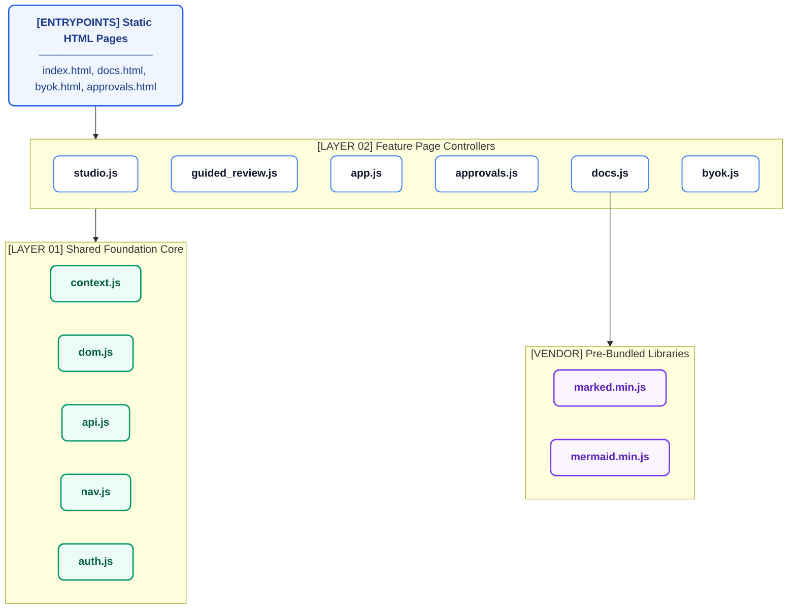

# 08 - Frontend Architecture

The Citeable/AREOS frontend is built as a highly optimized, vanilla JavaScript single-page application architecture spanning multiple static HTML pages. It strictly avoids build steps, bundlers, or npm dependencies, opting instead for pre-bundled vendor libraries and native browser APIs.

## Module Inventory

| Module | Size | Purpose | Dependencies | API Calls | State (localStorage/sessionStorage) |
| --- | --- | --- | --- | --- | --- |
| `api.js` | 3.3KB | Centralized fetch wrapper, auth headers injection, toast notifications. | None | `window.fetch` wrapper | Reads `AreosContext` |
| `app.js` | 18.8KB | Claims Explorer UI logic, search/filtering, modals. | `auth.js`, `dom.js`, `api.js`, `context.js` | `/claims`, `/claims/ingest` | Reads/writes `areos_pins_*`, `areos_filters_*` |
| `approvals.js` | 23.1KB | Approvals Queue UI logic and batch processing. | `api.js`, `dom.js`, `context.js` | `/approvals`, `/approvals/batch` | None |
| `auth.js` | 2.4KB | Admin authentication utility and token management. | None | None | Reads `areos_api_token` (sessionStorage) |
| `byok.js` | 20.6KB | BYOK (Bring Your Own Key) Vault UI, AES-GCM encryption logic. | `dom.js`, `context.js` | None | Reads/writes `areos_byok_vault` |
| `context.js` | 1.1KB | App-wide context singleton. | None | None | Reads/writes `areos_analyst_id`, `areos_last_domain`, `areos_active_run_id` |
| `docs.js` | 33.1KB | Documentation rendering, markdown parsing, and mermaid integration. | `vendor/marked.min.js`, `vendor/mermaid.min.js` | `/docs/*` | None |
| `dom.js` | 5.4KB | Safe DOM utilities, XSS prevention (`escapeHtml`, `safeUrl`), accessibility (`makeDialogAccessible`). | None | None | None |
| `guided_review.js`| 32.3KB| Wizard stepper for guided review workflow. | `dom.js`, `api.js`, `context.js` | `/review/next`, `/review/submit` | None |
| `help.js` | 11.9KB | Contextual help and documentation panels. | `dom.js` | None | None |
| `identity.js` | 5.4KB | Analyst identity selection modal logic. | `context.js`, `dom.js` | None | Reads/writes `areos_analyst_id` |
| `knowledge_explorer.js`| 15.8KB| Knowledge Base explorer UI and search interface. | `api.js`, `dom.js`, `context.js` | `/knowledge` | None |
| `manual_review.js`| 15.0KB| Interface for detailed manual review of claims. | `api.js`, `dom.js` | `/review/manual` | None |
| `nav.js` | 19.8KB | Global sidebar navigation, Cmd+K palette, Admin auth modal. | `auth.js`, `api.js` | `/api/v1/knowledge` (search) | Reads `areos_api_token` (sessionStorage) |
| `outcome.js` | 6.5KB | End-of-run outcome and synthesis reporting UI. | `api.js`, `dom.js` | `/outcome` | None |
| `prompts.js` | 4.6KB | Interface for designing system prompts (Admin-only). | `api.js`, `dom.js`, `auth.js`| `/prompts` | None |
| `remediation.js` | 12.7KB | Remediation and fix-proposal UI. | `api.js`, `dom.js` | `/remediation` | None |
| `studio.js` | 64.9KB | Main Audit Studio orchestration and UI state machine. | `api.js`, `dom.js`, `context.js`, `guided_review.js`| `/audit/start`, `/audit/status`| None |
| `synthesis_prompts.js`| 4.9KB | Synthesis prompt configuration interface (Admin-only).| `api.js`, `dom.js`, `auth.js`| `/synthesis/prompts` | None |

## Page Inventory

| Page | URL Path | JS Modules Loaded | Purpose | Admin-Only? |
| --- | --- | --- | --- | --- |
| Audit Studio | `/index.html` | `vendor/marked.min.js`, `context.js`, `help.js`, `identity.js`, `api.js`, `dom.js`, `nav.js`, `auth.js`, `guided_review.js`, `studio.js` | Primary domain audit orchestration and review flow. | No |
| Knowledge Explorer | `/knowledge_explorer.html` | `context.js`, `identity.js`, `api.js`, `dom.js`, `nav.js`, `auth.js`, `knowledge_explorer.js` | Explore and search the unified knowledge base. | No |
| Approvals | `/approvals.html` | `context.js`, `identity.js`, `api.js`, `dom.js`, `nav.js`, `auth.js`, `approvals.js` | Review and approve/reject claims. | Partially (Admin functions) |
| Documentation | `/docs.html` | `vendor/marked.min.js`, `vendor/mermaid.min.js`, `context.js`, `auth.js`, `identity.js`, `api.js`, `dom.js`, `nav.js`, `docs.js` | View system and architectural documentation. | No |
| Prompt Design | `/prompts.html` | `context.js`, `identity.js`, `api.js`, `dom.js`, `nav.js`, `auth.js`, `prompts.js` | Configure system prompts. | Yes |
| Synthesis Prompts | `/synthesis_prompts.html` | `context.js`, `identity.js`, `api.js`, `dom.js`, `nav.js`, `auth.js`, `synthesis_prompts.js` | Configure synthesis specific prompts. | Yes |
| Case Study | `/case_study.html` | `context.js`, `identity.js`, `api.js`, `dom.js`, `nav.js` | View internal case studies and cross-references. | Yes |
| BYOK Vault | `/byok.html` | `context.js`, `auth.js`, `identity.js`, `api.js`, `dom.js`, `nav.js`, `byok.js` | Manage client-side AI keys. | No |
| Claims Browser | `/claims_browser.html` | `context.js`, `identity.js`, `api.js`, `dom.js`, `nav.js`, `auth.js`, `app.js` | Explore individual claims and propose edits. | No |

## Module Dependency Graph

## State Management

State is managed without global stores like Redux, instead leaning heavily on native web storage APIs and a lightweight context singleton.

### `window.AreosContext` (`context.js`)
A centralized singleton handling application-wide state:
- `analystId`: Current user identity.
- `activeRoute`: Current URL path.
- `lastDomain`: Most recently audited domain.
- `activeRunId`: Current audit run context for scoped operations.

### Storage Layers

#### `sessionStorage`
- `areos_api_token`: Temporary admin authentication token. If present, unlocks admin-only pages and functionality.

#### `localStorage`
- `areos_analyst_id`: Persistent analyst identity string.
- `areos_byok_vault`: Encrypted JSON vault containing Bring Your Own Key API credentials.
- `areos_pins_<analystId>`: JSON array of pinned claim IDs.
- `areos_filters_<analystId>`: JSON object of last-used UI filter states.
- `areos_last_domain`: The last audited domain to auto-populate fields.
- `areos_active_run_id`: The ID of the currently active audit run, used to persist run context across page reloads.

## Navigation System

Implemented in `nav.js`, the navigation system is fully client-side but relies on standard HTML routing (multi-page app architecture).

### Sidebar Rendering
The sidebar dynamically renders navigation links based on user role and context. The `window.AreosNav` object injects links into the DOM element with ID `main-nav`. Links include:
- **Workflow Items**: Audit Studio, Knowledge Explorer, Approvals Queue.
- **Config Items**: Documentation, Prompt Design, Synthesis Prompts, Case Study.
- **Dynamic Context**: An active run chip is injected into the topbar if `activeRunId` exists.

### Command Palette (Cmd+K)
Pressing `Cmd+K` or `Ctrl+K` opens a global search modal overlay. 
- Searches across defined `ROUTES` for quick page navigation.
- If the query exceeds 2 characters, fires a request to `/api/v1/knowledge` to surface claims directly in the palette.

### Admin Authentication (Cmd+Shift+A)
Pressing `Cmd+Shift+A` or `Ctrl+Shift+A` opens the Admin Authentication modal. 
- Takes an administrative key to unlock admin-only routes.
- Routes like `prompts.html`, `synthesis_prompts.html`, and `case_study.html` are excluded from the sidebar rendering unless `areos_api_token` exists in `sessionStorage`.

## Key User Flows

1. **Audit Flow**: 
   `index.html` (Audit Studio) -> User inputs target domain -> `studio.js` orchestrates run creation -> Triggers `guided_review.js` stepper UI -> Results presented -> Transition to Synthesis.
2. **Review Flow**:
   Within the `guided_review.js` wizard -> Cards presented -> Analyst selects verdict (1-4) -> Inputs observation -> Transitions to next card -> Completes queue -> Triggers synthesis.
3. **Governance Flow**: 
   `claims_browser.html` -> User searches claims -> Clicks "Propose Edit" -> Opens editor modal -> Submits change to Approval Queue (`/claims/ingest`) -> `approvals.html` -> Admin reviews pending edits -> Approves/Rejects.
4. **BYOK Flow**:
   `byok.html` -> User inputs API key -> Key is encrypted and stored in `localStorage.areos_byok_vault` -> `nav.js` injects the BYOK indicator in the sidebar footer -> Keys are dynamically injected into headers via `api.js` interceptors during execution.

## Design System

Defined in `index.css`, the UI employs a clinical "Restraint Architecture" (Linear × Stripe Sigma Precision style).

### Custom Properties (Tokens)
- **Colors**: 90% Neutral Grayscale (`#F8FAFC` canvas, `#FFFFFF` panels). 10% Surgical Sapphire accents (`--brand-500: #0A66C2`).
- **Typography**: Inter (sans/body), JetBrains Mono (monospace), Plus Jakarta Sans (display). Modular scale from `text-2xs` (11px) to `text-3xl` (36px).
- **Spacing**: 4px base spatial rhythm (`--space-1` to `--space-8`).
- **Radii**: Strict 5-tier scale (`--radius-xs` 4px to `--radius-xl` 16px).
- **Status Colors**: WCAG AAA compliant semantic colors (`--status-success`, `--status-warning`, `--status-danger`, `--status-info`, `--status-neutral`).
- **Glassmorphism**: Utilized in modals and floating palettes using `backdrop-filter: blur()`.

## Accessibility

- **Safe Dialogs**: `dom.js` provides `makeDialogAccessible()`, which enforces `role="dialog"`, traps focus within the modal, supports `Escape` to close, and restores focus to the triggering element upon close.
- **Keyboard Navigation**: 
  - `j` / `k` (or `ArrowDown` / `ArrowUp`) for list navigation (Vim style).
  - `Enter` to expand/select.
  - `1-4` numeric keys for quick verdict selection in the Guided Review flow.

## Build Architecture

The frontend is strictly Vanilla JS with no build step, no framework (React/Vue), and no bundler (Webpack/Vite). All third-party dependencies are pre-bundled and served from `vendor/` (e.g., `marked.min.js`, `mermaid.min.js`). The code utilizes modern ES features natively supported by modern browsers.
