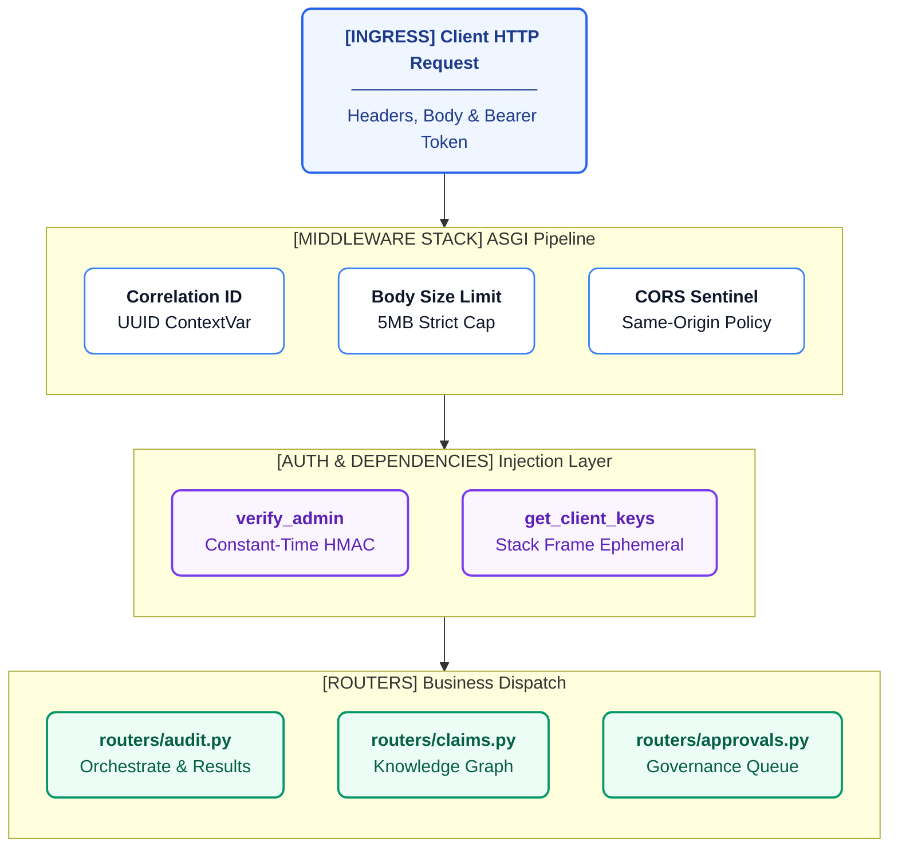

# AREOS API Reference

This document provides a complete inventory of the AREOS API endpoints, data models, middleware mechanisms, and error handling as defined in the FastAPI router files.

## Request Routing Architecture



## Global Mechanisms

### Authentication & BYOK Dependencies

AREOS implements two forms of API protection depending on the functional area:

1. **System Administration (Admin Token)**
   Admin authentication is required for endpoints that modify system configuration, knowledge models, or prompts. The `verify_admin` dependency (in `areos/api/dependencies.py`) enforces this. 
   - Uses constant-time comparison (`hmac.compare_digest`) against the `AREOS_API_TOKEN` environment variable.
   - Requires the header: `Authorization: Bearer <TOKEN>`

2. **Bring Your Own Key (BYOK) Inference**
   Audit orchestration endpoints rely on client-provided API keys injected directly into headers rather than stored centrally. The `get_client_keys` dependency extracts these from headers matching the pattern `x-api-key-{provider}` and `x-api-base-{provider}`.

### Rate Limiting

Rate limiting is enforced at the ASGI level using in-memory state locks and sliding windows. This protects expensive backend processes and API quotas:

| Functional Area | Scope | Limit | Window | Enforced By |
| --- | --- | --- | --- | --- |
| Audit Orchestration | `orchestrate:{ip}` | 3 requests | 60 seconds | `audit.py:check_rate_limit` |
| Domain Authority Check | `authority:{ip}` | 3 requests | 60 seconds | `audit.py:check_authority_rate_limit` |
| BYOK Verification | `{ip}` | 15 requests | 60 seconds | `byok.py:check_byok_rate_limit` |

### Idempotency

Idempotency guarantees are implemented for critical mutation endpoints (primarily `POST /audit/runs`) using `areos/util/idempotency.py`. 
- **Mechanism:** The client provides an `Idempotency-Key` header. `with_idempotency` inserts a pending sentinel (`IDEMPOTENCY_IN_PROGRESS` with HTTP 202) into the `idempotency_keys` table. 
- **Conflict Handling:** If a subsequent request arrives while the original is processing, a `409 Conflict` is returned. Once complete, the table is updated with the final HTTP status and JSON response body, which is served transparently on subsequent requests with the same key.

### Error Response Format

Errors follow a standardised response schema mapping to `areos/api/error_codes.py`:

```json
{
  "detail": "Human readable error message",
  "code": "ERROR_CODE_CONSTANT"
}
```

Standard error codes include: `INTERNAL_ERROR`, `VALIDATION_ERROR`, `NOT_FOUND`, `UNAUTHORIZED`, `SSRF_BLOCKED`, `IDEMPOTENCY_IN_PROGRESS`, etc.

### Static File Serving

The user interface and documentation are served natively by the FastAPI application (`areos/api/main.py`):
- **`/docs`**: Mounts `StaticFiles` pointing to `areos/ui/docs` (HTML mode enabled).
- **`/`**: Mounts `StaticFiles` pointing to `areos/ui` for the primary SPA dashboard.

---

## Complete Endpoint Inventory

### 1. Audit Execution
Endpoints orchestrating and managing the core pipeline. Defined in `areos/api/routers/audit.py`.

| Method | Path | Auth | Rate Limit | DB Mutations | Errors |
|---|---|---|---|---|---|
| `POST` | `/api/v1/audit/orchestrate` | None | 3/60s | Mutates `audit_runs`, findings | 400, 429 |
| `POST` | `/api/v1/audit/runs` | None | None | Inserts `audit_runs` | 409 (Idempotency) |

### 2. Audit Results
Endpoints for retrieving runs and historical data. Defined in `areos/api/routers/audit.py`.

| Method | Path | Auth | Rate Limit | DB Mutations | Errors |
|---|---|---|---|---|---|
| `GET` | `/api/v1/audit/runs` | None | None | None | - |
| `GET` | `/api/v1/audit/runs/{run_id}` | None | None | None | 404 |
| `GET` | `/api/v1/audit/runs/{run_id}/full` | None | None | None | 404 |
| `GET` | `/api/v1/audit/runs/{run_id}/full-report` | None | None | None | 404 |
| `GET` | `/api/v1/audit/authority/{target_domain}` | None | 3/60s | None | 429 |

### 3. Manual Review
Endpoints for capturing auditor observations and final verdicts.

| Method | Path | Auth | Rate Limit | DB Mutations | Implementation |
|---|---|---|---|---|---|
| `POST` | `/api/v1/audit/runs/{run_id}/observations` | None | None | Mutates `manual_verdicts` | `audit.py` |
| `POST` | `/api/v1/audit/runs/{run_id}/verdicts` | None | None | Mutates `manual_verdicts`, `audit_runs` status | `verdicts.py` |
| `POST` | `/api/v1/audit/runs/{run_id}/synthesize` | None | None | Updates `audit_runs` (AI synthesis cache) | `audit.py` |

### 4. Knowledge Base
Searching, browsing, and statistics for the underlying knowledge graph. Defined in `areos/api/routers/knowledge.py`.

| Method | Path | Auth | DB Mutations | Errors |
|---|---|---|---|---|
| `GET` | `/api/v1/knowledge` | None | None | - |
| `GET` | `/api/v1/knowledge/stats` | None | None | - |
| `GET` | `/api/v1/knowledge/{kid}` | None | None | 404 |
| `GET` | `/api/v1/knowledge/{kid}/evidence` | None | None | 404 |
| `GET` | `/api/v1/knowledge/check-code/{check_code}`| None | None | 404 |

### 5. Governance
Claims ingestion and administrator approvals. Defined in `areos/api/routers/claims.py` and `approvals.py`.

| Method | Path | Auth | DB Mutations | Errors |
|---|---|---|---|---|
| `GET` | `/api/v1/claims` | None | None | - |
| `POST` | `/api/v1/claims/ingest` | `verify_admin` | Inserts `claims` | 401 |
| `GET` | `/api/v1/approvals` | `verify_admin` | None | 401 |
| `POST` | `/api/v1/approvals/{run_id}/{candidate_id}`| `verify_admin` | Mutates approved claims | 401 |

### 6. Configuration
Admin configuration of system prompts and BYOK key testing.

| Method | Path | Auth | DB Mutations | Implementation |
|---|---|---|---|---|
| `GET` | `/api/v1/prompts` | None | None | `prompts.py` |
| `POST` | `/api/v1/prompts` | `verify_admin` | Inserts `prompts` | `prompts.py` |
| `DELETE`| `/api/v1/prompts/{prompt_id}` | `verify_admin` | Deletes `prompts` | `prompts.py` |
| `GET` | `/api/v1/synthesis/prompts` | `verify_admin` | None | `synthesis.py` |
| `PUT` | `/api/v1/synthesis/prompts/{step}` | `verify_admin` | Updates `synthesis_prompts` | `synthesis.py` |
| `POST` | `/api/v1/synthesis/prompts/reset/{step}` | `verify_admin` | Updates `synthesis_prompts` | `synthesis.py` |
| `POST` | `/api/v1/verify` | None (BYOK limits) | None | `byok.py` |

### 7. Reports
Generating Markdown exports and remediation plans. Defined in `areos/api/routers/reports.py`.

| Method | Path | Auth | DB Mutations | Side Effects |
|---|---|---|---|---|
| `GET` | `/api/v1/audit/runs/{run_id}/report` | None | Mutates `audit_runs.status` | Triggers final Markdown render |
| `GET` | `/api/v1/audit/runs/{run_id}/remediation`| None | None | Triggers LLM remediation synthesis |

### 8. System
System health check. Defined in `areos/api/main.py`.

| Method | Path | Auth | DB Mutations | Errors |
|---|---|---|---|---|
| `GET` | `/api/health` | None | Reads test query | 503 (DB unreachable) |

---

## Core Request/Response Schemas

### OrchestratedAuditPayload (`audit.py`)
```python
class OrchestratedAuditPayload(BaseModel):
    target_domain: str = Field(..., pattern=r"^(?:[a-zA-Z0-9](?:[a-zA-Z0-9-]{0,61}[a-zA-Z0-9])?\.)+[a-zA-Z]{2,}$", max_length=253)
    sample_content: str = Field("", max_length=50000)
    api_provider: str = "auto"
```

### ObservationPayload (`audit.py`)
```python
class ObservationPayload(BaseModel):
    question_id: str
    maps_to_claims: list[str] = []
    structured_data: dict[str, Any] = {}
    severity: Literal["error", "warning", "info"]
    diagnosis_text: str = ""
```

### ApprovalAction (`approvals.py`)
```python
class ApprovalAction(BaseModel):
    action: str  # "approve" or "reject"
    rejection_reason: Optional[str] = None
```

### PromptUpdate (`synthesis.py`)
```python
class PromptUpdate(BaseModel):
    system_prompt: str
```
