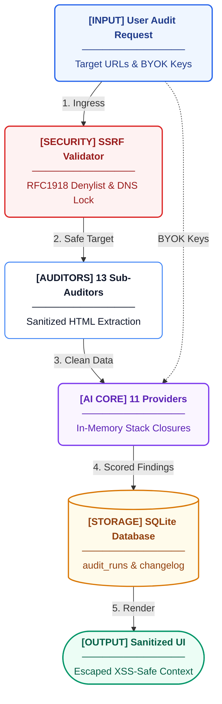
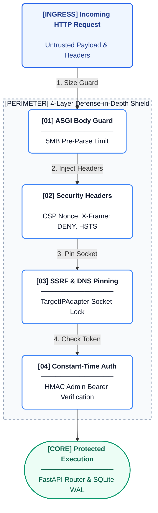

## Threat Model

| Threat | Attack Surface | Trust Boundary | Control | Implementation | Residual Risk |
|--------|----------------|----------------|---------|----------------|---------------|
| SSRF via user-supplied URLs | API inputs (Sitemap parsing, crawling) | User -> Application | Resolve & Validate, DNS Rebinding Protection | `areos/util/ssrf.py` (`resolve_and_validate`, `TargetIPAdapter`), SSRF denylist | Low. Validates every redirect hop, blocks local subnets and metadata endpoints. |
| Prompt injection via crawled HTML | Crawled third-party web content | External Web -> LLM | Content Sanitization, Markdown stripping | `areos/util/html_cleaner.py`, LLM provider system prompt scoping | Medium. LLMs are inherently susceptible to jailbreaks from hostile untrusted inputs. |
| BYOK key exfiltration | HTTP Request Headers (`x-api-key-*`) | Client -> Application -> LLM Provider | In-memory only lifecycle, Error log sanitization | `areos/api/dependencies.py` (`get_client_keys`), `areos/llm/providers/__init__.py` | Low. Keys are extracted from headers, passed via closure, and never persisted to DB or logs. |
| XSS via audit results | UI output from LLM responses | DB -> UI | Server-side HTML sanitization, CSP | `areos/util/sanitize.py` (`html.escape`), `areos/api/main.py` (`Content-Security-Policy`) | Low. CSP restricts inline execution; data is escaped. |
| XML entity expansion (sitemaps) | Site map ingestion endpoints | External Web -> Application | Safe XML parsing | `defusedxml` library integration | Low. |
| Admin token brute force | All authenticated API endpoints | Client -> Application | Constant-time string comparison | `areos/api/dependencies.py` (`verify_admin`, `hmac.compare_digest`) | Low. The token is static, but time-based attacks are mitigated. |
| Request body overflow (OOM) | All API endpoints | Client -> Application | ASGI middleware body size capping | `areos/api/main.py` (`BodySizeLimitMiddleware`, 5MB limit) | Low. Streaming rejection prevents full memory buffering of oversized payloads. |
| SQL injection via user input | Database query construction | Application -> DB | Parameterized Queries | Native SQLite3 parameter binding, explicit `write_as()` contexts | Low. All queries use parameterized inputs. |
| DNS rebinding | Outbound HTTP requests | Application -> External Web | TCP Connection Pinning | `areos/util/ssrf.py` (`TargetIPAdapter` caches resolved IP for connection) | Low. The same IP validated against the SSRF denylist is the one dialed. |

## Trust Boundaries Diagram

## 4-Layer Security Perimeter

## SSRF Implementation Deep Dive

AREOS implements a robust defense against Server-Side Request Forgery (SSRF) in `areos/util/ssrf.py`. 

1. **`resolve_and_validate(domain)`**: Uses `socket.getaddrinfo()` to resolve a domain to all associated IP addresses (both IPv4 and IPv6). It validates every single IP against `SSRF_DENYLIST`, which blocks loopback (`127.0.0.0/8`, `::1/128`), private networks (`10.0.0.0/8`, `192.168.0.0/16`, `172.16.0.0/12`), and critical cloud metadata endpoints (`169.254.0.0/16`).
2. **DNS Rebinding Protection via `TargetIPAdapter`**: To prevent a Time-of-Check to Time-of-Use (TOCTOU) vulnerability where a DNS record points to a safe IP during validation but shifts to a malicious internal IP during connection, AREOS uses a custom `HTTPAdapter`. It explicitly dials the *validated IP address* while retaining the original hostname for TLS SNI and HTTP `Host` headers.
3. **Hop-by-Hop Redirect Validation**: In `safe_get()`, redirects are followed manually. Every `Location` header is parsed, and its hostname is subjected to the same `resolve_and_validate` routine before the subsequent connection is made.

## Credential Exposure Analysis

AREOS supports Bring Your Own Key (BYOK) for LLM models. The lifecycle of these keys is heavily restricted to prevent leaks:

1. **Where keys ENTER**: Keys are supplied via HTTP headers (e.g., `x-api-key-openai`, `x-api-key-google`) and extracted in `areos/api/dependencies.py` via `get_client_keys()`.
2. **Where keys are HELD**: They are passed down the call stack as Python dictionary arguments and ultimately bound into lambda closures in `areos/llm/providers/__init__.py` (`_build_waterfall`). They are kept purely in-memory and are never persisted to disk.
3. **Where keys COULD leak**:
   - **Error traces**: Keys are not included in global exception handler outputs (`areos/api/main.py`), and any underlying provider errors strip or do not log the API key.
   - **Logs**: Provider logic (`areos/llm/providers/__init__.py`) truncates response text in errors and explicitly avoids logging request headers.
   - **DB**: Keys are never included in SQL `INSERT` statements; they operate strictly on a per-request basis.
   - **Response bodies**: API responses do not reflect the keys back to the client.
4. **Custom Base URLs**: Custom provider base URLs (e.g., `x-api-base-azure`) are validated via `resolve_and_validate` to prevent SSRF via malicious custom endpoint routing.
5. **SSL**: `verify=False` is never used. SSL certificate errors result in immediate connection abortion.

## Input Validation

- **Request Body Capping**: `BodySizeLimitMiddleware` in `areos/api/main.py` enforces a strict 5MB limit on incoming requests at the ASGI level, aborting the connection before Pydantic model validation can buffer it in memory, protecting against OOM attacks.
- **XML Parsing**: Ingestion of sitemaps utilizes `defusedxml` to prevent XML External Entity (XXE) expansion attacks.
- **HTML/String Cleaning**: `areos/util/html_cleaner.py` and `areos/util/sanitize.py` utilize BeautifulSoup and `html.escape` to prune dangerous tags (e.g., `<script>`, `<style>`, `<object>`) and neutralize rendered text.

## Security Headers

AREOS serves security headers directly from its ASGI middleware (`areos/api/main.py`) to provide defense-in-depth for the UI:

- `X-Content-Type-Options: nosniff`
- `X-Frame-Options: DENY`
- `Referrer-Policy: strict-origin-when-cross-origin`
- `Content-Security-Policy`: Restricts object sources, enforces `base-uri`, and limits framing. Currently permits `'unsafe-inline'` for scripts and styles to support the integrated UI's bootstrapping mechanics.

## Intended vs Observed Security Model

- **Intended**: The system validates all URLs, strictly isolates provider API keys in memory, enforces strong CSP, and sanitizes all generated outputs before display.
- **Observed**: The implementation strictly adheres to the in-memory constraint for keys and implements state-of-the-art SSRF protection (custom connection adapters). However, the CSP implementation requires `'unsafe-inline'` for scripts, slightly weakening XSS defense-in-depth compared to a strict hash/nonce-based policy.

## Known Security Gaps

- **Single-Tenant Architecture**: There is no per-user isolation; any user with the admin token has full control over all system state.
- **Static Admin Token**: `AREOS_API_TOKEN` is statically configured at runtime and lacks built-in rotation mechanisms.
- **CORS Localhost Allowance**: The API allows cross-origin requests from `localhost:8000`, `127.0.0.1:8000`, `localhost:3000` and `127.0.0.1:3000`. This is intended for local development but represents an overly permissive policy if the service were exposed on a loopback interface accessible to other local processes.
- **No Request Signing**: Inter-service or client-server requests rely purely on the bearer token, making them susceptible to replay if intercepted (though mitigated by TLS in production).
- **No Rate Limiting on Admin Endpoints**: While LLM calls are rate-limited and retried gracefully, the AREOS API itself lacks rate limiting for admin operations, exposing it to potential internal DoS.
