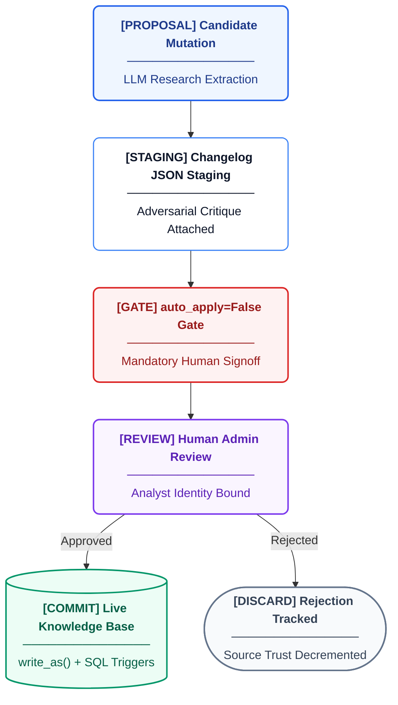

# Authentication, Authorization & Governance

Citeable/AREOS uses a strict, zero-trust approach to data mutation (Bible §6.3 / ADR D3) paired with a lightweight, stateless approach to read access. 

## Session Lifecycle

AREOS enforces a stateless bearer authentication model. There are no server-side sessions.

- **Analyst Identity**: Set via a UI modal on first launch (persisted to `localStorage.areos_analyst_id`). Used exclusively to log attribution for manual review actions.
- **Admin Token**: Set via the Cmd+Shift+A modal (persisted to `sessionStorage.areos_api_token`). Required for any administrative operations or core knowledge base mutations.

## Token Handling

The administrative token is managed securely:
- **Server**: Configured via the `AREOS_API_TOKEN` environment variable. The backend refuses to start without it (`areos/api/dependencies.py`).
- **Client**: Stored transiently in `sessionStorage` (with a seed fallback from `localStorage`). Sent via the standard `Authorization: Bearer <token>` header.
- **Verification**: The `verify_admin` dependency performs a constant-time comparison (`hmac.compare_digest()`) to mitigate timing attacks.
- **Security**: The token is never logged and never returned in API responses.

## Privileged Operations Table

All endpoints exposed by AREOS.

| Operation | Endpoint | Auth Required? | Additional Gate | Implementation |
|---|---|---|---|---|
| Get Pending Approvals | `GET /api/v1/approvals` | Yes (`verify_admin`) | None | `approvals.py` |
| Process Approval | `POST /api/v1/approvals/{run_id}/{candidate_id}` | Yes (`verify_admin`) | `x_analyst_id` Header | `approvals.py` |
| Create Prompt Set | `POST /api/v1/prompts` | Yes (`verify_admin`) | None | `prompts.py` |
| Delete Prompt Set | `DELETE /api/v1/prompts/{prompt_id}` | Yes (`verify_admin`) | None | `prompts.py` |
| Get Synthesis Prompts | `GET /api/v1/synthesis/prompts` | Yes (`verify_admin`) | None | `synthesis.py` |
| Update Synthesis Prompts | `PUT /api/v1/synthesis/prompts/{step}` | Yes (`verify_admin`) | None | `synthesis.py` |
| Reset Synthesis Prompts | `POST /api/v1/synthesis/prompts/reset/{step}` | Yes (`verify_admin`) | None | `synthesis.py` |
| Ingest Claims | `POST /api/v1/claims/ingest` | Yes (`verify_admin`) | None | `claims.py` |
| Verify BYOK Keys | `POST /api/v1/verify` | No | Rate Limiting | `byok.py` |
| Synthesize Audit Run | `POST /api/v1/audit/runs/{run_id}/synthesize` | No | Rate Limiting | `audit.py` |
| Execute Orchestrated Audit | `POST /api/v1/audit/orchestrate` | No | Rate Limiting | `audit.py` |
| All other `GET` routes | `/api/v1/audit/*`, `/api/v1/knowledge/*`, `/api/v1/reports/*`, `/api/v1/claims` | No | None | Read-only |
| Submit Verdicts/Observations | `POST /api/v1/audit/runs/{run_id}/verdicts`, `POST /api/v1/audit/runs/{run_id}/observations` | No | None | Review operations |

## auto_apply Gate

`areos/services/auto_apply.py` determines if a claim sourced from a URL should be auto-applied without human review.

**Design Intent**: All knowledge base mutations require human approval in v1 (Playbook 7.3). 
**Implementation**: The `is_auto_apply_eligible(source_url, db_path)` function is **hardcoded to return `False`**. The 25-in-a-row graduation trigger is structurally deferred, enforcing the mandatory manual review constraint.

## Mutation Audit Trail

All database mutations strictly adhere to ADR D3: mechanical triggers enforce logging, and application code provides semantic context.

1. **Staging Context**: `areos/db/context.py` provides the `write_as(conn, actor, reason)` context manager.
2. **Context Table**: It updates a single-row staging table `_txn_context` in the current transaction *before* executing the mutation.
3. **Database Triggers**: SQLite `AFTER INSERT` and `AFTER UPDATE` triggers (`areos/db/schema.sql`) capture the state.

### Implementation SQL Example

From `schema.sql`, the triggers read from `_txn_context` to embed the semantic actor/reason directly alongside JSON diffs:

```sql
CREATE TRIGGER IF NOT EXISTS trg_claims_after_update
AFTER UPDATE ON claims
FOR EACH ROW
BEGIN
    INSERT INTO changelog (entity_table, entity_id, operation, actor, reason, before_json, after_json, changed_at)
    VALUES (
        'claims', OLD.claim_id, 'UPDATE',
        (SELECT actor  FROM _txn_context WHERE id = 1),
        (SELECT reason FROM _txn_context WHERE id = 1),
        json_object('claim_scope', OLD.claim_scope, ...),
        json_object('claim_scope', NEW.claim_scope, ...),
        datetime('now')
    );
END;
```

### Hard Deletions Forbidden
`BEFORE DELETE` triggers prevent `DELETE` operations on governed tables, throwing an abort exception to enforce status transitions instead (e.g., `deprecated` or `superseded`):

```sql
CREATE TRIGGER IF NOT EXISTS trg_claims_block_hard_delete
BEFORE DELETE ON claims
BEGIN
    SELECT RAISE(ABORT, 'Hard delete forbidden on claims (Bible 6.3 / INVARIANT-08). Transition status to deprecated or superseded instead.');
END;
```

## Knowledge Mutation & Human Governance Stateflow



## Approval Workflow

Implemented in `areos/api/routers/approvals.py`:

- **Listing Pending**: The system reads pending changes directly from JSON files in the `changelogs` directory (filtering by `run_id`).
- **Approval Processing**: 
  - Exclusive locks are applied to the changelog JSON file (`msvcrt` on Windows, `fcntl` otherwise).
  - Approvals leverage `apply_insert`, `apply_update`, or `apply_flag_for_review` within a `write_as(conn, actor, reason)` transaction context block.
  - The `x-analyst-id` header populates the `actor` parameter.
- **Rejections**: A `rejection_reason` is strictly required. The operation bypasses KB modification entirely but correctly updates source track records.

## Source Trust Tracking

When an approval or rejection occurs, `areos/services/auto_apply.py` interacts with `areos/services/sources.py` source data:
- `record_approval(conn, source_url)` increments `approved_count` on the matching source domain.
- `record_rejection(conn, source_url)` increments `rejected_count`.
- This metadata serves as a foundation for source reliability tracking without requiring arbitrary editorial scores. The seed data for all `SOURCES` contains deterministic trust tiers based strictly on the source format type.

## Frontend Auth Flow

The frontend strictly enforces role visibility via `areos/ui/nav.js`:
- An admin authentication modal is hidden by default. It can be summoned globally using the **`Cmd+Shift+A`** (or Ctrl+Shift+A) hotkey.
- Submitting the token saves it to `sessionStorage.areos_api_token` and reloads the page.
- Admin-specific pages (`approvals`, `prompts`, `case_study`, `synthesis_prompts`) are filtered out of the navigation layout rendering entirely if a valid token is not present in `sessionStorage`.
- `areos/ui/auth.js` automatically intercepts backend requests and injects the stored bearer token into the `Authorization` header.
