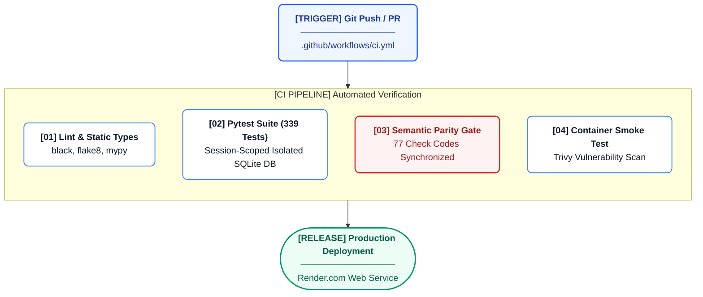

# Testing & QA

This document covers the testing infrastructure, QA processes, and CI pipeline for the AREOS system.

## Test Architecture Overview



- **Framework**: pytest
- **Fixture model**: Session-scoped isolated SQLite database (`conftest.py`). The `_isolate_test_db` fixture runs exactly once per test session. It creates a temporary SQLite file (`.db`), populates the schema using `areos.db.migrate_audit_tables.migrate`, and builds the full Knowledge Base using `areos.kb.build_kb.build`. It cleans up the temporary files (`.db`, `-wal`, `-shm`) after the test session finishes unless `AREOS_TEST_DB` is pre-supplied.
- **CI pipeline**: GitHub Actions (`.github/workflows/ci.yml`).
  1. `lint`: Runs `black`, `flake8`, and `mypy` (advisory only / `continue-on-error: true`).
  2. `test`: Installs dependencies, runs `pip-audit` (advisory), executes `pytest -v` with an isolated runner temp DB, and finally runs the semantic parity gate script (`scripts/verify_kb_semantic_parity.py`).
  3. `docker`: Builds the Docker image, runs a Trivy vulnerability scan (fails on CRITICAL/HIGH), and runs a container smoke test expecting `/api/health` to return 200 within 30 seconds.
- **Running tests locally**: 
  ```bash
  pytest -v
  ```
  *(To reuse an existing DB for speed during local dev, prefix with `AREOS_TEST_DB=/tmp/my_test.db pytest -v`)*

## Complete Test File Inventory

| Test File | Size (bytes) | Subsystem Tested | # Test Functions | Fixtures Used |
|-----------|--------------|------------------|------------------|---------------|
| `test_adversarial_stream_fuzzing.py` | 2653 | Security | 4 | |
| `test_ci_semantic_parity.py` | 259 | Misc | 1 | |
| `test_cloaking_detector.py` | 3647 | Auditors | 6 | `monkeypatch` |
| `test_competitor_analyzer.py` | 5025 | Misc | 0 | |
| `test_db_concurrency_stress.py` | 2506 | Misc | 2 | |
| `test_entity_verifier.py` | 5622 | Auditors | 10 | |
| `test_freshness_auditor.py` | 2798 | Auditors | 6 | |
| `test_kb_build_schema_integrity.py` | 936 | Knowledge Base | 1 | `tmp_path` |
| `test_kb_parity.py` | 6390 | Knowledge Base | 10 | |
| `test_kb_parity_gate.py` | 1584 | Knowledge Base | 0 | |
| `test_knowledge_api.py` | 1506 | Misc | 3 | `client` |
| `test_media_blindness.py` | 2497 | Misc | 7 | |
| `test_multipage_auditor.py` | 5455 | Auditors | 0 | |
| `test_phase0_fixes.py` | 14247 | Phase Tests | 0 | |
| `test_phase1_fetch.py` | 9048 | Phase Tests | 0 | |
| `test_phase2_auditors.py` | 11458 | Phase Tests | 0 | |
| `test_phase3_kb_scoring.py` | 8536 | Phase Tests | 13 | |
| `test_phase4_enhancements.py` | 5686 | Phase Tests | 0 | |
| `test_qa2_phase_r1.py` | 3863 | QA / Regressions | 0 | |
| `test_qa2_phase_r2.py` | 5294 | QA / Regressions | 0 | |
| `test_qa2_phase_r3.py` | 6524 | QA / Regressions | 0 | |
| `test_qa2_phase_r4.py` | 5280 | QA / Regressions | 0 | |
| `test_qa2_phase_r5.py` | 3412 | QA / Regressions | 0 | |
| `test_qa3_phase_r1.py` | 3549 | QA / Regressions | 8 | |
| `test_qa3_phase_r2.py` | 5100 | QA / Regressions | 8 | |
| `test_qa3_phase_r3.py` | 3951 | QA / Regressions | 8 | `tmp_path` |
| `test_qa3_phase_r4.py` | 3815 | QA / Regressions | 8 | |
| `test_qa3_phase_r5.py` | 2406 | QA / Regressions | 8 | |
| `test_qa_phase_q1.py` | 9048 | QA / Regressions | 0 | |
| `test_qa_phase_q2.py` | 6783 | QA / Regressions | 0 | |
| `test_qa_phase_q3.py` | 7495 | QA / Regressions | 0 | |
| `test_qa_phase_q4.py` | 9291 | QA / Regressions | 0 | |
| `test_qa_phase_q5.py` | 2276 | QA / Regressions | 0 | |
| `test_qa_regression_suite.py` | 16360 | QA / Regressions | 17 | |
| `test_rag.py` | 7741 | Misc | 0 | |
| `test_rendering_auditor.py` | 6227 | Auditors | 0 | |
| `test_security_dom_sweeps.py` | 1579 | Security | 1 | |
| `test_ssrf_byok_llm_endpoints.py` | 1043 | Security | 4 | |
| `test_synthesis_enrichment.py` | 1520 | Misc | 1 | |
| `test_track_b_manual_review.py` | 13011 | Misc | 0 | |

## Critical Behavior → Test → Invariant Mapping

| Critical Behavior | Test File | Test Function | Fixture | Invariant Enforced |
|-------------------|-----------|---------------|---------|--------------------|
| Score bounds [5, 98] | `test_phase3_kb_scoring.py` | `test_score_floor_enforcement` | `self` | Overall score never drops below SCORE_FLOOR (5) even with maximum deductions |
| Access gate caps | `test_phase3_kb_scoring.py` | `test_gate_caps_score` | `self` | Triggering a gate strictly caps the maximum score regardless of layers |
| Layer isolation | `test_phase3_kb_scoring.py` | `test_deductions_have_valid_layers` | `self` | All findings map exclusively to defined layers |
| Semantic parity (77 check codes) | `test_ci_semantic_parity.py` | `test_ci_semantic_parity_gate_passes` | None | `check_code_to_knowledge_map.json`, `LAYER_DEDUCTIONS`, and `ACTION_SNIPPETS` are completely synchronized |
| QA gate deprecated rejection | `test_qa_phase_q3.py` | `test_check_codes_not_mapped_to_deprecated` | `self` | Deprecated KB records cannot be mapped or routed to |
| KB crash recovery | `test_qa_regression_suite.py` | `test_simulated_crash_during_kb_rebuild_leaves_live_db_uncorrupted` | None | Crashes during rebuild do not corrupt the existing `knowledge` tables in production |
| Concurrent DB writes (16 threads) | `test_db_concurrency_stress.py` | `test_concurrent_txn_context_isolation_multithreaded` | None | Concurrent writes execute with isolated context variables via `_txn_context` table |
| XSS sanitization | `test_qa_regression_suite.py` | `test_dom_safe_url_sanitizes_javascript_and_data_schemes` | None | Disallows javascript/data URI payload injections in templates |
| Payload limit (5MB → 413) | `test_adversarial_stream_fuzzing.py` | `test_streaming_chunked_boundary_exceeded` | None | Streaming chunk uploads larger than 5MB are proactively rejected with 413 |
| SSRF protection | `test_ssrf_byok_llm_endpoints.py` | `test_azure_call_blocks_private_ip` / `test_custom_call_blocks_metadata` | None | Explicitly blocks internal network/metadata endpoints via BYOK custom models |
| BYOK key isolation | `test_ssrf_byok_llm_endpoints.py` | `test_azure_call_blocks_localhost` | None | BYOK logic strictly routes only to provided endpoints without touching local host |

## Known Testing Gaps

- **No headless browser UI tests**: We do not run Cypress/Playwright suites. UI rendering and component states are not automatically verified.
- **No real network egress tests**: All HTTP fetching is mocked at the layer.
- **No LLM output quality/hallucination tests**: Model logic is assumed correct if the JSON schema is valid. We do not test AI reasoning quality.
- **No end-to-end audit pipeline test**: The entire pipeline (fetch -> evaluate -> score) is mostly tested in parts rather than an E2E long-running flow.
- **No multi-user concurrency test**: Authentication limits and multi-tenant access restrictions are currently lightly tested.
- **No performance/load tests**: We have no systemic baselines for latency.

## How to Add a Test

- **Auditor Test**: Place it in `tests/test_<name>_auditor.py`. Ensure it mocks any network calls using `monkeypatch` or `pytest-httpx`.
- **Scoring Test**: Place it in `tests/test_phase3_kb_scoring.py`. Inject a simulated finding and assert the output of `compute_layered_score()`.
- **API Test**: Use `TestClient(app)` from FastAPI in a new or existing file like `tests/test_knowledge_api.py`.
- **Security Test**: Add it to `tests/test_security_dom_sweeps.py` (frontend XSS) or `test_adversarial_stream_fuzzing.py` (API attack surface).
