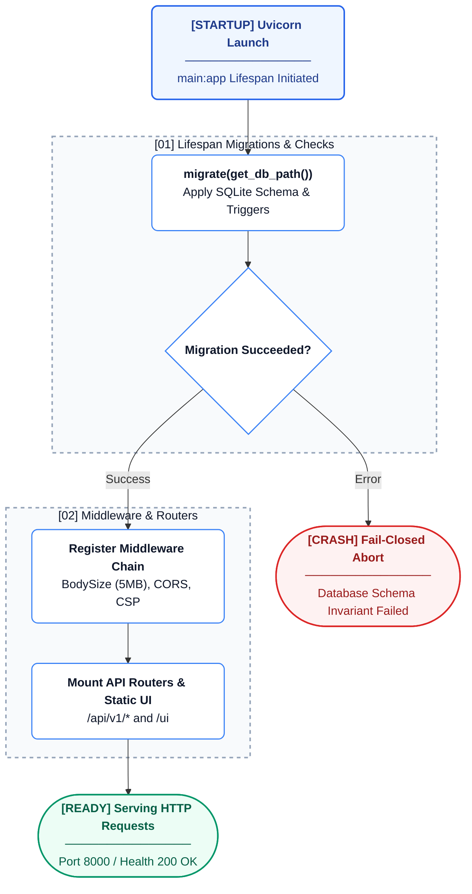

# 13. Deployment & Operations

This document covers the operational lifecycle of the AREOS engineering system, including setup, environment variable configuration, startup sequence, deployment, and database operations.

## Prerequisites

- **Python**: 3.11
- **Database**: SQLite 3.35+
- **Optional Dependencies**: Playwright (for JS-rendering diff, `playwright install chromium`)

## Local Development Setup

1. **Clone the repository**:
   ```bash
   git clone <repository_url>
   cd areos
   ```

2. **Install dependencies**:
   ```bash
   pip install -r requirements.txt
   ```
   *(Optional)* If you need JS rendering support:
   ```bash
   pip install playwright && playwright install chromium
   ```

3. **Set Environment Variables**:
   Configure necessary keys (see the full reference below). At a minimum, `AREOS_API_TOKEN` is required to pass the fail-closed startup check.

4. **Run the API server**:
   ```bash
   uvicorn areos.api.main:app --port 8000
   ```

## Complete Environment Variable Reference

The system relies on various environment variables across components. 

| Variable | Required | Default | Purpose | Where Read |
|---|---|---|---|---|
| `AREOS_API_TOKEN` | Yes | - | Primary API access token | `areos/api/dependencies.py` |
| `AREOS_ADMIN_TOKEN` | Yes | `dev-build-kb` | Admin token for KB build ops | `areos/kb/build_kb.py` |
| `PYTHONDONTWRITEBYTECODE` | No | `1` (in Docker) | Prevent `.pyc` creation | `Dockerfile`, `render.yaml` |
| `PYTHONUNBUFFERED` | No | `1` (in Docker) | Enable log buffer printing | `Dockerfile`, `render.yaml` |
| `PORT` | No | `8000` | Port for local dev or Render | `Dockerfile` |
| `AREOS_TEST_DB` | No | - | Overrides DB path for testing | `areos/db/connection.py`, `tests/` |
| `RENDER` | No | - | Automatically set by Render.com | `render.yaml`, `areos/db/connection.py` |
| `OPEN_PAGERANK_API_KEY` | No | - | Required for authority metrics | `areos/auditors/authority_auditor.py` |
| `PERPLEXITY_API_KEY` | No | - | LLM provider key | `areos/auditors/citation_sampler.py` |
| `AREOS_GEMINI_KEY_1` | No | - | Primary Gemini provider key | `areos/llm/providers/__init__.py` |
| `AREOS_GEMINI_KEY_2` | No | - | Secondary Gemini key for rotation | `areos/llm/providers/__init__.py` |
| `AREOS_GEMINI_MODEL_1`| No | *default model* | Override Gemini model string | `areos/llm/providers/__init__.py` |
| `OPENAI_API_KEY` | No | - | OpenAI provider key | `areos/llm/providers/__init__.py` |
| `AREOS_GROQ_KEY` | No | - | Groq provider key | `areos/llm/providers/__init__.py` |
| `ANTHROPIC_API_KEY` | No | - | Anthropic provider key | `areos/llm/providers/__init__.py` |
| `XAI_API_KEY` | No | - | xAI provider key | `areos/llm/providers/__init__.py` |
| `MISTRAL_API_KEY` | No | - | Mistral provider key | `areos/llm/providers/__init__.py` |
| `DEEPSEEK_API_KEY` | No | - | DeepSeek provider key | `areos/llm/providers/__init__.py` |
| `AZURE_OPENAI_KEY` | No | - | Azure OpenAI key | `areos/llm/providers/__init__.py` |
| `AZURE_OPENAI_BASE` | No | - | Azure OpenAI base URL | `areos/llm/providers/__init__.py` |
| `CUSTOM_LLM_BASE` | No | - | Base URL for custom/local LLM | `areos/llm/providers/__init__.py` |
| `AREOS_JINA_KEY` | No | - | Jina AI Reader key for web fetching| `areos/services/research_service.py` |
| `AREOS_ENABLE_PLAYWRIGHT` | No | `0` | Enable Playwright JS rendering diff| `areos/auditors/rendering_auditor.py` |
| `AREOS_EMBED_ON_BUILD`| No | - | Triggers KB embedding on build | `areos/kb/build_kb.py` |

## Startup Sequence



1. **Lifespan Context (`main.py`)**:
   Upon launch, FastAPI runs the async context manager `lifespan()`. This triggers `migrate(get_db_path())`, ensuring all required tables exist. If migration fails, the application crashes immediately (fail-closed, `MF-9`).
2. **Middleware Registration Order**:
   - `BodySizeLimitMiddleware`: Rejects requests larger than 5 MB.
   - `CORSMiddleware`: Permits local origins during dev (`127.0.0.1`, `localhost`).
   - `_security_headers_middleware`: Adds `X-Content-Type-Options`, `X-Frame-Options`, `Content-Security-Policy`, etc.
   - `_correlation_id_middleware`: Sets request UUIDs.
3. **Router Mounting**:
   Includes modular routes from `areos.api.routers` (`claims`, `approvals`, `audit`, `verdicts`, `reports`, `prompts`, `byok`, `synthesis`, `knowledge`).
4. **Static File Serving**:
   The API server explicitly mounts UI elements from the `ui/` directory and internal docs from `docs/` using `StaticFiles`.
5. **Uvicorn Bind**:
   The process binds to the host via Uvicorn. On Render.com, Uvicorn respects the `$PORT` assigned at runtime.
6. **Shutdown**:
   The `lifespan()` manager guarantees `close_all_connections()` is called to cleanly sever all pooled connections before process exit (`MF-11`).

## Production Deployment (Render.com)

The system is configured to deploy via Render.com natively using `render.yaml` and the `Dockerfile`.

- **Docker Build**: The image builds from `python:3.11-slim`, creating an unprivileged user `areos` to enforce non-root execution (SEC-6).
- **Web Service (`areos-studio`)**: Requires the `starter` plan because it mounts a persistent disk (`/data`, 1GB) to ensure SQLite persistence. 
- **Auto-seeding**: The database path resolver (`areos/db/connection.py`) checks if `RENDER` is set. If `/data/areos.db` is empty, it securely auto-seeds it using the root `areos.db` included in the Docker build.
- **Cron Service (`areos-backup`)**: A Render Cron Job executes `python scripts/backup_db.py` every 6 hours to safely backup the database without locking readers or writers.

## Database Operations

### Backup
Backups are performed using the SQLite Online Backup API (pages copied in non-blocking slices, safe for WAL mode).
- **Command**: `python scripts/backup_db.py`
- **Arguments**: 
  - `--source`: Path to the source database.
  - `--dest`: Destination directory for the backup file.
- **When to use**: Automatically scheduled via Render Cron, or manually before major environment changes.

### KB Rebuild
Knowledge Base data in the `corpus/` folder can be rebuilt via the script:
- **Command**: `python -m areos.kb.build_kb`
- **Process**: The script uses an atomic staging memory database (`:memory:`) to apply schema changes and load JSONL contents. It then performs an atomic `backup()` swap into the live connection. This ensures there are no broken partial states if a build fails.
- **Arguments**: Use `--embed` or `--embed-force` to pre-compute vector embeddings utilizing the available LLM keys.

### Migration
Database migration (`areos/db/migrate_audit_tables.py`) applies the consolidated schema dynamically at application startup.
- Uses a `CREATE TABLE IF NOT EXISTS` idempotent strategy.
- Handles edge cases for backward compatibility (e.g., adding `overall_score`, inserting `audit_phase` fallback seed data).

### Integrity Check
SQLite integrity checks (`PRAGMA integrity_check`) are natively embedded into the `scripts/backup_db.py` script. The backup fails if the source validation returns anything other than `"ok"`.

## Health Check

**Endpoint**: `GET /api/health`
- Verifies that the database file is physically reachable and queries can be executed (`SELECT 1`).
- Operates inside an `anyio.to_thread` to isolate the health check from asyncio pool exhaustion, satisfying `MF-10`.

## CLI Tools Reference

Located in `areos/cli/`, these tools are primarily used in the pipeline orchestration for Tasks 2 and 4.

| Tool | Command | Arguments | Purpose | DB Mutations |
|---|---|---|---|---|
| **Approve** | `python -m areos.cli.approve` | `--run-id`, `--db-path`, `--auto-approve` | Interactive approval workflow for proposed changelogs. | `INSERT`/`UPDATE claims`, records source approval/rejection metrics. |
| **Critique** | `python -m areos.cli.critique` | `--artifact`, `--persona` | Generate an adversarial LLM critique for an artifact. | None. |
| **Critique Changelog** | `python -m areos.cli.critique_changelog` | `--run-id` | Runs adversarial check on contradicting changelog entries. | None (modifies JSON file). |
| **Diff** | `python -m areos.cli.diff` | `--run-id`, `--db-path` | Diff candidate claims against live DB to propose changes. | None. |
| **Report** | `python -m areos.cli.report` | `--findings`, `--domain`, `--stages`, `--output` | Generates a manual gap markdown report from automated findings. | None. |
| **Research** | `python -m areos.cli.research` | `--stage`, `--output`, `--dry-run`, `--sources-yaml` | Fetch and extract candidate claims for a pipeline stage. | None (writes to JSON). |

## Troubleshooting Guide

| Symptom | Likely Cause | Detection | Recovery |
|---|---|---|---|
| **HTTP 500 (`INTERNAL_ERROR`)** | Unhandled exception in route or DB closure issue. | Correlation `error_id` in logs and HTTP response. | Trace the error ID in logs. Verify DB file permissions or external API limits. |
| **Database Locked / Busy Error** | Stalled writer transaction holding the lock longer than 30s. | `OperationalError: database is locked`. | Restart service to flush stale threads (`close_all_connections()` hook should clear). Optimize the query. |
| **Audit Hangs Indefinitely** | A downstream LLM provider API is completely unresponsive. | Look for timeout errors or lack of forward progress logs. | Check `api/providers` network status; shift `AREOS_GEMINI_KEY_2` to bypass throttles. |
| **KB Build Failure** | Malformed JSONL line in `corpus/` or database connection state block. | `build_kb` logs display parsing errors or integrity errors. | Rollback changes to the `jsonl` files in `corpus/`. The atomic memory-backup safeguards the DB. |
| **Missing API Key / No Synthesis**| Evaluator model was not found in `os.environ` or headers. | Missing responses, missing RAG output, or warnings about keys. | Double-check Render environment variables and header pass-throughs. |
| **Wrong Overall Score** | `overall_score` is missing or logic misfired during batch save. | Missing column crashes or UI defaults to `0`. | Run `migrate()` to ensure `overall_score` column exists. |

## Logging

- **Handler**: `logging.getLogger(__name__)`
- **Output**: Output defaults to `stdout` (`PYTHONUNBUFFERED=1` ensures real-time Docker/Render capture).
- **Correlation IDs**: All incoming web requests are wrapped by `_correlation_id_middleware`, appending a `uuid4` error ID context variable. If an exception triggers, this ID is exposed in the API response payload, allowing immediate correlation with backend logs.
