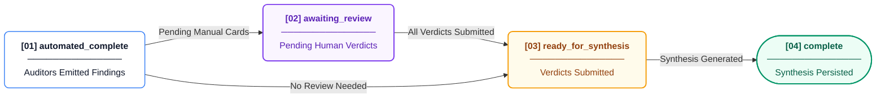

# Architecture Decision Records

## ADR-001: SQLite over PostgreSQL
**Context**: AREOS needed a transactional data store capable of enforcing foreign keys, handling concurrent readers, and surviving cloud deployments, but without the operational overhead of managing a separate database cluster.
**Options Considered**: PostgreSQL (managed), MySQL, SQLite.
**Decision**: SQLite configured with WAL (Write-Ahead Logging) and enforced foreign keys.
**Rationale**: AREOS is a single-node deployment with no multi-tenant data isolation requirements. SQLite in WAL mode provides sufficient concurrency for the application's scale. 
**Tradeoffs**: We lose distributed scaling, native high-availability, and advanced JSON querying features of PostgreSQL. The disk must be persistent and attached to the compute node.
**Consequences**: The application requires a persistent disk mount (`/data` via `render.yaml`). The connection must be carefully managed to ensure PRAGMAs (`journal_mode = WAL`, `foreign_keys = ON`) are set consistently on every connection.
**Status**: Active
**Evidence**: `areos/db/connection.py` (PRAGMAs and WAL config), `render.yaml` (persistent disk configuration for `areos-data`).

## ADR-002: Zero-SDK LLM Integration
**Context**: The system integrates with over 11 different LLM providers (Google, OpenAI, Anthropic, Groq, etc.) and allows users to Bring Your Own Key (BYOK).
**Options Considered**: Using official provider SDKs (e.g., `openai`, `anthropic`, `google-generativeai`), using an abstraction layer like `litellm`, or raw HTTP requests.
**Decision**: Use pure `requests.post()` without any external LLM SDKs.
**Rationale**: Avoids SDK version lock-in, dependency hell, and bloat. It allows precise control over error mitigation (429 backoffs, SSRF protection, timeout handling) and easily enables the stateless BYOK pattern without SDK reconfiguration bugs.
**Tradeoffs**: We must manually parse error responses, handle chunked encoding desyncs, and maintain the API request/response schemas for all providers ourselves.
**Consequences**: All LLM integrations live in a single file implementing a unified HTTP client with robust error handling.
**Status**: Active
**Evidence**: `areos/llm/providers/__init__.py` (Zero SDK imports, uses `requests.post()`, handles full waterfall).

## ADR-003: Deterministic-First Audit Architecture
**Context**: Evaluating website readiness for AI requires both mechanical checks (e.g., HTTP status, robots.txt, schema validation) and semantic checks (e.g., is the content extractable).
**Options Considered**: Feed HTML directly to LLMs for a holistic score, or build specialized deterministic auditors for mechanical checks and reserve LLMs for semantic checks.
**Decision**: Use deterministic Python logic for the vast majority of audit checks and reserve LLM usage only for specific, semantic evaluations.
**Rationale**: Deterministic checks are faster, cheaper, 100% reproducible, and not subject to hallucination. LLMs are slow and non-deterministic.
**Tradeoffs**: Increased development time to write parsing logic and rulesets instead of just prompting an LLM.
**Consequences**: 14 out of 15 auditor modules are pure Python. Only `extractability_judge.py` and `citation_sampler.py` utilize the LLM API.
**Status**: Active
**Evidence**: `areos/auditors/` (Only two modules import LLM functions).

## ADR-004: Forward/Reverse Waterfall
**Context**: When synthesizing audits or critiquing outputs, using the exact same LLM model for both generation and critique can lead to "sycophancy" (the model agreeing with itself).
**Options Considered**: Hardcode different models for different tasks, or randomize the model selection.
**Decision**: Implement a `complete()` function that walks the provider waterfall forwards, and a `complete_adversarial()` function that walks the same configured waterfall in reverse.
**Rationale**: Guarantees cognitive diversity between the generator and the critic, utilizing whichever keys the user has provided, without requiring explicit configuration of separate models.
**Tradeoffs**: If a user only provides one key, the reverse waterfall will just use the same single model, defeating the purpose.
**Consequences**: The system naturally separates generation from adversarial evaluation as long as multiple keys are present.
**Status**: Active
**Evidence**: `areos/llm/providers/__init__.py` (`complete` vs `complete_adversarial` logic).

## ADR-005: Hardcoded auto_apply=False
**Context**: When extracting knowledge from URLs, the system needs to decide whether to automatically trust the extraction or require human review.
**Options Considered**: Trust authoritative sources automatically, implement a graduation system (e.g., 25 approvals in a row), or mandate human review for all mutations.
**Decision**: Hardcode `auto_apply = False` for all extractions.
**Rationale**: AI hallucination and extraction errors present a high risk to the Knowledge Base integrity. All KB mutations must require explicit human approval (Task 2e).
**Tradeoffs**: Increases operational burden as operators must manually approve every extraction.
**Consequences**: The graduation trigger logic is deferred, and the `is_auto_apply_eligible` function always returns False.
**Status**: Active
**Evidence**: `areos/services/auto_apply.py` (Function `is_auto_apply_eligible` returns `False`).

## ADR-006: Derived State over Written State
**Context**: The application UI needs to know the completeness status of an audit run (e.g., awaiting review, ready for synthesis, complete).
**Options Considered**: Update a `status` string column on the `audit_runs` table whenever actions occur, or compute the status dynamically on read.
**Decision**: State is computed dynamically from the ground truth queries (stored findings + submitted verdicts + persisted synthesis).
**Rationale**: Updating a string column from multiple different routers leads to race conditions, inconsistencies, and bugs where the string doesn't match the actual underlying data. Deriving the state ensures 100% accuracy.
**Tradeoffs**: Slight performance hit to run multiple count/existence queries on read instead of reading a single string.
**Consequences**: The `get_run_completeness` function calculates the status on the fly based on the number of completed cards and the existence of a synthesis record.

**Status**: Active
**Evidence**: `areos/services/run_state.py` (Logic in `get_run_completeness`).

## ADR-007: 5-Layer Scorecard
**Context**: The system needs a way to score a website's AI readiness that is intuitive and reflects the sequential nature of how AI engines process data.
**Options Considered**: A flat score subtracting points for every error/warning, or a weighted categorical system.
**Decision**: A 5-Layer Scorecard model (Access, Schema, Content, Citation, Authority) where each layer has its own weight and check codes deduct points from their specific layer.
**Rationale**: AI readiness is a funnel. If a site blocks crawlers (Access), the other layers don't matter. The layered system allows for logical caps (e.g., hard cap at 25 if fully blocked) and accurately reflects real-world readiness.
**Tradeoffs**: More complex scoring logic than a simple flat subtraction.
**Consequences**: The `compute_layered_score` function implements stacking deductions per layer, with a floor of 0 per layer and global access gate caps.
**Status**: Active
**Evidence**: `areos/auditors/scoring.py` (`LAYERS` dictionary and `compute_layered_score` function).

## ADR-008: Atomic KB Rebuild
**Context**: The Knowledge Base (KB) is periodically rebuilt from corpus files. The rebuild process drops and recreates tables, parsing JSONL files.
**Options Considered**: Modify the live tables inside a transaction, or use a staging database.
**Decision**: Build the new KB in an in-memory staging SQLite database (`:memory:`), then atomically swap it into the live destination connection via the backup API.
**Rationale**: Modifying live tables can cause locking issues and partial reads if the rebuild takes a long time or fails halfway through. The atomic swap ensures zero downtime and absolute consistency for readers.
**Tradeoffs**: Requires enough memory to hold the entire KB temporarily during the build process.
**Consequences**: The `build()` function uses `sqlite3.connect(":memory:")` and `staging_conn.backup(conn)`.
**Status**: Active
**Evidence**: `areos/kb/build_kb.py` (Staging connection and atomic backup swap).

## ADR-009: Thread-Local DB Connections
**Context**: Multithreaded execution (e.g., in tests or background workers) requires safe access to the SQLite database without triggering "database is locked" or cross-thread contamination errors.
**Options Considered**: Create a new connection per request, use a heavy connection pooler, or use thread-local caching.
**Decision**: Connections are cached per-thread AND per resolved database path using `threading.local()`.
**Rationale**: Ensures that different threads get their own connection to avoid locking, while preventing cross-test contamination where two tests in the same thread using different temp databases might accidentally share a connection.
**Tradeoffs**: Connection lifecycle must be strictly managed centrally; callers cannot manually close connections.
**Consequences**: Callers use `get_connection()` which checks `_local.conns`. The shutdown hook in `main.py` handles closing all pooled connections.
**Status**: Active
**Evidence**: `areos/db/connection.py` (`_local = threading.local()` and `get_connection` logic).

## ADR-010: SSRF with DNS Rebinding Protection
**Context**: The system fetches arbitrary URLs provided by users (e.g., for target audits or Azure OpenAI endpoints). This opens the door to Server-Side Request Forgery (SSRF) and DNS rebinding attacks against internal infrastructure.
**Options Considered**: Simple hostname regex blocking, one-time DNS resolution checks, or deep connection pinning.
**Decision**: A two-step process using a custom `TargetIPAdapter` that resolves the IP, validates it against a denylist, and then pins the HTTP connection directly to that validated IP while preserving the original TLS SNI.
**Rationale**: A one-time DNS check is vulnerable to DNS rebinding (the IP changes between validation and connection). Connecting directly to the validated IP eliminates the Time-of-Check to Time-of-Use (TOCTOU) vulnerability.
**Tradeoffs**: Requires custom `requests.adapters.HTTPAdapter` implementation and manual redirect following to re-validate IPs at every hop.
**Consequences**: All external fetching must go through `safe_get()` or use the `TargetIPAdapter`.
**Status**: Active
**Evidence**: `areos/util/ssrf.py` (`TargetIPAdapter` and `safe_get` implementation).

## ADR-011: Client-Side Rendering, No Build Step
**Context**: The application required a web UI for interacting with the API and viewing audit results.
**Options Considered**: React/Vue/Angular with a Node.js build pipeline (Webpack/Vite), or vanilla JavaScript.
**Decision**: Vanilla JavaScript with client-side rendering, using no build step (no webpack, no npm).
**Rationale**: Minimizes dependencies, eliminates build times, and keeps the deployment artifact small and simple. It aligns with the overall minimalist architecture of the backend.
**Tradeoffs**: Lacks the component ecosystems and state management libraries of modern frontend frameworks. Developer ergonomics for complex UI state are lower.
**Consequences**: The `areos/ui/` directory contains plain `.html`, `.css`, and `.js` files served directly as static assets.
**Status**: Active
**Evidence**: `areos/ui/` directory structure (inspection confirms no `package.json` or build configs).

## ADR-012: BYOK Ephemeral Key Lifecycle
**Context**: Users need to provide their own API keys for LLM providers (Bring Your Own Key), but storing these keys persistently creates a significant security liability.
**Options Considered**: Encrypt and store keys in the database, or pass them ephemerally via request headers.
**Decision**: API keys are extracted from HTTP request headers (`x-api-key-*`) on every request and held only in memory for the duration of that request.
**Rationale**: Stateless pass-through ensures that the server never persists user API keys to disk, eliminating the risk of a database breach compromising user keys.
**Tradeoffs**: Clients must send the keys with every request, requiring the frontend to manage the keys securely in the browser (e.g., localStorage).
**Consequences**: The `get_client_keys` dependency parses headers and passes the resulting dictionary down the call stack to the LLM providers.
**Status**: Active
**Evidence**: `areos/api/dependencies.py` (`get_client_keys` function).

## ADR-013: Synchronous Audit Execution
**Context**: Website audits can take time, involving network requests and LLM evaluations.
**Options Considered**: Use an asynchronous task queue (e.g., Celery, Redis RQ) with background workers and polling, or execute synchronously in the request thread.
**Decision**: Audit execution is synchronous.
**Rationale**: Simplifies the architecture massively by removing the need for a message broker (Redis/RabbitMQ) and separate worker processes. Keeps the deployment to a single container.
**Tradeoffs**: Long audits tie up a request thread and may hit HTTP timeout limits (e.g., 30-second timeouts on some load balancers).
**Consequences**: The `areos/jobs/` module is empty. The client waits on the HTTP connection until the audit completes.
**Status**: Active
**Evidence**: `areos/jobs/__init__.py` (Empty directory/file, no background worker setup).

## ADR-014: Changelog Triggers for Data Integrity
**Context**: Every change to the database (especially claims and rules) needs an audit trail identifying who made the change and why.
**Options Considered**: Rely on application code to always insert an audit log row, or use database-level triggers.
**Decision**: Use SQLite `AFTER INSERT/UPDATE` triggers combined with a temporary `_txn_context` table to enforce changelog creation.
**Rationale**: Triggers provide a mechanical guarantee that no write can bypass the audit log, even if executed outside the normal application paths (e.g., via CLI or raw SQL). The `write_as` context manager injects the semantic context (actor, reason) into the transaction.
**Tradeoffs**: Debugging triggers can be harder than debugging application code. Requires careful transaction management.
**Consequences**: All application writes must be wrapped in `with write_as(conn, actor, reason):` to provide context to the triggers.
**Status**: Active
**Evidence**: `areos/db/context.py` (`write_as` context manager sets `_txn_context`).

## ADR-015: 3-Tier Knowledge Resolution
**Context**: When an audit finding fires, the system must resolve it to actionable knowledge from the corpus.
**Options Considered**: Pure semantic RAG (Retrieve-Augment-Generate) for everything, or a hybrid approach.
**Decision**: A 3-tier routing system: Deterministic Lookup → Semantic Search (RAG) → Insufficient Knowledge fallback.
**Rationale**: Deterministic mapping (`kb_check_code_map`) is fast and 100% accurate for known check codes. Semantic search acts as a fallback for novel or unmapped findings, but only if a BYOK key is present and cosine similarity thresholds (0.82 primary) are met. If neither yields a confident result, the system gracefully degrades to "INSUFFICIENT" rather than hallucinating.
**Tradeoffs**: Requires maintaining both explicit mappings in the database and pre-computed vector embeddings.
**Consequences**: The `resolve()` function attempts to query `kb_check_code_map` first, then falls back to `_rag_search`, and finally returns `INSUFFICIENT`.
**Status**: Active
**Evidence**: `areos/kb/router.py` (`resolve` function implements the deterministic → RAG → INSUFFICIENT logic).
