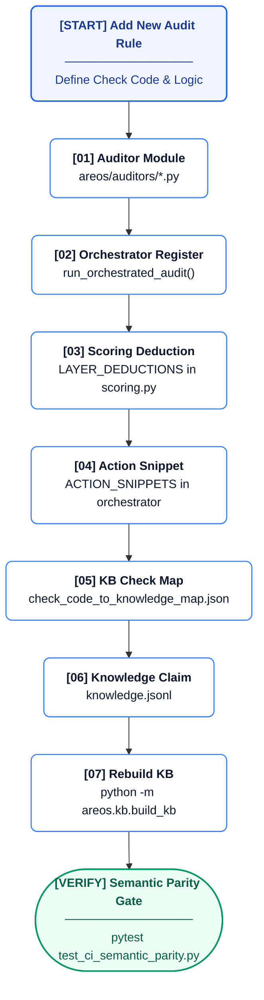
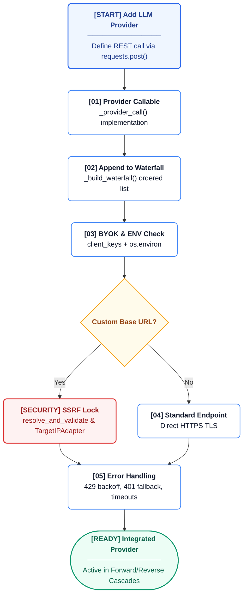

# Practical Maintainer Guide

This guide details the practical, step-by-step procedures for safely modifying the core subsystems of AREOS.

## Adding an Audit Rule

Audit rules map empirical checks to the central knowledge base and scoring model. When adding a new auditor or check code:



1. **Create the auditor module:** 
   Implement the logic in a new or existing module within [`areos/auditors/`](file:///d:/07%20Transfer-20260727T165431Z-1-001/Antigravity%2026-07%20Transfer/AREOS_COMPLETE_WORKSPACE/areos/auditors/).
2. **Register the auditor:**
   Add the invocation of your auditor to `run_orchestrated_audit()` in [`areos/auditors/audit_orchestrator.py`](file:///d:/07%20Transfer-20260727T165431Z-1-001/Antigravity%2026-07%20Transfer/AREOS_COMPLETE_WORKSPACE/areos/auditors/audit_orchestrator.py). Ensure exceptions are caught to prevent a crash in one phase from bringing down the entire orchestration (use `AUDIT_PHASE_CRASHED` as a fallback finding).
3. **Add scoring deductions:**
   Add the new check code to `LAYER_DEDUCTIONS` inside [`areos/auditors/scoring.py`](file:///d:/07%20Transfer-20260727T165431Z-1-001/Antigravity%2026-07%20Transfer/AREOS_COMPLETE_WORKSPACE/areos/auditors/scoring.py). Map it to a valid layer (`access`, `schema`, `content`, `citation`, `authority`) and specify the points to deduct.
4. **Provide an action snippet:**
   Add remediation text mapped to the check code in the `ACTION_SNIPPETS` dictionary in [`areos/auditors/audit_orchestrator.py`](file:///d:/07%20Transfer-20260727T165431Z-1-001/Antigravity%2026-07%20Transfer/AREOS_COMPLETE_WORKSPACE/areos/auditors/audit_orchestrator.py).
5. **Map to Knowledge Base:**
   Link the check code to its governing claims in [`areos/kb/check_code_to_knowledge_map.json`](file:///d:/07%20Transfer-20260727T165431Z-1-001/Antigravity%2026-07%20Transfer/AREOS_COMPLETE_WORKSPACE/areos/kb/check_code_to_knowledge_map.json) (or similar map location).
6. **Create knowledge records:**
   Add corresponding factual or standard claims into [`areos/kb/corpus/knowledge.jsonl`](file:///d:/07%20Transfer-20260727T165431Z-1-001/Antigravity%2026-07%20Transfer/AREOS_COMPLETE_WORKSPACE/areos/kb/corpus/knowledge.jsonl) if they do not already exist.
7. **Rebuild the Knowledge Base:**
   Execute `python -m areos.kb.build_kb` to parse the `jsonl` files and recompile the local SQLite `.db`.
8. **Add tests:**
   Write unit tests mapping your new behavior, verifying both the auditor's detection and the check code strings.
9. **Verify semantic parity:**
   Run `pytest tests/test_ci_semantic_parity.py` to ensure all rules are balanced across mapping layers.
10. **Update registry:**
    Document the new code in `CHECK_CODE_REGISTRY.md`.

## Adding an LLM Provider

Providers are handled through a strict waterfall sequence in [`areos/llm/providers/__init__.py`](file:///d:/07%20Transfer-20260727T165431Z-1-001/Antigravity%2026-07%20Transfer/AREOS_COMPLETE_WORKSPACE/areos/llm/providers/__init__.py) to ensure maximum availability.



1. **Add the provider function:**
   Create a `_provider_call()` function implementing the REST API logic using pure `requests`. Append it to the waterfall array inside `_build_waterfall()`.
2. **Add ENV var fallback:**
   Ensure the provider checks both the `client_keys` dictionary (BYOK) and the `os.environ` environment variables.
3. **Respect BYOK headers:**
   Register the corresponding header logic (e.g. `x-api-key-provider`).
4. **SSRF validate custom endpoints:**
   If the provider allows custom base URLs (like Azure or Custom LLMs), you must pass the hostname through `resolve_and_validate(hostname)` and use the `TargetIPAdapter` to prevent SSRF vulnerabilities.
5. **Test error mitigation:**
   Ensure the provider handles `429` (with backoff), `401`/`403` (instant fallback), and server timeouts/`5xx` cleanly by raising internal exception types (`_ProviderUnavailable`, `_AuthFailure`, `_RateLimit`).

## Modifying Scoring

The layered scoring algorithm lives in [`areos/auditors/scoring.py`](file:///d:/07%20Transfer-20260727T165431Z-1-001/Antigravity%2026-07%20Transfer/AREOS_COMPLETE_WORKSPACE/areos/auditors/scoring.py). 

1. **Change logic/deductions:**
   Modify `LAYER_DEDUCTIONS` or adjust caps in `ACCESS_GATE`.
2. **Maintain invariants:**
   Any change must hold true to the following:
   * **Score Floor:** Overall score must never drop below 5 (`SCORE_FLOOR`).
   * **Maximums:** Layer scores must not exceed their `max` and the overall `TOTAL_MAX` is 100.
   * **Cap Rules:** When `ACCESS_GATE` rules trigger (e.g. `CRAWLER_FULLY_BLOCKED`), the overall score is strictly capped (e.g., at 25).
3. **Run tests:**
   Execute tests in [`tests/test_phase3_kb_scoring.py`](file:///d:/07%20Transfer-20260727T165431Z-1-001/Antigravity%2026-07%20Transfer/AREOS_COMPLETE_WORKSPACE/tests/test_phase3_kb_scoring.py) to validate bounds, presence in `LAYER_DEDUCTIONS`, and knowledge map alignments.
4. **Semantic Parity:**
   Run the semantic parity test suite to ensure the map isn't broken.

## Modifying Review/Approval Logic

All write operations regarding review states must go through strict administrative and context rules.

1. **Require Admin Auth:**
   Endpoints in [`areos/api/routers/approvals.py`](file:///d:/07%20Transfer-20260727T165431Z-1-001/Antigravity%2026-07%20Transfer/AREOS_COMPLETE_WORKSPACE/areos/api/routers/approvals.py) MUST enforce the `verify_admin` dependency.
2. **Auto-apply Gate:**
   `is_auto_apply_eligible()` in [`areos/services/auto_apply.py`](file:///d:/07%20Transfer-20260727T165431Z-1-001/Antigravity%2026-07%20Transfer/AREOS_COMPLETE_WORKSPACE/areos/services/auto_apply.py) is hardcoded to `False` for v1. Do not modify this until human review metrics dictate otherwise.
3. **Changelog Triggers:**
   Any mutations MUST be wrapped in the `write_as()` context manager from [`areos/db/context.py`](file:///d:/07%20Transfer-20260727T165431Z-1-001/Antigravity%2026-07%20Transfer/AREOS_COMPLETE_WORKSPACE/areos/db/context.py) (e.g. `with write_as(conn, actor=actor_id, reason="..."):`) to ensure mechanical SQLite triggers correctly attribute semantic context.

## Adding a Database Table

Database schema changes have a strict generative workflow.

1. **Define Schema Components:**
   Modify the Python source files (`areos/db/schema/mixins.py` or `areos/db/schema/artifacts.py`), then regenerate `schema.sql` by running `generate_schema.py`. Do NOT hand-edit [`areos/db/schema.sql`](file:///d:/07%20Transfer-20260727T165431Z-1-001/Antigravity%2026-07%20Transfer/AREOS_COMPLETE_WORKSPACE/areos/db/schema.sql).
2. **Migration application:**
   Updates are applied via idempotent execution of `CREATE TABLE IF NOT EXISTS` through [`areos/db/migrate_audit_tables.py`](file:///d:/07%20Transfer-20260727T165431Z-1-001/Antigravity%2026-07%20Transfer/AREOS_COMPLETE_WORKSPACE/areos/db/migrate_audit_tables.py). Note that this limits structural changes (e.g., column drops). For new tables, add any manual backward-compatibility checks in the migrate script as needed.
3. **Trigger Protections:**
   If the new table is governed by the changelog (e.g., records claims or findings), add `AFTER INSERT/UPDATE` triggers that write to the `changelog` table and a `BEFORE DELETE` trigger that blocks hard deletes.
4. **Document Drift Risk:**
   Be aware that since `migrate_audit_tables.py` skips altering existing views and relies on `IF NOT EXISTS`, manual `ALTER TABLE` statements might be needed within the migration script for backward compatibility with live environments.

## Adding a Frontend Page

The UI is built with vanilla JS and interconnected through [`areos/ui/nav.js`](file:///d:/07%20Transfer-20260727T165431Z-1-001/Antigravity%2026-07%20Transfer/AREOS_COMPLETE_WORKSPACE/areos/ui/nav.js).

1. **Create HTML/JS:**
   Add a new HTML file and optional corresponding JS module into `areos/ui/`.
2. **Update nav.js Sidebar:**
   Append the path and icon to the `ROUTES` array and categorise it within `window.AreosNav.workflowItems` or `window.AreosNav.configItems`.
3. **Load Shared Modules:**
   Ensure `nav.js` and `byok.js` are properly sourced in the HTML template.
4. **Gate with Admin Auth:**
   If the page requires admin privileges (like Approvals or Prompt Design), add the route ID to the `adminIds` array inside the `renderNav()` function in `nav.js`.

## Adding a Knowledge Claim

Knowledge representation consists of interlinked JSON Lines files built into a SQLite KB.

1. **Add to knowledge.jsonl:**
   Add the core claim to [`areos/kb/corpus/knowledge.jsonl`](file:///d:/07%20Transfer-20260727T165431Z-1-001/Antigravity%2026-07%20Transfer/AREOS_COMPLETE_WORKSPACE/areos/kb/corpus/knowledge.jsonl). It requires keys like `kid`, `type`, `scope`, `statement`, `status`, `confidence`, and `support`.
2. **Add to evidence.jsonl:**
   Link the `kid` to specific sources with corresponding weights and relationships.
3. **Add to sources.jsonl (if new):**
   If the evidence points to a new source, add the metadata to `sources.jsonl`.
4. **Map Check Codes:**
   Link the `kid` to diagnostic `check_code` values inside `check_code_to_knowledge_map.json`.
5. **Rebuild the KB:**
   Compile the corpus by running: 
   ```bash
   python -m areos.kb.build_kb
   ```

## Running the Full Verification Suite

Before merging any changes to the AREOS workspace, strictly verify the test suite:

```bash
pytest -v
python scripts/verify_kb_semantic_parity.py
```
