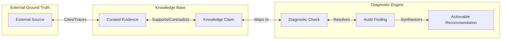
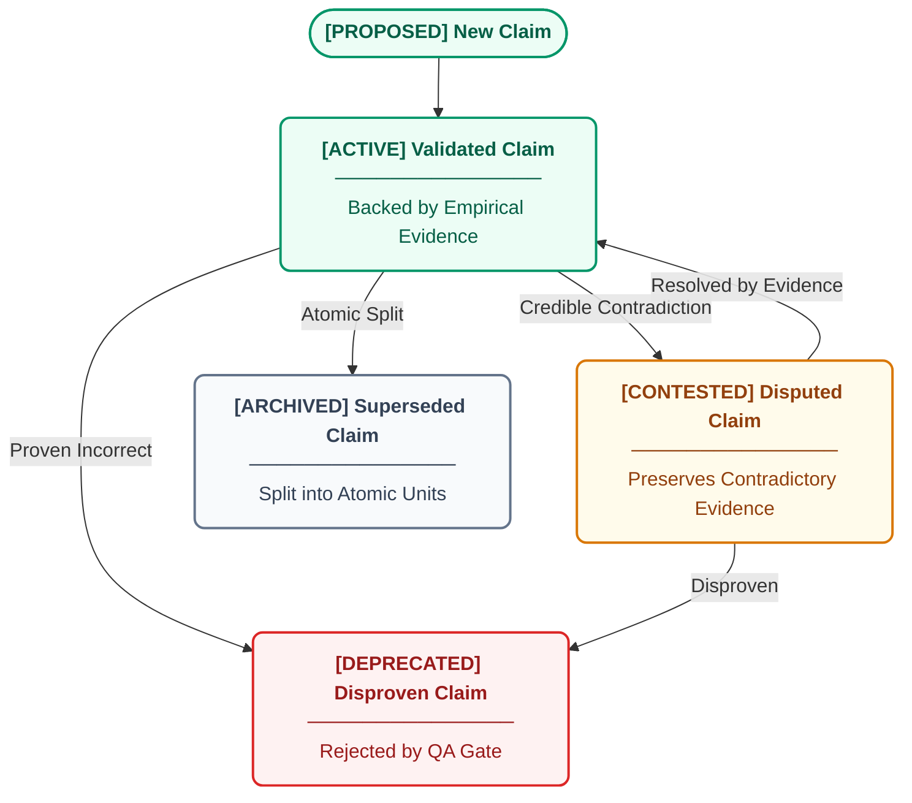

# Our Evidence Standards

Citeable separates diagnostic execution from the knowledge that explains and remediates findings. Every recommendation we provide is backed by curated, evidence-graded claims. This page details our evidence standards, credibility hierarchy, claim lifecycle, and governance rules that ensure our platform acts as an auditable knowledge system rather than just a diagnostic tool.

## What a Knowledge Claim Is

Knowledge claims are atomic assertions supported by evidence. They are classified into five distinct types:

| Type | Purpose | Example |
|---|---|---|
| FACT | Verifiable empirical behavior | "Googlebot renders JavaScript using the Chromium Web Rendering Service" |
| STANDARD | Formal specification or policy | "RFC 9309 defines robots.txt as an advisory protocol" |
| FINDING | Empirical research conclusion | "Generic schema markup provides no measurable citation uplift" |
| UNCERTAINTY | Confirmed absence of disclosure | "No AI engine discloses its citation ranking algorithm" |
| GUIDANCE | Actionable remediation | Problem → Action → Rationale → Check codes |

Each claim is atomic (one assertion per claim) and explicitly models reality. If credible sources disagree, we preserve both assertions rather than forcing artificial consensus, ensuring our recommendations are grounded in truth rather than simplification.

## The Evidence Chain

Every recommendation generated by Citeable carries its full provenance. A reader can trace any recommendation backward through the audit finding, into the specific knowledge claim, through the evidence record that qualifies it, and finally to the original source citation.

## Source Tier Hierarchy

Our source tier system acts as a credibility hierarchy. Sources are categorized deterministically based on source type rather than editorial judgment. Higher tiers establish higher confidence ratings.

| Tier | Type | Authority | Example |
|---|---|---|---|
| T1 | Formal Standards | Authoritative for stated policy | RFCs, W3C |
| T2 | Search Engine Docs | Authoritative for platform | Google Search Central |
| T3 | Academic Research | Peer-reviewed | University papers |
| T4 | Primary Empirical | Controlled studies | Ahrefs studies |
| T5 | Secondary Analysis | Expert synthesis | Search Engine Land |
| T6 | Industry Observation | Tool adoption baselines | BrightEdge blog |
| T7 | Community | Signals only | Reddit, X threads |

```mermaid
flowchart TD
    %% =========================================================================
    %% Cognitive Clarity Architecture Standard (Luminance, Depth & Rigor)
    %% =========================================================================
    classDef t1 fill:#ECFDF5,stroke:#059669,stroke-width:2px,color:#065F46,rx:8px,ry:8px;
    classDef t2 fill:#ECFDF5,stroke:#10B981,stroke-width:2px,color:#065F46,rx:8px,ry:8px;
    classDef t3 fill:#EFF6FF,stroke:#2563EB,stroke-width:2px,color:#1E3A8A,rx:8px,ry:8px;
    classDef t4 fill:#EFF6FF,stroke:#3B82F6,stroke-width:2px,color:#1E3A8A,rx:8px,ry:8px;
    classDef t5 fill:#FFFBEB,stroke:#D97706,stroke-width:2px,color:#92400E,rx:8px,ry:8px;
    classDef t6 fill:#FFFBEB,stroke:#EA580C,stroke-width:2px,color:#92400E,rx:8px,ry:8px;
    classDef t7 fill:#F8FAFC,stroke:#64748B,stroke-width:2px,color:#334155,rx:8px,ry:8px;

    T1["<b>[TIER 01] Formal Standards</b><br/>───────────────<br/>RFCs, W3C, ISO (Authoritative)"]:::t1
    T2["<b>[TIER 02] Search Engine Docs</b><br/>───────────────<br/>Google Search Central, Bing Docs"]:::t2
    T3["<b>[TIER 03] Academic Research</b><br/>───────────────<br/>Peer-Reviewed Scientific Papers"]:::t3
    T4["<b>[TIER 04] Primary Empirical</b><br/>───────────────<br/>Controlled Experiments &amp; Crawl Studies"]:::t4
    T5["<b>[TIER 05] Secondary Analysis</b><br/>───────────────<br/>Industry Expert Synthesis (Search Engine Land)"]:::t5
    T6["[TIER 06] Industry Observational<br/>───────────────<br/>Tool Adoption Baselines (BrightEdge)"]:::t6
    T7["[TIER 07] Community Signals<br/>───────────────<br/>Reddit, X Threads (Hypothesis Only)"]:::t7

    T1 -->|"Highest Weight"| T2
    T2 -->|"Authoritative Platform"| T3
    T3 -->|"Peer-Reviewed"| T4
    T4 -->|"Empirical Studies"| T5
    T5 -->|"Expert Analysis"| T6
    T6 -->|"Observational"| T7
```

## Claim Lifecycle

We treat intellectual honesty as a core component of our methodology. When new evidence emerges, claims must evolve. We explicitly track when claims are disputed or disproven.

Knowledge claims transition through strict states based on evidence:
- **Active**: Backed by empirical evidence or authoritative documentation.
- **Contested**: When a T1 platform doc contradicts T3 observed behavior. Both sides are preserved.
- **Deprecated**: When a best practice is proven to have no effect on AI citation.
- **Archived**: When a compound claim is split into multiple atomic units for better precision.

Contested claims are never deleted. Both sides of a disagreement are maintained, ensuring that the system models actual epistemic uncertainty.

## The Governance Workflow

Our governance process provides rigorous quality control. The knowledge base is updated through a strict 4-stage pipeline:

1. **Research Phase**: Extract candidate claims from external documents using multiple frontier foundation models.
2. **Comparison Phase**: Classify candidates against the existing knowledge base (corroborating / contradicting / novel).
3. **Review Queue**: Proposed changes are queued alongside adversarial AI critique.
4. **Expert Approval**: An analyst reviews the proposed changes and approves or rejects with a stated reason.

Critically, every mutation to the knowledge corpus requires explicit human signoff. The system is designed to ensure no unverified evidence enters the production baseline.

```mermaid
flowchart LR
    classDef ingress fill:#EFF6FF,stroke:#2563EB,stroke-width:2px,color:#1E3A8A,rx:8px,ry:8px;
    classDef proc fill:#FFFFFF,stroke:#3B82F6,stroke-width:1.5px,color:#0F172A,rx:8px,ry:8px;
    classDef human fill:#FAF5FF,stroke:#7C3AED,stroke-width:2px,color:#5B21B6,rx:8px,ry:8px;
    classDef db fill:#FFFBEB,stroke:#D97706,stroke-width:2px,color:#92400E,rx:8px,ry:8px;

    Src["<b>[SOURCE] External Document</b><br/>───────────────<br/>RFC / Platform Doc"]:::ingress
    Res["<b>[01] Research Phase</b><br/>───────────────<br/>Extract candidate claims"]:::proc
    Diff["<b>[02] Comparison Phase</b><br/>───────────────<br/>Classify vs existing KB"]:::proc
    Staging["<b>[03] Review Queue</b><br/>───────────────<br/>Adversarial Critique"]:::proc
    Analyst["<b>[04] Expert Approval</b><br/>───────────────<br/>Human Validation Gate"]:::human
    KB[("<b>[STORAGE] Knowledge Base</b><br/>───────────────<br/>Curated Evidence Corpus")]:::db

    Src -->|"1. Parse"| Res
    Res -->|"2. Propose"| Diff
    Diff -->|"3. Stage"| Staging
    Staging -->|"4. Review"| Analyst
    Analyst -->|"5. Commit"| KB
```

## The QA Gate

Before any recommendation is finalized, it must pass a deterministic safety barrier. Every recommendation is verified against the live evidence corpus and will be safely rejected if the associated knowledge has been deprecated or archived. This strict verification barrier is designed to prevent unsupported recommendations from surfacing or citing knowledge that the research team has explicitly deprecated.

---

> *Knowledge base guidance does not constitute professional advice. See [Legal](legal.md) for full disclaimers.*
