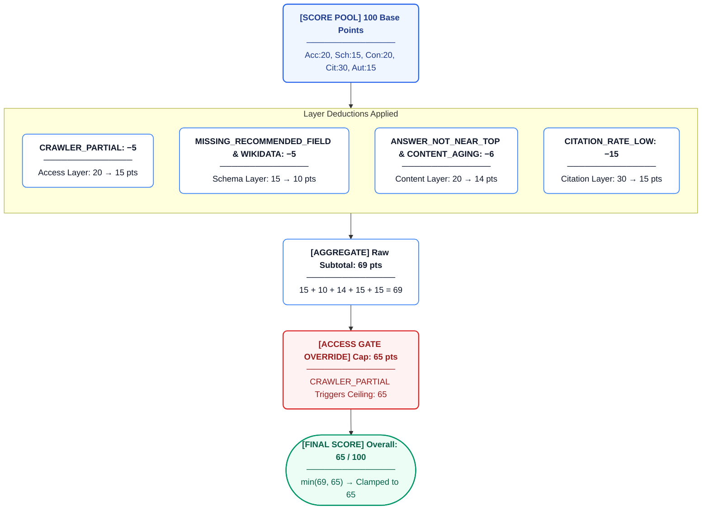
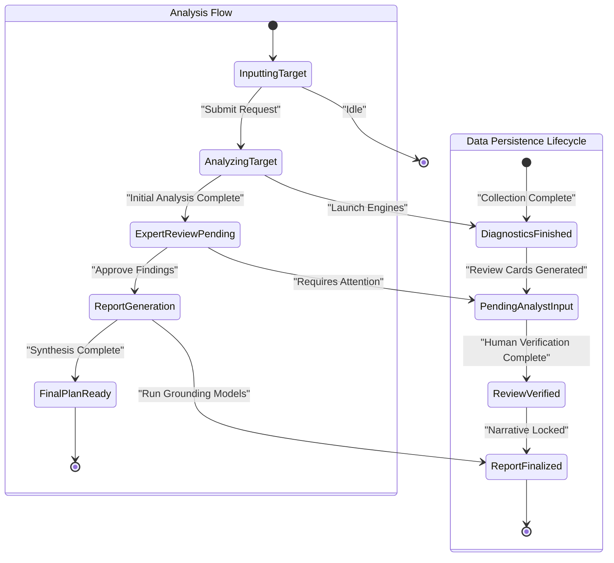

The Citeable audit lifecycle traces the exact data flow from a raw URL input to a prioritized, grounded remediation plan. This document maps how our diagnostic engines collect findings, how those findings are scored and wired to knowledge claims, and how the human-in-the-loop synthesis produces the final report.

## Section 1: Pipeline Overview

The Citeable audit pipeline executes in five sequential phases:

1. **Collection:** Your domain is analyzed across multiple dimensions. We dispatch parallel diagnostic engines to evaluate the target domain across access, schema, content, authority, and live AI citation.
2. **Evaluation:** Findings are scored using our 5-layer weighted model. This aggregates raw data into a structured scorecard, while our knowledge engine links each technical failure to a governing empirical knowledge claim.
3. **Review:** An expert reviews key findings. The human-in-the-loop system pauses the pipeline, presenting triggered manual review cards for analyst verification.
4. **Synthesis:** A grounded remediation report is generated. A 3-step synthesis pipeline (Drafting → Red Teaming → Grounding) transforms the structured data and manual notes into an actionable narrative.
5. **Persistence:** The final state is securely saved and can be safely retrieved at any time.

```mermaid
flowchart TD
    %% =========================================================================
    %% Cognitive Clarity Architecture Standard (Luminance, Depth & Rigor)
    %% =========================================================================
    classDef ingress fill:#EFF6FF,stroke:#2563EB,stroke-width:2px,color:#1E3A8A,rx:8px,ry:8px;
    classDef step fill:#FFFFFF,stroke:#3B82F6,stroke-width:1.5px,color:#0F172A,rx:8px,ry:8px;
    classDef human fill:#FAF5FF,stroke:#7C3AED,stroke-width:2px,color:#5B21B6,rx:8px,ry:8px;
    classDef ai fill:#FFFFFF,stroke:#10B981,stroke-width:1.5px,color:#0F172A,rx:8px,ry:8px;
    classDef gate fill:#FFF1F2,stroke:#EF4444,stroke-width:1.5px,color:#991B1B,rx:8px,ry:8px;
    classDef storage fill:#FFFBEB,stroke:#F59E0B,stroke-width:1.5px,color:#854D0E,rx:8px,ry:8px;
    classDef outcome fill:#ECFDF5,stroke:#059669,stroke-width:2px,color:#065F46,rx:8px,ry:8px;
    classDef zone fill:#F8FAFC,stroke:#94A3B8,stroke-width:2px,stroke-dasharray:5 5,color:#0F172A;

    ClientReq["<b>Audit Request</b><br/>───────────────<br/>Target URL & Ephemeral Context"]:::ingress

    subgraph PHASE1["[PHASE 01] Collection & Diagnostics"]
        direction TB
        SSRF["<b>Security Gate</b><br/>───────────────<br/>Network Security Validations"]:::step
        SubAuditors["<b>Diagnostic Engines</b><br/>───────────────<br/>Parallel Dimensional Analysis"]:::step
    end
    class PHASE1 zone

    subgraph PHASE2["[PHASE 02] Deterministic Scoring & Wiring"]
        direction TB
        Scorer["<b>Scoring Engine</b><br/>───────────────<br/>5-Layer Weighted Aggregation"]:::step
        Wiring["<b>Knowledge Base Wiring</b><br/>───────────────<br/>Link Findings to Curated Evidence"]:::step
    end
    class PHASE2 zone

    subgraph PHASE3["[PHASE 03] Human Review & AI Synthesis"]
        direction TB
        Wizard["<b>Human Review System</b><br/>───────────────<br/>Analyst Verification & Overrides"]:::human
        Synthesis["<b>Automated Synthesis</b><br/>───────────────<br/>Drafting → Red-Team → Grounder"]:::ai
        QAGate["<b>Quality Gate</b><br/>───────────────<br/>Strips Deprecated Guidance"]:::gate
    end
    class PHASE3 zone

    DB[("<b>Secure Local Storage</b><br/>───────────────<br/>State Persistence")]:::storage
    Report(["<b>Final Remediation Plan</b><br/>───────────────<br/>Grounded & Bounds-Enforced Report"]):::outcome

    ClientReq -->|"1. Start Analysis"| SSRF
    SSRF -->|"2. Safe Request"| SubAuditors
    SubAuditors -->|"3. Raw Diagnostics"| Scorer
    Scorer -->|"4. Layer Results"| Wiring
    Wiring -->|"5. Context Cues"| Wizard
    Wizard -->|"6. Verified Notes"| Synthesis
    Synthesis -->|"7. Narrative Draft"| QAGate
    QAGate -->|"8. Approved Plan"| Report
    QAGate -->|"9. Save Run State"| DB
```

## Section 2: The Diagnostic Engines

The Collection phase utilizes a suite of modular engines. Most engines are fully deterministic, while select evaluations rely on AI-assisted sampling or hybrid approaches.

| Engine Focus | Description | Key Check Codes | Evaluation Type |
|---|---|---|---|
| AI Directives | Verifies AI crawler directives in robots.txt and compliance. | `CRAWLER_FULLY_BLOCKED`, `CRAWLER_PARTIAL`, `LLMS_TXT_MISSING` | Deterministic |
| Structured Data | Validates JSON-LD structured data against Schema.org types. | `MISSING_TYPE`, `MISSING_RECOMMENDED_FIELD`, `SCHEMA_MISSING` | Deterministic |
| Content Formatting | Assesses answer positioning, specificity, and list/table presence. | `ANSWER_NOT_NEAR_TOP`, `EXTRACTABILITY_LOW` | Deterministic |
| Domain Authority | Measures domain authority and entity presence. | `REFERRING_DOMAINS_CRITICAL`, `AUTHORITY_DR_LOW` | Deterministic |
| Cloaking Detection | Detects content disparities presented to different user agents. | `CLOAKING_DETECTED`, `CLOAKING_SUSPECTED` | Deterministic |
| Entity Resolution | Validates external linkages, knowledge graph presence, and naming. | `WIKIDATA_MISSING`, `SAMEAS_MISSING`, `ENTITY_NAME_MISSING` | Deterministic |
| Content Freshness | Extracts and validates content freshness dates. | `CONTENT_AGING`, `CONTENT_STALE`, `DATE_MISSING` | Deterministic |
| Media Blindness | Identifies content trapped in inaccessible formats or lacking text equivalents. | `ALL_CONTENT_IN_MEDIA`, `IMAGES_MISSING_ALT` | Deterministic |
| URL Integrity | Audits redirect chains, canonical mismatches, and indexability rules. | `REDIRECT_CHAIN_EXCESSIVE`, `CANONICAL_MISMATCH`, `META_NOINDEX` | Deterministic |
| Sitemap Health | Checks XML sitemap presence, temporal metadata, and reachability. | `SITEMAP_MISSING`, `SITEMAP_NO_LASTMOD` | Deterministic |
| Multi-Page Context | Detects cross-page schema gaps, thin content, and near-duplicates. | `MULTI_PAGE_SCHEMA_GAPS`, `NEAR_DUPLICATE_PAGES` | Deterministic |
| JavaScript Dependency | Detects critical content blocks gated behind client-side rendering. | `JS_CRITICAL_CONTENT_GATED` | Deterministic |
| Live Citation | Samples live AI citation frequency across major foundation models. | `CITATION_RATE_LOW`, `CITATION_NOT_OBSERVED` | AI-Assisted |
| Competitor Benchmarking | Compares schema and content density against cited competitor domains. | `COMPETITOR_SCHEMA_ADVANTAGE` | Deterministic |

## Section 3: From Findings to Scores

The Evaluation phase aggregates raw findings into an executive scorecard.

- Each diagnostic engine produces structured findings.
- The scoring engine applies corresponding deduction values to specific evaluation layers (Access, Schema, Content, Citation, Authority).
- Deductions stack within their respective layers but cannot cross-contaminate. Each layer has a maximum score and cannot go below zero.
- **Access Gate:** Critical access failures trigger hard caps that override the final total if triggered. For example, if a site blocks AI crawlers, the overall score is strictly limited.
- The final overall score is bounded to a standardized range.

> **Note:** See the [Scoring Model](scoring.md) for a complete breakdown of layer weights and deduction logic.

## Section 4: From Findings to Recommendations

Raw technical findings are wired to empirical knowledge claims before presentation.

- Each finding is linked to curated knowledge claims in our knowledge base.
- If an exact match isn't found, our system utilizes a semantic routing layer to identify the closest relevant guidance.
- Recommendations are enriched with statements, confidence scores, evidence chains, and source citations.
- A quality assurance gate validates every recommendation, rejecting any guidance that relies on deprecated or archived knowledge claims. Manual observations added by analysts bypass this automated filter.
- Evidence follows a strict tiering hierarchy conceptually grouped from highly empirical (Tier 1) down to theoretical or contested (Tier 7), ensuring users only act on proven strategies. Claims themselves flow through a lifecycle: active, contested, or deprecated.

> **Note:** See the [Knowledge Base](knowledge.md) for details on the evidence model and claim lifecycle.

## Section 5: Anatomy of a Real Audit

This walkthrough traces the execution of a concrete audit for `acme-widgets.com`.

### Stage 1: Input
- Target: `acme-widgets.com`
- The domain is normalized and secured against malicious network routing attempts. We maintain strict security commitments, including zero long-term storage of PII and rigorous input validation.

### Stage 2: Collection
The diagnostic engines run concurrently and return numerous data points. Representative findings include:
- `AI Directives` → `CRAWLER_PARTIAL` (warning): Some essential AI agents are allowed, others blocked.
- `Structured Data` → `MISSING_RECOMMENDED_FIELD` (warning): Article schema lacks modification dates.
- `Content Formatting` → `ANSWER_NOT_NEAR_TOP` (error): Key product description starts too deep in the page.
- `Entity Resolution` → `WIKIDATA_MISSING` (warning): Organization schema lacks external knowledge graph linkages.
- `Live Citation` → `CITATION_RATE_LOW` (warning): Brand cited infrequently across major foundation models.
- `Content Freshness` → `CONTENT_AGING` (warning): Content has not been updated recently.

### Stage 3: Scoring
The scoring system processes the findings against the established layers.

| # | Check Code | Layer | Points | Layer After | Running Total |
|---|---|---|---|---|---|
| — | (start) | — | — | — | 100 |
| 1 | `CRAWLER_PARTIAL` | Access (20) | −5 | 15/20 | 95 |
| 2 | `MISSING_RECOMMENDED_FIELD` | Schema (15) | −3 | 12/15 | 92 |
| 3 | `ANSWER_NOT_NEAR_TOP` | Content (20) | −4 | 16/20 | 88 |
| 4 | `WIKIDATA_MISSING` | Schema (15) | −2 | 10/15 | 86 |
| 5 | `CITATION_RATE_LOW` | Citation (30) | −15 | 15/30 | 71 |
| 6 | `CONTENT_AGING` | Content (20) | −2 | 14/20 | 69 |

**Gate Applied:** The raw total computed is `69`. However, `CRAWLER_PARTIAL` triggers the Access Gate cap set at `65`. Since `69 > 65`, the overall score is hard-capped at **65**.

### Stage 4: Knowledge Wiring
Each finding is linked to curated knowledge claims:
- The `ANSWER_NOT_NEAR_TOP` issue maps to empirical principles about AI extraction efficiency.
- The claim is backed by high-confidence evidence detailing why answer depth matters for foundation models.
- A quality assurance check ensures the underlying claim is still active and recognized as best practice.

### Stage 5: Manual Review
- The analysis pauses, surfacing context cards to human analysts based on the triggered findings.
- For example, an analyst reviews the content formatting issues and provides specific context about the site's layout.
- The expert verifies the findings and adds qualitative notes to be included in the final report.

### Stage 6: Synthesis
- **Step 1 (Drafting):** Multiple frontier foundation models with priority-weighted failover cascade synthesize a draft narrative combining technical findings with expert notes.
- **Step 2 (Red Teaming):** Adversarial red-teaming using a structurally independent model challenges the draft, flagging any unsupported claims or hallucinations.
- **Step 3 (Grounding):** The text is finalized. All recommendations are explicitly tied to our knowledge base or direct site evidence.

### Stage 7: Output
- **Final Score:** 65 (Access gate applied).
- **Grounded Narrative:** Complete with verified claim citations.
- **Remediation Plan:** Prioritized, step-by-step instructions.

## Section 6: Run State Lifecycle

Audit runs transition through clear stages as they progress through our analysis platform.

These states reflect the journey of a request:
- Initial processing completes the comprehensive diagnostic sweep.
- Expert intervention validates critical technical findings.
- Automated synthesis leverages a zero-SDK integration layer with direct API orchestration to finalize the report.
