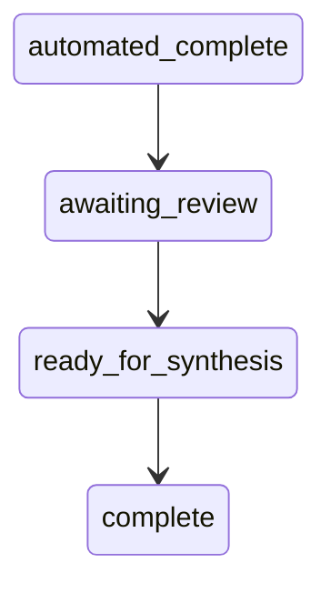

This page outlines the human-in-the-loop review and governance mechanisms within Citeable. By treating human judgment as a required architectural primitive, the system ensures that automated diagnostics are contextualized and validated by qualitative auditor insights.

## Why Human Review Exists

Automated diagnostics in Citeable are highly effective at detecting structural issues, such as missing schema, blocked crawlers, or stale content. However, certain critical evaluations require qualitative human judgment that cannot be fully automated:

- Is the schema claim actually truthful relative to visible page content?
- Is the AI-generated citation factually accurate about the brand?
- Is cloaking intentional or accidental?
- What is the root cause connecting multiple findings?

Citeable deliberately defers synthesis until human review completes. This architectural decision ensures that AI-generated narratives incorporate qualitative auditor insights rather than simply generating generic recommendations based on raw structural data.

## The Guided Review Wizard

The guided review wizard walks the analyst through an 11-question conditional flow to gather qualitative insights. The following card IDs define the scope of human evaluation:

| Card ID | Purpose |
|---------|---------|
| `A1_PROMPT_VALIDATION` | Are the test prompts aligned with real user discovery queries? |
| `B1_SCHEMA_HONESTY` | Do JSON-LD claims match visible page content? |
| `B2_CONTENT_ANSWERABILITY` | Can an AI engine extract a complete answer from the lead text? |
| `B3_CLOAKING_INTENT` | Is the content disparity between bot and browser intentional? |
| `C1_BRAND_ACCURACY` | Are AI-generated citations factually accurate about the brand? |
| `C2_CONTENT_TRUSTWORTHINESS` | Does the content demonstrate first-hand expertise (E-E-A-T)? |
| `C3_CITATION_FRAMING` | What is the qualitative sentiment of AI citations? |
| `C4_CITATION_GAP` | What content do cited competitors have that this site lacks? |
| `C5_SPEAKABLE` | Is the speakable schema markup voice-assistant ready? |
| `D1_LLMS_TXT_REVIEW` | Does the `llms.txt` accurately summarize the site for AI? |
| `D2_ROOT_CAUSE_DIAGNOSIS` | What is the holistic root cause connecting the findings? |

## Conditional Visibility

To prevent analysts from wasting time on irrelevant questions, not all cards appear in every audit:

- **Express Mode:** Shows only high-impact cards (`B2`, `C1`, `C2`, `D2`).
- **`B3_CLOAKING_INTENT`:** Appears only if the `CLOAKING_DETECTED` condition fired.
- **`C3_CITATION_FRAMING`:** Appears only if citations were observed (`cited_count > 0`).
- **`C4_CITATION_GAP`:** Appears only if citation gaps exist (`cited_count < total_prompts`).
- **`C5_SPEAKABLE`:** Appears only if speakable schema markup was found.
- **`D1_LLMS_TXT_REVIEW`:** Appears only if an `llms.txt` file exists.

## Data Pre-population

The wizard does not start from a blank slate; it presents the analyst with evidence to review rather than gather:

- `B1_SCHEMA_HONESTY` receives the extracted schema claims for side-by-side comparison with the page content.
- `B2_CONTENT_ANSWERABILITY` receives the extracted lead text.
- `C1_BRAND_ACCURACY` receives the full AI model responses.
- `C4_CITATION_GAP` receives the competitor domain list populated from citation sampling.

## How Observations Flow Into Synthesis

The integration of human feedback follows a strictly enforced flow:

1. The analyst submits observations via `POST /api/v1/audit/runs/{id}/observations`.
2. Each observation acts as an atomic UPSERT (ensuring `run_id` + `question_id` uniqueness).
3. When all visible wizard cards are completed, synthesis becomes available.
4. The synthesis pipeline loads these human observations and merges them into the finding context.
5. Human observations appear as `[HUMAN CONFIRMED]` annotations within the synthesis input.
6. If human diagnosis text is provided (`D2_ROOT_CAUSE_DIAGNOSIS`), it explicitly forms the opening framing of the final narrative.

## The Verification Shield

Audits transition through a provisional scoring phase to ensure integrity:

- After automated diagnostics conclude, the score is marked **PROVISIONAL**.
- A verification shield tracks the review progress (e.g., "4/11 cards completed").
- The UI displays a warning banner until the human review is fully completed.
- This serves as a strong signal to the reader that the score has not yet been validated by a human auditor.

## Analyst Identity Attribution

Every human action within Citeable is strictly attributed to ensure an immutable audit trail:

- First-time visitors are prompted to provide an Analyst ID (e.g., "A-742" or "Alice S.").
- This ID persists in `localStorage`.
- Every manual verdict, observation, claim edit, and logged outcome is attributed to this analyst identity within SQLite.
- A `write_as()` context manager injects actor identity into database triggers.
- This creates an undeniable record of who reviewed what and when.

## Knowledge Governance — The Approval Console

Beyond audits, Citeable enforces a separate governance workflow for knowledge base mutations:

- A research service extracts candidate claims from external documents.
- The diff service classifies candidates into categories: novel, corroborating, or contradicting.
- Candidates are staged in changelog files with an adversarial AI critique attached.
- The Approval Console displays a side-by-side diff comparing the candidate with existing DB records.
- An analyst can approve (committing to the DB) or reject (requiring a rejection reason).
- Importantly, `auto_apply` is hardcoded to return `False` — **every single mutation requires human signoff**.
- Source reliability is actively tracked, maintaining approved/rejected counts per source domain.

## Run State Derivation

In Citeable, run states are computed from ground truth rather than being manually set. This derived state approach eliminates the bug class where a status field is out of sync with reality.

- `automated_complete`: The scan has finished, and wizard cards are pending.
- `awaiting_review`: The number of completed cards is less than the total required cards.
- `ready_for_synthesis`: All cards are reviewed, but synthesis has not yet run.
- `complete`: A synthesis record successfully exists in the `audit_synthesis` table.
