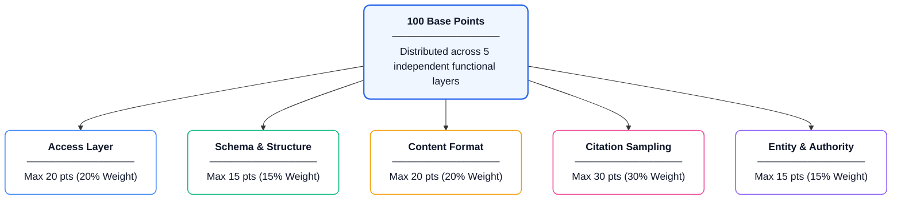
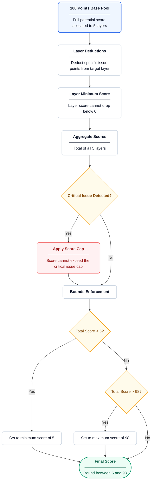
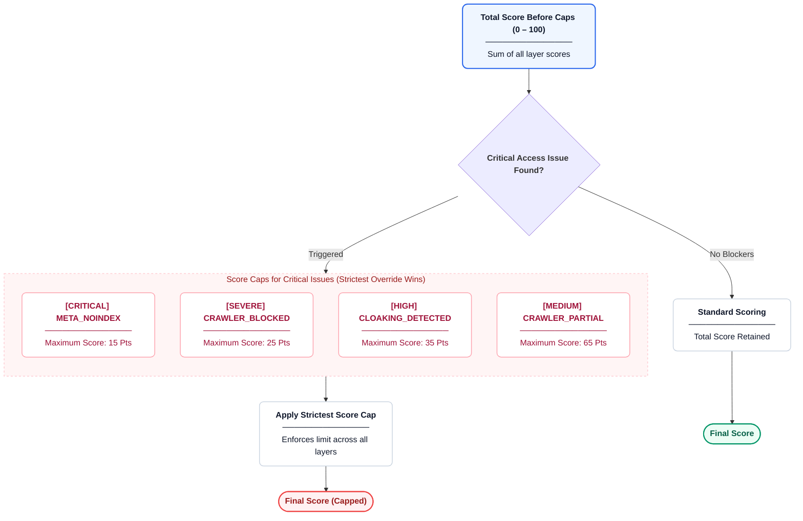

This page details the scoring model used by Citeable, outlining the five-layer architecture, deduction mechanisms, and scoring rules. The model produces reproducible, transparent scores derived from audit findings.

## Scoring Philosophy

Scoring is highly consistent and transparent. Given identical inputs, the output is identical every time. We check a comprehensive set of signals without relying on unpredictable AI evaluations for the final mathematical score. This ensures that changes in the score reflect genuine changes in AI readiness, not fluctuations in model inference.

## The Five-Layer Model

The overall score is distributed across five logical layers, representing a funnel from basic technical accessibility to real-world AI impact.

| Layer | Max Points | Weight | Purpose |
|---|---|---|---|
| Access | 20 | 20% | Can AI crawlers reach the site? Prerequisite for everything else. |
| Schema & Structure | 15 | 15% | Can AI engines unambiguously identify entities and properties? |
| Content Format | 20 | 20% | Can AI engines extract citable, direct answers? |
| Citation Sampling | 30 | 30% | Is the brand actually being cited by AI search engines? |
| Entity & Authority | 15 | 15% | Do external signals validate the entity's legitimacy? |

The **Citation Sampling** layer carries the highest weight (30%) because it acts as the ground-truth outcome signal. It is a direct measurement of real-world AI presence and citation frequency, which Citeable ultimately seeks to measure and improve.

## When Citeable finds an issue

When Citeable finds an issue, points are deducted from the relevant scoring layer. The process ensures fair and consistent application of penalties.

- Each finding maps to a specific layer and point deduction.
- Deductions stack within a layer but are capped at the layer's max points (a layer's score cannot fall below 0).
- There is no cross-layer contamination: if the Access layer is depleted to 0, additional Access findings do not subtract from the running total, leaving other layers unaffected.
- All deduction values are positive integers.

## Score Caps for Critical Issues

To prevent misleadingly high scores for sites that block AI, certain critical access failures trigger an override mechanism. If an AI engine cannot read the page, perfect schema and authority cannot save the score.

| Issue Trigger | Maximum Score Allowed |
|---|---|
| `META_NOINDEX` | 15 |
| `CRAWLER_FULLY_BLOCKED` | 25 |
| `CLOAKING_DETECTED` | 35 |
| `CRAWLER_PARTIAL` | 65 |

- If multiple critical issues are found, the strictest (lowest score cap) applies.
- If the calculated score is higher than the cap, the final score is reduced to match the cap.
- **Rationale:** A well-optimized site that blocks AI crawlers cannot receive a misleadingly high AI readiness score, as it cannot participate in AI ecosystems.

## Score Bounds

- **Minimum Score: 5** (even worst-case audits receive a non-zero score).
- **Maximum Score: 98** (even pristine audits leave a 2-point margin for continuous improvement).
- **Rationale:** This prevents users from misinterpreting a score of 0 as a completely broken site or 100 as an absolutely perfect, mathematically untouchable site.

## Worked Example A — Mixed Findings, No Critical Issues

In this scenario, we evaluate a site with several issues across different layers. No critical access issues are triggered.

| Check Code | Layer | Max Points | Deduction | Layer Remaining | Running Total |
|---|---|---|---|---|---|
| _Start_ | - | - | - | - | 100 |
| `SCHEMA_MISSING` | Schema | 15 | -10 | 5 | 90 |
| `ANSWER_NOT_NEAR_TOP` | Content | 20 | -4 | 16 | 86 |
| `CITATION_RATE_LOW` | Citation | 30 | -15 | 15 | 71 |
| `BRAND_MENTIONS_STAGNANT` | Authority | 15 | -3 | 12 | 68 |

**Final Calculation:**
The total before caps is 68. Since no score caps were triggered, the final overall score is **68**.

## Worked Example B — Score Cap Applied

In this scenario, a site has excellent content but is blocking AI crawlers, triggering a score cap.

| Check Code | Layer | Max Points | Deduction | Layer Remaining | Running Total |
|---|---|---|---|---|---|
| _Start_ | - | - | - | - | 100 |
| `CRAWLER_FULLY_BLOCKED` | Access | 20 | -20 | 0 | 80 |
| `EXTRACTABILITY_NONE` | Content | 20 | -20 | 0 | 60 |
| `SCHEMA_MISSING` | Schema | 15 | -10 | 5 | 50 |

**Final Calculation:**
The total layer score is 50. However, `CRAWLER_FULLY_BLOCKED` triggers a maximum score cap of 25.
Since the score of 50 is greater than the cap of 25, the cap is applied. The final overall score is **25**.

## Complete Check Code Reference

The following tables define the standard point deduction values for all check codes, grouped by layer. 

> **Note:** Check codes not present in these tables (e.g., `CITATION_OBSERVED`, `CRAWLER_ALLOWED`) are informational only and produce no deduction.

### Access Layer (20 points)

| Check Code | Deduction | Cap | Description |
|---|---|---|---|
| `CRAWLER_FULLY_BLOCKED` | 20 | 25 | Entire layer wiped; blocks crawlers entirely |
| `JS_CRITICAL_CONTENT_GATED` | 10 | - | Content heavily gated behind JS execution |
| `PAGE_FETCH_FAILED` | 10 | - | Unable to fetch page |
| `CLOAKING_DETECTED` | 10 | 35 | Detected cloaking between AI and human |
| `NOSNIPPET_BLOCKING_AI` | 8 | - | Blocks snippet extraction |

> *Note: `CLOAKING_DETECTED` is a technical heuristic that compares content served to different user agents. It is an algorithmic observation of content disparity, not a determination of intentional deception. See [Legal](legal.md) for the full diagnostic opinion disclaimer.*
| `REDIRECT_CHAIN_EXCESSIVE` | 8 | - | Unreasonably long redirect chain |
| `META_NOINDEX` | 8 | 15 | Explicit noindex instruction |
| `AI_BOT_BLOCKED_HTTP` | 8 | - | Blocked at HTTP level for AI user agents |
| `CRAWLER_PARTIAL` | 5 | 65 | Some AI bots are blocked |
| `AUDIT_PHASE_CRASHED` | 5 | - | Audit sub-phase failure |
| `CLOAKING_SUSPECTED` | 5 | - | Suspected cloaking |
| `CLOAKING_FETCH_FAILED` | 5 | - | Cloaking check fetch failed |
| `REDIRECT_CHAIN_LONG` | 3 | - | Long redirect chain |
| `SITEMAP_MISSING` | 3 | - | Sitemap is missing |
| `SITEMAP_EMPTY` | 2 | - | Sitemap exists but is empty |
| `SITEMAP_PAGES_UNREACHABLE` | 2 | - | Pages in sitemap cannot be reached |
| `INVALID_CRAWL_DELAY` | 1 | - | Invalid crawl delay specified |
| `SITEMAP_NOT_IN_ROBOTS` | 1 | - | Sitemap not referenced in robots.txt |

### Schema & Structure (15 points)

| Check Code | Deduction | Description |
|---|---|---|
| `SCHEMA_MISSING` | 10 | No JSON-LD schema present |
| `MISSING_TYPE` | 8 | Missing @type definition |
| `JSON_PARSE_FAILURE` | 7 | JSON-LD block cannot be parsed |
| `MISSING_REQUIRED_FIELD` | 5 | Required field absent |
| `ENTITY_NAME_MISSING` | 5 | Missing entity name |
| `MULTI_PAGE_SCHEMA_GAPS` | 5 | Schema inconsistencies across pages |
| `CANONICAL_MISMATCH` | 4 | Canonical URL does not match |
| `MISSING_RECOMMENDED_FIELD` | 3 | Recommended field absent |
| `REDIRECT_DOMAIN_CHANGE` | 3 | Redirect changes domain |
| `SAMEAS_DEAD_LINK` | 3 | dead link in sameAs array |
| `COMPETITOR_SCHEMA_ADVANTAGE` | 3 | Competitors have stronger schema |
| `UNKNOWN_FIELD` | 2 | Non-standard property used |
| `UNKNOWN_SCHEMA_TYPE` | 2 | Unrecognized @type |
| `CANONICAL_MISSING` | 2 | Canonical tag missing |
| `SAMEAS_MISSING` | 2 | Missing sameAs property |
| `WIKIDATA_MISSING` | 2 | Missing Wikidata entity link |
| `SAMEAS_INCOMPLETE` | 1 | sameAs array is sparse |

### Content Format (20 points)

| Check Code | Deduction | Description |
|---|---|---|
| `EXTRACTABILITY_NONE` | 20 | Zero extractable content |
| `EXTRACTABILITY_LOW` | 12 | Sparse or CSS-heavy content |
| `ALL_CONTENT_IN_MEDIA` | 8 | All informational content embedded in media |
| `EXTRACTABILITY_MEDIUM` | 6 | Partial extractability |
| `MULTI_PAGE_THIN_CONTENT` | 5 | Thin content across multiple pages |
| `ANSWER_NOT_NEAR_TOP` | 4 | First answer is far down the page (>30%) |
| `ANSWER_NOT_SELF_CONTAINED` | 4 | Answer requires external context |
| `CONTENT_STALE` | 4 | Content is noticeably stale |
| `IFRAME_HEAVY` | 4 | Heavy reliance on iframes |
| `NEAR_DUPLICATE_PAGES` | 4 | Many near-duplicate pages |
| `ANSWER_NOT_FACTUALLY_SPECIFIC` | 3 | No specific numbers, dates, or metrics |
| `IMAGES_MISSING_ALT` | 3 | Missing alt attributes on images |
| `COMPETITOR_CONTENT_ADVANTAGE` | 3 | Competitor content is superior for extraction |
| `NO_LIST_OR_TABLE` | 2 | No scannable structure |
| `CONTENT_AGING` | 2 | Content is aging |
| `DATE_MISSING` | 2 | Missing publication date |
| `VIDEO_NO_TRANSCRIPT` | 2 | Missing transcript for video content |
| `SITEMAP_NO_LASTMOD` | 2 | Sitemap lacks lastmod dates |

### Citation Sampling (30 points)

| Check Code | Deduction | Description |
|---|---|---|
| `CITATION_NOT_OBSERVED` | 30 | Not cited at all by AI engines |
| `CITATION_RATE_LOW` | 15 | Rarely cited by AI engines |
| `SHARE_OF_VOICE_LOW` | 10 | Low share of voice compared to competitors |

### Entity & Authority (15 points)

| Check Code | Deduction | Description |
|---|---|---|
| `REFERRING_DOMAINS_CRITICAL` | 5 | Critically low referring domains (<50) |
| `WIKIPEDIA_ENTITY_MISSING` | 5 | No Wikipedia or Wikidata entity |
| `BRAND_MENTIONS_STAGNANT` | 3 | No recent brand mentions |

## Scoring Rules

The scoring engine enforces several boundaries to ensure predictable and fair results:

- **Strict Boundaries:** Every generated score is always bound between a minimum score of 5 and a maximum score of 98.
- **Layer Bounds:** Layer scores are always bounded between 0 and their respective maximum points.
- **Total Points:** The sum of all layer maximum points exactly equals 100.
- **Cap Enforcement:** If a critical access issue is detected, the final score will never exceed the specific maximum score cap for that issue.
- **Transparent Calculations:** The final score is determined directly by iterating through the identified issues and applying standard point deductions.
