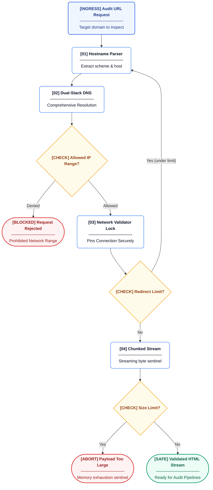
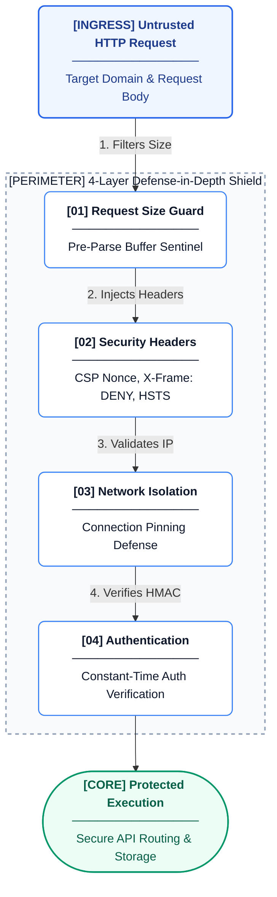

# How We Protect Your Data

This document details the defense-in-depth security architecture of Citeable. It outlines how each layer independently mitigates specific threat classes, ensuring robust protection without single points of failure.

## 1. Security Model Overview

Citeable's security model follows a defense-in-depth approach. Each architectural layer addresses a specific threat class independently. By isolating responsibilities, a failure or bypass in one layer does not compromise the overall system integrity.

The key threat classes we protect against include:
1. **Network Security**: Ensuring we safely fetch user-supplied URLs for auditing.
2. **Data Privacy**: Safely handling high-value user-supplied API keys for LLM access.
3. **API Integrity**: Guarding against compute-intensive endpoint abuse that could exhaust resources.
4. **Audit Trail**: Guaranteeing write operations are strictly attributed and auditable.
5. **Information Disclosure**: Ensuring error messages do not leak internal state.
6. **Input Validation**: Safely parsing request bodies and external formats.

## 2. Network Security

Server-Side Request Forgery (SSRF) is a primary threat, as our system routinely fetches user-provided URLs. Protection relies on a five-stage defense-in-depth strategy to enforce network isolation:

1. **DNS Resolution**: All user-supplied URLs are comprehensively resolved across dual-stack protocols.
2. **IP Validation**: The resolved IP addresses are verified against a strict denylist, rejecting private, loopback, link-local, and cloud metadata networks.
3. **Connection Pinning**: Standard HTTP clients can be vulnerable to Time-of-Check to Time-of-Use (TOCTOU) DNS rebinding attacks. Citeable uses a secure network validator to pin the connection directly to the pre-validated IP address, while preserving secure certificate validation.
4. **Redirect Validation**: Our implementation manually handles redirects. Each redirect target's hostname is fully re-resolved and re-validated before opening the next connection.
5. **Response Size Limit**: Response bodies are safely streamed and strictly capped, preventing memory exhaustion attacks.

## 3. Data Privacy

Citeable employs a Bring-Your-Own-Key (BYOK) zero-retention lifecycle for LLM API credentials, ensuring no credentials are at risk.

1. API keys arrive securely via HTTP headers.
2. They are extracted into an ephemeral, isolated memory context.
3. The keys are passed down the execution pipeline strictly as short-lived variables.
4. Once the request completes, the context is immediately cleared from memory.
5. Keys are **never** written to secure local storage, disk files, log files, error traces, or audit logs.

## 4. Input Validation

The API employs a strict pipeline to sanitize incoming requests, establishing a 4-Layer Security Perimeter:

1. **Body Size Limit**: A strict sentinel rejects oversized request bodies *before* they are parsed by application logic.
2. **CORS**: Enforces secure Same-Origin Policy constraints.
3. **Correlation ID**: Generates a secure reference bound to each request to securely trace logs without exposing internal context.
4. **Security Headers**: Injects defensive headers (CSP, X-Frame-Options, X-Content-Type-Options) to provide comprehensive XSS and clickjacking protection.
5. **XML Security**: The sitemap auditor parses potentially untrusted XML from external sites utilizing a safe parser, effectively preventing exponential entity expansion (Billion Laughs) and external entity (XXE) injection attacks.

## 5. Authentication

The system enforces a strict two-tier authorization model:
- **Public Endpoints**: Permit read-only queries and audit execution.
- **Admin Endpoints**: Govern knowledge management and prompt configurations.

Startup is strictly gated to authenticated environments. All token verification is executed using cryptographic constant-time comparison to mitigate timing attacks.

## 6. Audit Trail

Every modification operation maintains a strict, tamper-evident audit trail to maintain data integrity:
- All writes are strictly attributed to an actor and a verified reason.
- Automated systems append comprehensive logs upon any state change.
- Hard deletes are categorically prevented at the lowest system level to maintain a complete historical record.
- Audit entries capture complete before/after snapshots, the responsible actor, the explicit reason, and a precise timestamp.

## 7. Information Disclosure

A global exception handler prevents internal state leakage:
- Safely intercepts all unhandled errors and returns a structured response.
- Exposes only a generic message and a correlation ID.
- Never leaks internal stack paths, database queries, or internal state to clients.
- Full diagnostic data is securely stored server-side for internal debugging.

## 8. API Abuse Protection

To prevent API abuse and resource exhaustion, endpoints are protected by robust rate limiting:
- Utilizes thread-safe tracking mechanisms.
- Prevents resource exhaustion.
- Compute-intensive endpoints (e.g., auditing) are strictly capped per origin IP address.

## 9. Security Summary Table

| Threat | Control | Layer |
|---|---|---|
| SSRF | Dual-stack resolution + network denylist + connection pinning + hop-by-hop redirect validation | Network |
| DNS Rebinding | Connection pinning defense | Network |
| Credential Theft | Zero-retention BYOK, ephemeral memory lifecycle | Data Privacy |
| Memory Exhaustion | Pre-parse body limit, capped HTTP response limit | Input Validation |
| API Abuse | Per-IP rate limiting | API Integrity |
| XML Injection | Safe parsing engine | Input Validation |
| Data Tampering | Comprehensive audit trails + hard delete prevention | Audit Trail |
| Information Disclosure | Global exception guard, correlation tracking | Information Disclosure |
| Clickjacking / XSS | Defensive response headers (CSP, X-Frame-Options) | Input Validation |
| Timing Attacks | Constant-time authentication verification | Authentication |

---

> *Operators deploying Citeable in GDPR/CCPA jurisdictions must configure data retention and erasure procedures for personal data. No security measures are impenetrable; this document describes controls in place, not absolute guarantees of security. See [Legal](legal.md) for the full privacy and data notice.*
