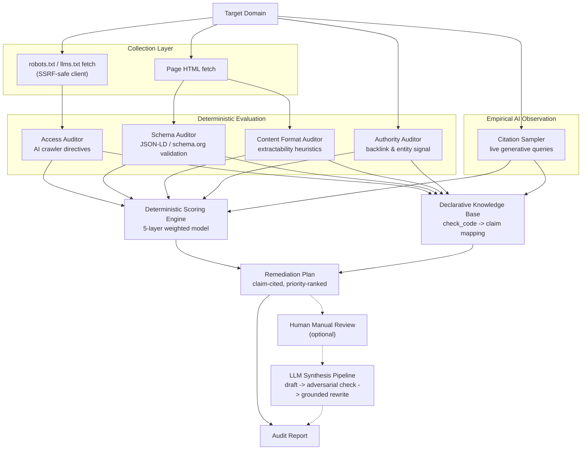
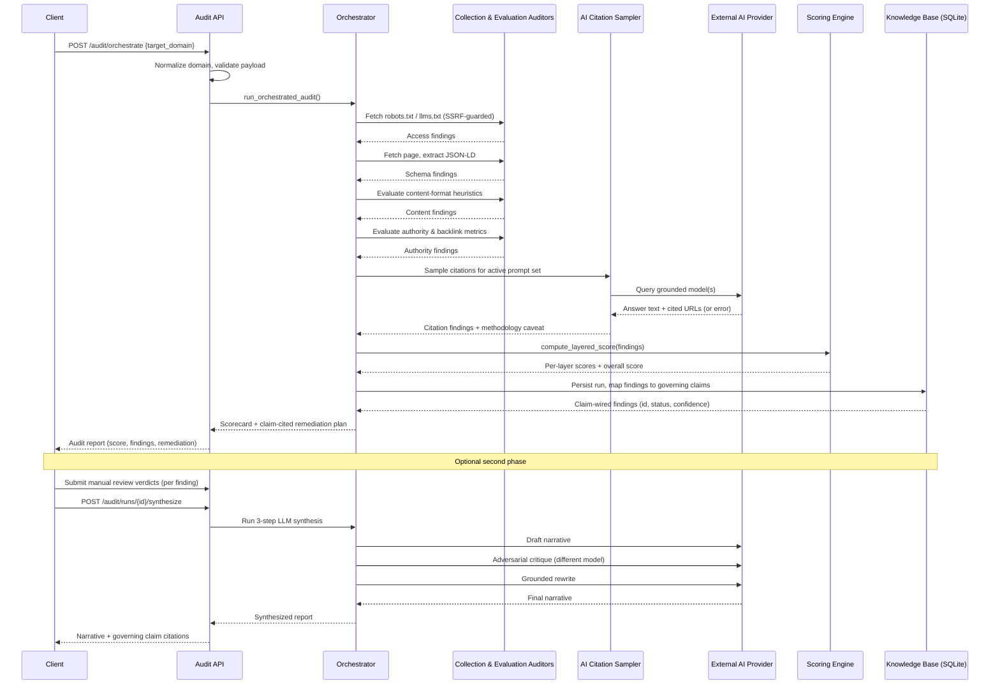

# Citeable Technical Reference

**Autonomous Research & Empirical Optimization System**

Citeable audits how ready a domain is to be read, trusted, and cited by AI
answer engines. It fetches a target domain's crawl policies and markup,
evaluates its content against known extractability factors, samples live
generative AI answers for the domain's presence, computes a bounded
readiness score from deterministic rules, and returns a prioritized,
evidence-cited remediation plan.

This document is a technical reference, not a marketing page. Every
mechanism described below is grounded in the running system: the scoring
formulas, deduction tables, and failure-handling rules are the actual
values the engine uses, not illustrative approximations.

> **In 30 seconds**
>
> | | |
> |---|---|
> | **What it is** | A measurement instrument for whether a website can be found, correctly parsed, and cited by AI answer engines — not an SEO rank tracker. |
> | **Problem it solves** | Nobody could say *why* a language model does or doesn't cite a given page. Citeable turns that into five observable, independently scored dimensions instead of a guess. |
> | **What goes in** | A target domain, optionally a funnel-stage filter, and (for the AI-written narrative) a caller-supplied LLM key. |
> | **What happens** | A deterministic pipeline crawls the domain, validates its structured data, evaluates content extractability, samples live AI answers for citations, and scores all of it against a fixed 100-point rubric — see [§4](#4-audit-request-lifecycle). |
> | **What comes out** | A bounded 5–98 readiness score, a prioritized remediation plan where every recommendation cites a specific governed claim, and — once any required human review is complete — an AI-drafted, adversarially self-checked narrative report. |
> | **Why the architecture is interesting** | The score, the evidence, and the remediation advice are all computed by deterministic code, not an LLM. The LLM's only job is writing the narrative *after* the facts are already settled — see [§7](#7-declarative-knowledge-base) and [§9](#9-llm--provider-architecture). |

---

## 1. What Citeable Is

### 1.1 The problem

Generative AI answer engines (chat-style assistants, grounded search
products, AI Overviews) increasingly mediate how people discover and
evaluate a business. Traditional SEO tooling measures rankability in a
link-and-keyword index. It does not measure whether a language model can
find a page, extract a clean fact from it, decide the site is a credible
source, or ultimately cite it in a generated answer. Citeable exists to close
that measurement gap: it treats "AI readiness" as an engineering property
of a domain that can be observed and scored, not a vague marketing
outcome.

### 1.2 What "AI readiness" means here

Citeable defines AI readiness along five independently scored dimensions,
described in full in [§5](#5-deterministic-scoring-model):

1. **Access** — can AI crawlers reach the site at all?
2. **Schema & structure** — is machine-readable entity data present and
   well-formed?
3. **Content format** — is the content shaped so a retrieval or chunking
   system can extract a clean, self-contained answer?
4. **Citation** — is the domain actually appearing in live generative
   answers today?
5. **Authority** — does the domain carry the external corroboration
   (backlink and entity-graph signal) that models use as a trust proxy?

A domain that scores well is one that AI systems can technically reach,
correctly parse, and have external reason to trust — not one that is
guaranteed to be cited by any specific model on any specific query.

### 1.3 What Citeable does

Given a target domain, Citeable runs a fixed audit pipeline that:

- Fetches and parses the domain's `robots.txt` and `llms.txt` files for
  AI-crawler directives.
- Fetches the domain's markup and validates any `application/ld+json`
  structured data against schema.org rules.
- Evaluates page content against deterministic content-format heuristics
  (answer placement, self-containment, factual specificity, structured
  lists/tables).
- Evaluates domain authority and backlink signal, using a live
  third-party metrics provider when configured, with a deterministic
  fallback otherwise.
- Samples live generative AI answers for domain-relevant prompts and
  records whether the domain is cited.
- Computes a single bounded readiness score (5–98) from a five-layer
  deterministic model.
- Maps every automated finding to a claim in a declarative knowledge
  base, producing a prioritized, evidence-cited remediation plan.
- Optionally incorporates human-reviewed verdicts and a three-step LLM
  synthesis pass into a final narrative report.

### 1.4 What Citeable deliberately does not do

- **It does not guarantee citation.** A high score describes a domain
  that meets the technical and structural preconditions AI systems are
  known to depend on. It is not a prediction that any specific model will
  cite the domain on any specific future query.
- **It is not a continuous monitor.** An audit is a point-in-time
  snapshot triggered on demand. Citeable does not run a background crawler
  and does not maintain a rolling baseline for a domain unless a caller
  explicitly runs and stores repeated audits.
- **It does not scrape AI products that forbid it.** Citation sampling is
  restricted to engines with a programmatic, Terms-of-Service-compliant
  API. Interfaces with no compliant API are excluded rather than scraped
  (see [§6](#6-ai-citation-sampling)).
- **It does not silently invent remediation advice.** Every recommendation
  in the output plan is required to trace back to a specific claim in the
  knowledge base; a recommendation with no valid, active governing claim
  is rejected before it reaches a report (see [§7](#7-declarative-knowledge-base)).

### 1.5 Measurement, not prediction

Every score Citeable produces should be read as: *"as of this run, against
this specific prompt sample and this specific snapshot of the site, these
are the deterministic and empirically observed conditions."* It is a
measurement instrument, not a forecasting model. [§15](#15-interpretation--limitations)
spells out the boundaries of that measurement in detail — read it before
treating a score as anything stronger than a snapshot.

---

## 2. The Complete AEO/GEO Audit Lifecycle

### 2.1 What a full AEO/GEO audit actually involves

"AEO/GEO audit" is used loosely across the industry to mean anything from a
five-minute automated scan to a multi-week engagement involving stakeholder
interviews, competitive research, and a delivered strategy deck. Citeable's
knowledge base treats this ambiguity as something to resolve empirically
rather than assume away: it encodes a nine-phase audit taxonomy, built by
independently researching how a full audit is actually scoped and executed,
then cross-checking that breakdown for structural agreement before treating
any part of it as a governed claim.

Each phase below carries its own set of governed knowledge-base claims
rating whether the work in that phase is automatable, partially
automatable, or requires human judgment — the same claim records that
justify individual findings elsewhere in an audit report (see
[§7](#7-declarative-knowledge-base)). This section exists to answer a
question the rest of this document doesn't: *of everything a full AEO/GEO
audit actually requires, which parts does Citeable do for you, and which
parts are still on you?*

### 2.2 The nine phases

| # | Phase | What it covers | Automation profile |
|---|-------|-----------------|---------------------|
| 1 | **Business & Competitive Scoping** | Defining goals and KPIs, deciding which AI engines/surfaces matter for this business, identifying the competitor set to benchmark against. | Human-judgment-heavy. Selecting a competitor set or prioritizing engines is a commercial call no crawl or API can make. |
| 2 | **Structured Data & Schema Validation** | JSON-LD syntax and `schema.org` conformance, whether structured-data claims semantically match the visible page, Rich Results eligibility. | Mixed. Syntax and required-field checks are mechanical; judging whether a schema claim is *honest* relative to the visible page is closer to a judgment call. |
| 3 | **Technical Crawlability & Site Access** | Full-site crawling, sitemap parsing, `robots.txt` / `llms.txt` parsing for named AI-crawler directives, deciding the *correct* access policy per crawler. | The most mechanically verifiable phase in the taxonomy — the majority of its knowledge-base claims describe fully or near-fully automatable checks. |
| 4 | **Content Quality & E-E-A-T Assessment** | Content depth, factual accuracy, first-hand expertise, and overall trustworthiness signal. | Predominantly human judgment. Assessing genuine expertise and trust signal is explicitly the kind of subject-matter call a script cannot make. |
| 5 | **AI Citation Testing** | Running a fixed prompt set across AI engines and recording citations, designing the prompt set itself, and attributing *why* a model cited (or ignored) a given source. | Split cleanly: executing and recording a citation test is mechanical; designing realistic prompts and explaining a citation outcome is not. |
| 6 | **Competitive & Authority Analysis** | Comparing competitor schema/content coverage, backlink and mention profile pulls, digital-PR / third-party-citation-gap analysis. | Split: metric pulls (backlinks, referring domains) are fully automatable; judging which links carry real topical authority, or diagnosing a PR gap, is not. |
| 7 | **Synthesis, Prioritization & Reporting** | Cross-referencing findings to diagnose root causes, prioritizing the remediation roadmap by impact vs. effort, producing the final report. | Split: chart/report generation from already-collected data is automatable; weighting priorities against business context and validating a root-cause narrative is not. |
| 8 | **Legal & Terms-of-Service Compliance** | Understanding what each AI platform's consumer and API terms of service actually permit with respect to automated querying and citation tracking. | Contextual/legal judgment. Directly shapes which citation-testing methods are permissible (see [§6](#6-ai-citation-sampling)). |
| 9 | **Market & Tool Landscape Awareness** | Understanding the competitive landscape of other AEO/GEO tools and vendors, and where a given tool's claims are and aren't independently verifiable. | Contextual knowledge; not an execution phase. |

### 2.3 Where Citeable fits

Citeable automates the mechanically verifiable core of phases 2, 3, 5, and
6 — schema validation, crawlability, citation sampling, and authority
metrics — because those are exactly the four (of five) scoring layers
described in [§5](#5-deterministic-scoring-model) that have a deterministic,
observable ground truth. It does **not** attempt phases 1, 4, 8, or 9:
business scoping, subjective content-quality judgment, legal interpretation,
and market awareness are treated as inputs the operator brings to the tool,
not outputs it produces.

For the phases it partially automates, Citeable's Manual Review Wizard is
the explicit seam between the automated and human halves of the work: every
automated finding that maps to a partially-automatable knowledge-base claim
generates a guided review card asking a human to make the specific judgment
call the claim says a script can't (see
[§4.3](#43-what-happens-at-each-stage) for where this fires in the request
lifecycle, and [§9.4](#94-the-synthesis-pipelines-self-check) for how a
human verdict then feeds the AI-written narrative). Phase 7 (synthesis and
reporting) is where this converges: Citeable's three-step LLM pipeline
drafts the narrative, but only after every partially-automatable finding
has a recorded human verdict — the deterministic score and the human
judgment calls are both inputs to that draft, not replaced by it.

```mermaid
flowchart TB
    subgraph manual["Outside Citeable — human-only"]
        P1["1. Business & Competitive Scoping"]
        P4["4. Content Quality & E-E-A-T"]
        P8["8. Legal & ToS Compliance"]
        P9["9. Market & Tool Landscape"]
    end

    subgraph automated["Citeable's automated pipeline"]
        P2["2. Structured Data & Schema"]
        P3["3. Technical Crawlability"]
        P5["5. AI Citation Testing"]
        P6["6. Competitive & Authority Analysis"]
    end

    subgraph hybrid["Manual Review Wizard — human judgment on automated findings"]
        MR["Guided review cards<br/>(one per partially-automatable finding)"]
    end

    subgraph synth["Synthesis"]
        P7["7. Synthesis, Prioritization & Reporting"]
    end

    P1 -. scoping input .-> automated
    automated --> MR
    MR --> P7
    P4 -. qualitative input .-> MR
    P8 -. shapes method .-> P5
    P9 -. context only .-> P7
    P7 --> OUT["Final report"]

    style manual fill:#1a1a1a,stroke:#555
    style automated fill:#0f2818,stroke:#2d6a4f
    style hybrid fill:#2a2410,stroke:#8a6d1a
    style synth fill:#0f1f2e,stroke:#1e5a8a
```



### 2.4 A note on overlapping terminology

This nine-phase taxonomy uses the prefix `AP-01` … `AP-09`. [§5.2](#52-the-five-layers)
separately describes Citeable's five *scoring layers*, which are internally
labeled `AP-01` … `AP-05` in the scoring engine itself. **These are two
unrelated numbering systems that happen to share a prefix** — one indexes
phases of a real-world audit process, the other indexes scoring dimensions
inside Citeable's engine. `AP-03` in this section ("Technical Crawlability
& Site Access") is not the same thing as `AP-03` in [§5.2](#52-the-five-layers)
("Content Format"). Where this document needs to distinguish them, it says
so explicitly; the two are never used interchangeably.

---

## 3. System Architecture

### 3.1 Shape of the system

Citeable is a single-node application: one FastAPI process, one embedded
SQLite database, and outbound HTTP calls to the target domain and to
external AI/authority providers. There is no message queue, no worker
fleet, and no ORM — the pipeline runs synchronously, end-to-end, inside
a single request/response cycle (with the exception of the optional
post-review synthesis step, which is a second, separate call).

This is a deliberate simplification: an audit is a bounded, one-shot
computation over a single domain, not a long-running distributed job, so
the architecture avoids the operational surface area a queue or worker
pool would add.

### 3.2 Component overview

At a high level, an audit moves through four functional zones:

- **Collection** — outbound fetches of the target domain's crawl-policy
  files and markup, guarded by an SSRF-safe HTTP client.
- **Evaluation** — deterministic, rule-based auditors that turn raw
  collected material into structured findings (a `check_code`, a
  severity, and a human-readable message).
- **Scoring & knowledge mapping** — findings are run through the
  deterministic scoring engine and, separately, wired to governing
  claims in the knowledge base.
- **Synthesis & delivery** — findings and claims are assembled into a
  remediation plan; an optional narrative synthesis pass (LLM-backed,
  self-critiqued) can run once any human review is complete.

### 3.3 Architecture diagram



Solid arrows are always executed as part of a single audit request.
Dashed arrows represent the optional second phase: a human completes a
guided manual review, which then unlocks the LLM synthesis pass that
folds human judgment into a final narrative.

### 3.4 Design principles

- **Deterministic-first.** Every score-bearing signal — access,
  schema, content format, authority — is computed by rule-based code with
  no model in the loop. Only the citation-sampling layer and the optional
  narrative synthesis step involve a language model, and both are clearly
  demarcated from the deterministic core.
- **Evidence before narrative.** The system always produces a structured,
  claim-cited finding set before any language model touches the data.
  Narrative synthesis (§8.4) is additive polish over a already-complete,
  already-scored evidence set — never a substitute for it.
- **Zero-SDK dependency philosophy.** Outbound calls to AI providers use
  plain HTTP requests rather than vendor SDKs, keeping the dependency
  surface small and every provider integration inspectable as ordinary
  request/response code.
- **Fail informative, not silent.** A collection or evaluation step that
  cannot complete (blocked request, timeout, malformed response) emits an
  explicit "unverifiable" finding rather than a false pass or a crash.
  See [§12](#12-failure-modes--degraded-operation).

---

## 4. Audit Request Lifecycle

### 4.1 Two-phase execution model

A full Citeable engagement has up to two phases:

1. **Automated phase** (always runs): a single request triggers
   collection, evaluation, citation sampling, scoring, and knowledge-base
   mapping, returning a scored, claim-cited remediation plan.
2. **Review & synthesis phase** (optional): a human works through a
   guided review wizard for findings the deterministic layer flagged as
   needing judgment (e.g. brand sentiment framing, root-cause narrative).
   Once complete, a caller can trigger a three-step LLM synthesis pass
   that folds those human verdicts, together with the automated findings,
   into a single narrative report.

Synthesis is intentionally *not* triggered automatically at the end of
phase one. Running narrative synthesis on automated findings alone, with
no human signal, produces a generic write-up untethered from any
judgment call a real reviewer would make — so the pipeline requires the
review step (or an explicit skip) before synthesis runs.

### 4.2 Sequence diagram



### 4.3 What happens at each stage

1. **Normalization.** The target domain string is stripped of scheme
   (`http://`/`https://`), path, and surrounding whitespace, producing a
   canonical hostname. An empty result after normalization is rejected
   with a validation error before any network call is made.
2. **Access collection.** `robots.txt` and `llms.txt` are fetched through
   an SSRF-hardened client (see [§13](#13-security-model)) and parsed for
   directives affecting a fixed set of known AI-crawler user agents.
3. **Schema collection & validation.** The page is fetched once; every
   `<script type="application/ld+json">` block found is parsed and
   validated against schema.org rules for the declared `@type`.
4. **Content-format evaluation.** The same fetched content is evaluated
   against deterministic formatting heuristics (see [§5.2](#52-the-five-layers)).
5. **Authority evaluation.** Domain-level authority and backlink metrics
   are retrieved — from a live third-party API when a key is configured,
   or from a deterministic fallback profile otherwise.
6. **Citation sampling.** A small set of prompts relevant to the domain
   is issued to a live, API-accessible generative model; the response is
   scanned for citations of the target domain.
7. **Scoring.** All findings from steps 2–6 are passed through the
   five-layer deterministic scoring engine ([§5](#5-deterministic-scoring-model)).
8. **Persistence.** The run — target domain, timestamp, audited stages,
   findings, and score — is written to the embedded database as an
   append-only record.
9. **Knowledge mapping.** Every finding's `check_code` is resolved to a
   governing claim; a validation gate strips any recommendation whose
   claim cannot be verified as active (see [§7](#7-declarative-knowledge-base)).
10. **Plan assembly.** Wired findings become a prioritized remediation
    plan, ordered by an urgency score derived from severity and layer.
11. **(Optional) Human review.** Findings that automated heuristics flag
    as requiring qualitative judgment are surfaced in a guided review
    wizard.
12. **(Optional) Synthesis.** Once review is complete, a three-step
    LLM pipeline turns the claim-cited findings (plus any human notes)
    into a narrative report.

---

## 5. Deterministic Scoring Model

### 5.1 Three distinct analytical stages

It is important to separate three concepts that are easy to conflate:

| Stage | What it is | Example | Deterministic? |
|---|---|---|---|
| **Observation** | Raw material collected from the target or a provider | The text of `robots.txt`; a parsed JSON-LD block; a model's answer text and cited URLs | Collection is deterministic (same request, same parsing rules); the *content* observed from a live AI provider is not — it can vary run to run |
| **Evaluation** | A rule applied to an observation, producing a `check_code` with a severity | `Disallow: /` for `GPTBot` → `CRAWLER_FULLY_BLOCKED` (error) | Yes — every evaluation rule is a fixed function of its input |
| **Scoring** | Numeric deductions applied to findings, layer by layer, to produce a bounded score | `CRAWLER_FULLY_BLOCKED` → −20 points in the Access layer | Yes — the scoring function itself is deterministic; its *inputs* may include one non-deterministic observation (citation sampling) |

The only genuinely non-deterministic step in the entire pipeline is the
live citation sample: the same prompt against the same model can return
different cited sources on different runs. Every other observation and
every evaluation and scoring rule is a pure function of its input.

### 5.2 The five layers

The overall score is a **layered composite**, not a flat penalty count.
Each of the five layers is scored independently out of its own point
budget; a domain's overall score is the sum of the five layer scores
(subject to the access gate described in [§5.4](#54-the-access-gate)).

| Layer | Stage code | Max points | What it measures |
|---|---|---|---|
| Access | AP-01 | 20 | Can AI crawlers reach the site at all? Prerequisite layer — if blocked, every other layer is moot in practice. |
| Schema & Structure | AP-02 | 15 | Is machine-readable structured data (JSON-LD / schema.org) present and well-formed? Necessary but not sufficient — table stakes. |
| Content Format | AP-03 | 20 | Can the content be chunked and fact-extracted? The second-strongest predictor of citation: if a model cannot form a clean, self-contained answer from the page, it cannot describe the brand accurately. |
| Citation Sampling | AP-04 | 30 | Ground truth. Is the domain actually being cited in live generative answers right now? Carries the largest single weight because it directly measures the outcome the other four layers exist to influence. |
| Entity & Authority | AP-05 | 15 | External consensus: backlink profile, referring-domain diversity, and public entity-graph presence (e.g. a verifiable Wikidata/Wikipedia entry). This is how models corroborate that a source is legitimate. |

**Total maximum: 100.**

### 5.3 Deduction mechanics

Every automated finding carries a `check_code`. Codes that represent a
deficiency are mapped to a specific layer and a fixed point deduction;
codes that represent a healthy state (e.g. "schema block is well-formed")
carry no deduction. The full deduction table currently in effect:

| Check code | Layer | Deduction |
|---|---|---|
| `CRAWLER_FULLY_BLOCKED` | Access | −20 |
| `CLOAKING_DETECTED` | Access | −10 |
| `JS_CRITICAL_CONTENT_GATED` | Access | −10 |
| `PAGE_FETCH_FAILED` | Access | −10 |
| `AI_BOT_BLOCKED_HTTP` | Access | −8 |
| `META_NOINDEX` | Access | −8 |
| `NOSNIPPET_BLOCKING_AI` | Access | −8 |
| `REDIRECT_CHAIN_EXCESSIVE` | Access | −8 |
| `AUDIT_PHASE_CRASHED` | Access | −5 |
| `CLOAKING_FETCH_FAILED` | Access | −5 |
| `CLOAKING_SUSPECTED` | Access | −5 |
| `CRAWLER_PARTIAL` | Access | −5 |
| `REDIRECT_CHAIN_LONG` | Access | −3 |
| `SITEMAP_MISSING` | Access | −3 |
| `SITEMAP_EMPTY` | Access | −2 |
| `SITEMAP_PAGES_UNREACHABLE` | Access | −2 |
| `INVALID_CRAWL_DELAY` | Access | −1 |
| `SITEMAP_NOT_IN_ROBOTS` | Access | −1 |
| `SCHEMA_MISSING` | Schema | −10 |
| `MISSING_TYPE` | Schema | −8 |
| `JSON_PARSE_FAILURE` | Schema | −7 |
| `ENTITY_NAME_MISSING` | Schema | −5 |
| `MISSING_REQUIRED_FIELD` | Schema | −5 |
| `MULTI_PAGE_SCHEMA_GAPS` | Schema | −5 |
| `CANONICAL_MISMATCH` | Schema | −4 |
| `COMPETITOR_SCHEMA_ADVANTAGE` | Schema | −3 |
| `MISSING_RECOMMENDED_FIELD` | Schema | −3 |
| `REDIRECT_DOMAIN_CHANGE` | Schema | −3 |
| `SAMEAS_DEAD_LINK` | Schema | −3 |
| `CANONICAL_MISSING` | Schema | −2 |
| `SAMEAS_MISSING` | Schema | −2 |
| `UNKNOWN_FIELD` | Schema | −2 |
| `UNKNOWN_SCHEMA_TYPE` | Schema | −2 |
| `WIKIDATA_MISSING` | Schema | −2 |
| `SAMEAS_INCOMPLETE` | Schema | −1 |
| `EXTRACTABILITY_NONE` | Content | −20 |
| `EXTRACTABILITY_LOW` | Content | −12 |
| `ALL_CONTENT_IN_MEDIA` | Content | −8 |
| `EXTRACTABILITY_MEDIUM` | Content | −6 |
| `MULTI_PAGE_THIN_CONTENT` | Content | −5 |
| `ANSWER_NOT_NEAR_TOP` | Content | −4 |
| `ANSWER_NOT_SELF_CONTAINED` | Content | −4 |
| `CONTENT_STALE` | Content | −4 |
| `IFRAME_HEAVY` | Content | −4 |
| `NEAR_DUPLICATE_PAGES` | Content | −4 |
| `ANSWER_NOT_FACTUALLY_SPECIFIC` | Content | −3 |
| `COMPETITOR_CONTENT_ADVANTAGE` | Content | −3 |
| `IMAGES_MISSING_ALT` | Content | −3 |
| `CONTENT_AGING` | Content | −2 |
| `DATE_MISSING` | Content | −2 |
| `NO_LIST_OR_TABLE` | Content | −2 |
| `SITEMAP_NO_LASTMOD` | Content | −2 |
| `VIDEO_NO_TRANSCRIPT` | Content | −2 |
| `CITATION_NOT_OBSERVED` | Citation | −30 |
| `CITATION_RATE_LOW` | Citation | −15 |
| `SHARE_OF_VOICE_LOW` | Citation | −10 |
| `REFERRING_DOMAINS_CRITICAL` | Authority | −5 |
| `WIKIPEDIA_ENTITY_MISSING` | Authority | −5 |
| `BRAND_MENTIONS_STAGNANT` | Authority | −3 |

`CITATION_OBSERVED` (the domain *was* cited during sampling) carries no
deduction — the citation layer simply stays at its full 30 points.

**Stacking rule.** Multiple findings within the same layer stack
(deductions sum), but each layer is floored at 0 — a layer cannot go
negative and cannot pull points from another layer.

### 5.4 The access gate

Access is treated as a *prerequisite*, not merely one layer among five.
If AI crawlers cannot reach the site at all, the other four layers'
scores are structurally meaningless — a perfectly-marked-up page that no
crawler can fetch has near-zero real-world AI readiness, regardless of
how well it would score on paper. To encode this, four specific findings
apply a hard ceiling to the *overall* score, independent of the layered
total:

| Trigger | Overall score capped at |
|---|---|
| `CRAWLER_FULLY_BLOCKED` (a major AI crawler is fully disallowed) | 25 |
| `CRAWLER_PARTIAL` (some AI crawlers are restricted) | 65 |
| `CLOAKING_DETECTED` (cloaked content detected between bots and users) | 35 |
| `META_NOINDEX` (page carries noindex directive blocking indexing) | 15 |

The gate is a **ceiling**, not an additional deduction: it only changes
the outcome when the layered total would otherwise land *above* the cap.
If other deductions already pull the layered total below the cap, the
gate has no additional effect. See Worked Example B below for the case
where it does bind.

### 5.5 Score bounds

- **Floor: 5.** No matter how many findings fire, the overall score never
  drops below 5. A score is a diagnostic instrument, not a
  disqualification — even a badly-misconfigured domain gets a non-zero
  number to build from.
- **Ceiling: 98.** No domain is scored as mathematically perfect. This is
  a deliberate epistemic choice, not a rounding artifact: it keeps the
  score from ever implying a false guarantee of complete, permanent AI
  readiness.

### 5.6 Worked example A — mixed findings, gate not binding

A hypothetical domain triggers:

- `CRAWLER_PARTIAL` (Access, −5)
- `GPTBOT_MISSING` (Access, −3)
- `SCHEMA_MISSING` (Schema, −10)
- `EXTRACTABILITY_LOW` (Content, −12)
- `CITATION_NOT_OBSERVED` (Citation, −30)
- `AUTHORITY_DR_LOW` (Authority, −6)

Layer-by-layer:

| Layer | Max | Deducted | Remaining |
|---|---|---|---|
| Access | 20 | 8 | 12 |
| Schema | 15 | 10 | 5 |
| Content | 20 | 12 | 8 |
| Citation | 30 | 30 | 0 |
| Authority | 15 | 6 | 9 |

Layered total = 12 + 5 + 8 + 0 + 9 = **34**.

`CRAWLER_PARTIAL` sets a gate cap of 65. Since 34 is already below 65,
the gate does not change the outcome.

**Overall score = 34.**

### 5.7 Worked example B — the access gate binding

Same domain, but this time the *only* finding is `CRAWLER_FULLY_BLOCKED`
— every other layer is otherwise clean (schema well-formed, content
well-formatted, domain cited, authority healthy).

Layer-by-layer:

| Layer | Max | Deducted | Remaining |
|---|---|---|---|
| Access | 20 | 20 | 0 |
| Schema | 15 | 0 | 15 |
| Content | 20 | 0 | 20 |
| Citation | 30 | 0 | 30 |
| Authority | 15 | 0 | 15 |

Layered total = 0 + 15 + 20 + 30 + 15 = **80**.

`CRAWLER_FULLY_BLOCKED` sets a gate cap of 25. Because 80 > 25, the gate
binds: the overall score is capped at 25 regardless of how clean every
other layer is.

**Overall score = 25**, not 80 — illustrating the design intent directly:
a structurally excellent site that AI crawlers cannot reach is not a
structurally excellent AI-readiness outcome.

---

## 6. AI Citation Sampling

### 6.1 Why sampling, not scraping

The Citation layer is the only layer in the scoring model backed by a
live empirical observation rather than a static rule. Citeable measures
whether generative AI systems currently cite a domain by issuing a small,
fixed set of prompts to models with a **documented, Terms-of-Service-compliant
programmatic API** and inspecting the returned citations.

Interfaces without such an API — consumer AI Overviews surfaces, browsing
modes with no citation-extraction endpoint, and similar products — are
explicitly excluded from sampling rather than accessed through
unofficial scraping. If a compliant API becomes available for one of
those surfaces, it can be added; until then, Citeable does not claim
coverage it cannot back with compliant access.

### 6.2 What is measured

For each sampled run, Citeable records:

- The exact prompt issued.
- Whether the target domain appears among the URLs the model cited.
- A short snippet of the model's answer, retained for auditability.
- Any error that prevented a clean observation (timeout, auth failure,
  empty response).

The result is reported as **observed frequency** — "cited in N of M
sampled runs" — never as a pass/fail verdict. This framing, and the
methodology caveat that accompanies it, is a fixed part of the output and
cannot be silently dropped by any calling code path.

### 6.3 Sampling mechanics

- **Prompt set.** Prompts are drawn from a governed, editable prompt set
  associated with the domain (or a small set of generic fallback prompts
  if none has been configured), designed to reflect realistic
  discovery/comparison/specification-style queries a prospective user
  might put to an AI assistant.
- **Engines.** Sampling currently targets Perplexity's Sonar API and
  Google's Gemini grounded-search API — the two providers offering an
  explicit, documented citation-return mode as of this writing. This is
  the same disclosure the product surfaces directly in its own output
  (every citation-based finding carries a methodology note naming the
  exact provider(s) used for that run). A single automated audit run
  samples a small number of prompt variants; a dedicated, deeper sampling
  pass (more prompts, more repetitions per prompt) is available for
  engagements that need a tighter statistical picture of citation
  frequency.
- **Interpretation.** A domain is counted as "cited" for a given run if
  any URL returned in that run's citations matches the target domain. No
  distinction is currently drawn between a citation of the homepage and a
  citation of a deep page — both count as a citation event.

### 6.4 Known sources of noise

- **Small N.** Statistical noise from a small sample size is a real,
  acknowledged limitation, not an oversight — see [§15](#15-interpretation--limitations).
- **False negatives.** A model may have genuine knowledge of a domain but
  choose not to cite it verbatim on a given prompt phrasing; this reads
  as "not observed," not "unknown to the model."
- **False positives.** A cited URL matching the target domain by
  substring does not guarantee the citation reflects the specific claim
  being tested; sampling measures presence in the citation list, not
  semantic accuracy of the surrounding answer.
- **Model and product drift.** Generative products update their
  underlying models and grounding behavior on their own schedule. A
  citation observation reflects the product's behavior at the moment of
  sampling, not a stable, permanent characteristic.

### 6.5 Failure and degraded behavior

If no provider key is available, if a provider request errors, or if a
circuit breaker has tripped after repeated failures for a given engine,
the affected run is recorded with an explicit error rather than being
silently counted as "not cited." The scoring layer only distinguishes
`CITATION_OBSERVED` from `CITATION_NOT_OBSERVED` based on runs that
actually completed; a citation layer with mostly failed samples is a
signal to re-run sampling, not a reliable negative result.

---

## 7. Declarative Knowledge Base

### 7.1 Why separate knowledge from execution

Citeable deliberately does not hard-code remediation explanations inside
auditor logic. Every automated check is small and mechanical — it emits
a `check_code` and nothing more. What that code *means*, why it matters,
how confident Citeable is in that guidance, and what the recommended fix is,
lives separately, in a **declarative knowledge base** of claims.

Conceptually:

```
CHECK_X  →  KNOWLEDGE_ITEM_Y  →  EXPLANATION  →  REMEDIATION
```

A check is a narrow, mechanical trigger. A claim is a versioned,
independently-maintained statement of AI-readiness practice, carrying its
own confidence level, evidence tier, and remediation text. Decoupling the
two means:

- **Consistency.** The same explanation and remediation text is used
  everywhere a given check fires, instead of being duplicated (and
  drifting) across auditor code paths.
- **Maintainability.** Guidance can be corrected, re-worded, or
  strengthened/weakened in confidence without touching or redeploying any
  auditor code.
- **Auditable provenance.** Every recommendation a user sees can be
  traced back to exactly one governing claim, rather than to inline
  strings scattered across the codebase.

### 7.2 Anatomy of a claim

A claim is a single, declarative, atomic statement of AI-readiness
practice. Each one carries:

- A unique identifier.
- The statement itself (what is true, and why it matters).
- A **confidence level**, reflecting how strongly the underlying evidence
  supports the statement.
- A **source tier** (Tier 1–4), reflecting the strength of the citation
  backing the claim — from primary technical documentation and published
  research at the top, down to lower-confidence secondary sources.
- A **scope**: whether the claim is a general knowledge-base principle
  (true regardless of the specific site being audited) or site-specific
  evidence (derived from what was actually observed on this domain during
  this run).
- A **status**, governed by the lifecycle below.

### 7.3 Claim lifecycle

Claims move through a controlled lifecycle: **active → contested →
deprecated / superseded**. A claim that is contested, deprecated, or
superseded is excluded from new remediation plans by a deterministic
validation step that runs before any plan is shown to a client — a
recommendation whose governing claim cannot be verified as active is
rejected outright rather than shown with stale justification. This is a
hard, fail-loud rule: there is no code path that lets an unverified
recommendation slip through silently.

### 7.4 Why this matters for the output you receive

Every item in an Citeable remediation plan carries an explicit **evidence
label** — either *Knowledge Base Principle* (general guidance) or
*Site-Specific Evidence* (something actually observed on the audited
domain) — plus the identifier of the specific claim backing it and that
claim's confidence level. This is intended to let a reader distinguish
"Citeable observed this concrete problem on your site" from "Citeable applied a
general best-practice rule here," rather than presenting both with equal,
undifferentiated authority.

---

## 8. Evidence Model

Citeable combines several distinct kinds of evidence into a single findings
set. Not all evidence carries the same epistemic weight, and the system
is designed to keep that distinction visible rather than flattening
everything into one undifferentiated "finding."

| Evidence type | Source | Direct or derived? | Deterministic? |
|---|---|---|---|
| Crawl-policy text | `robots.txt` / `llms.txt`, fetched directly | Direct | Yes (parsing is deterministic) |
| Structured metadata | `application/ld+json` blocks parsed from fetched HTML | Direct | Yes |
| Content-format signal | Heuristic analysis of fetched HTML/text (answer position, self-containment, specificity, list/table presence) | Derived from directly fetched content | Yes (rules are fixed; the underlying text is directly observed) |
| Authority metrics | Live third-party domain-metrics API when configured, deterministic fallback profile otherwise | Direct when live; a heuristic estimate otherwise | Yes, though the *fallback* is an approximation, not a measurement |
| Citation observations | Live queries to external AI providers | Direct, but inherently variable | No — the only non-deterministic input in the system |
| Governing claims | Declarative knowledge base lookup keyed by check code | Derived (an interpretation layer over the findings above) | Yes (the mapping itself is deterministic; the claim's content reflects curated judgment) |

When an authority metrics provider is not configured or a live call
fails, Citeable falls back to a deterministic heuristic profile rather than
scoring the domain as an automatic failure. This keeps a missing
third-party integration from being indistinguishable from a genuinely
low-authority domain — see [§12](#12-failure-modes--degraded-operation) for
the general principle this follows.

---

## 9. LLM / Provider Architecture

### 9.1 Zero-SDK waterfall

The language-model layer is built as a provider **waterfall**: a list of
candidate providers is attempted in order, using plain HTTP requests
rather than vendor SDKs. The first provider that returns a usable
response wins; every other provider in the list is skipped for that
call. Supported provider categories include major hosted model APIs
(covering families such as Gemini, GPT-series, Claude, and others
reachable through a standard chat-completions-style HTTP interface),
several fast-inference and specialist providers, and self-hosted /
OpenAI-compatible endpoints (including local daemons) for callers who
want to run synthesis entirely against their own infrastructure.

Avoiding vendor SDKs keeps the dependency surface small, keeps every
provider integration inspectable as ordinary request/response code, and
avoids coupling Citeable's release cadence to any single vendor's client
library.

### 9.2 BYOK model

Callers may supply their own provider API keys via request headers
(`X-API-Key-<provider>`, plus an optional `X-API-Base-<provider>` for
self-hosted or Azure-style endpoints). Client-supplied keys take
precedence over any server-configured key for that provider. Keys:

- Are used strictly in-memory, for the duration of the single request
  that supplied them.
- Are never written to disk or to the database.
- Are never included in logs.
- Are stored client-side only (in the browser), never persisted
  server-side between requests.

This lets a caller run Citeable's synthesis features against their own
provider account and quota, without Citeable ever holding a durable copy of
the credential.

### 9.3 Failure handling matrix

Every outbound provider call applies a fixed mitigation strategy based on
the failure mode observed, so a single provider hiccup degrades to the
next provider in the waterfall rather than failing the whole synthesis
step:

| Condition | Behavior |
|---|---|
| Rate limited (HTTP 429) | Exponential backoff, then fall through to the next provider if still unavailable |
| Auth or billing failure (401 / 402 / 403) | Instant skip to the next provider — no retry |
| Malformed request rejected for policy reasons (HTTP 400) | Inspected for a content-filter signal; skipped rather than retried |
| Server-side error (500 / 503 / 504) | One retry after a short delay, then skip |
| Network timeout | Hard timeout enforced; treated as unavailable and skipped |
| Connection / DNS / TLS failure | Caught explicitly and skipped — TLS verification is never disabled as a workaround |
| Empty or refused response | Treated as unavailable and skipped |
| All providers exhausted | The caller receives an explicit "no provider available" result rather than a partial or fabricated narrative |

### 9.4 The synthesis pipeline's self-check

The optional narrative synthesis pass (triggered only after any human
review step is complete) is a three-step chain, not a single model call:

1. **Synthesizer** — drafts a remediation narrative strictly from the
   claim-cited findings it is given; it is explicitly instructed not to
   introduce facts, statistics, or citations absent from that input.
2. **Adversarial critique** — a *different* model (the waterfall run in
   reverse order, so the critique is not performed by the same model that
   wrote the draft) reviews the draft specifically for hallucinated
   claim references, unsupported logical leaps, fabricated statistics,
   and generic/non-actionable advice.
3. **Grounded rewrite** — a final pass resolves every flag the critique
   raised, removing or rewriting anything unsupported, before the
   narrative is returned.

Each of the three steps has an independent failure path: if the critique
step fails, synthesis proceeds with an empty flag set rather than
aborting; if the final rewrite step fails, the still-fully-claim-grounded
draft from step one is returned instead. The pipeline as a whole either
returns a complete narrative or an explicit `llm_synthesis_used: false`
result — it never returns a partially-synthesized, ambiguously-provenanced
output.

---

## 10. API & Runtime Behavior

### 10.1 Public integration surface

The following categories of endpoint are available without
administrative authentication (some are rate-limited per client IP to
protect shared upstream quota):

- **Health** — a liveness/readiness probe that verifies the process is
  up and the database is reachable.
- **Knowledge base read access** — querying the current set of active
  claims (search, filter by status/confidence/type).
- **Audit execution** — creating and running a full audit against a
  target domain; this is the primary integration point and is
  rate-limited.
- **Authority lookup** — a standalone domain-authority check, also
  rate-limited, usable independently of a full audit.
- **Run retrieval** — listing prior audit runs and fetching a specific
  run's detail, final report, or remediation plan.
- **Manual verdict submission** — recording a human reviewer's verdict
  against a specific finding on a specific run, as part of the guided
  review workflow.
- **Synthesis** — triggering the narrative synthesis pipeline for a run
  that has completed review; also rate-limited.
- **BYOK key verification** — a lightweight, zero-token-cost check that a
  supplied provider API key is structurally valid and live, without
  spending model quota.

An additional set of endpoints supports knowledge-base governance and
operator tooling (editing claims, managing the prompt set used for
citation sampling, approving pending knowledge-base changes, and related
administrative workflows). These require a bearer-token administrative
credential and are not part of the public integration surface described
in this document.

### 10.2 Authentication

Administrative endpoints require an `Authorization: Bearer <token>`
header. The token is compared using a constant-time comparison to avoid
leaking information through response-timing side channels. Public
endpoints (audit execution, run retrieval, health, claim reads) do not
require this token; several of them are instead protected by per-IP rate
limiting to bound abuse of shared upstream resources (third-party
authority APIs, AI provider quota).

### 10.3 Rate limiting & idempotency

Audit orchestration, synthesis, the standalone authority lookup, and BYOK
key verification are all rate-limited per client IP. Run creation
additionally supports an `Idempotency-Key` request header so a client
that retries a request (for example, after a network timeout on its own
side) does not accidentally create a duplicate run.

### 10.4 Error format

Unhandled server errors return a structured body containing a stable
`error_code`, a per-request `error_id` suitable for referencing when
reporting an issue, and a human-readable `detail` string. A correlation
identifier is also attached to every response as a header, so a specific
request can be traced through server-side logs without exposing internal
log contents to the caller. Known, expected failure conditions (a
malformed target domain, a request blocked by egress protection, an
unreachable database) return their own specific error codes rather than
falling back to a generic internal-error response.

---

## 11. Persistence Model

### 11.1 Storage engine

Citeable persists to a single embedded SQLite database file, accessed
through a pooled, thread-local connection layer — there is no separate
database server process and no ORM. Every connection sets Write-Ahead
Logging (WAL) mode, allowing concurrent readers alongside a writer
without blocking, plus standard durability and foreign-key-enforcement
pragmas.

### 11.2 What is stored

- **Audit runs** — one record per executed audit: target domain, run
  timestamp, which stages were audited, the full findings set, and the
  computed score.
- **Knowledge base claims** — the declarative statements described in
  [§7](#7-declarative-knowledge-base), each with its own status, confidence,
  and source-tier metadata.
- **Manual review verdicts** — human-submitted pass/warn/fail/n-a
  judgments tied to a specific run and finding.
- **Governance changelog** — every mutating write to governed tables is
  attributed to an actor and a reason at write time, producing an
  append-only audit trail of who changed what and why.

### 11.3 Concurrency & durability assumptions

The persistence layer is designed for a single-process, multi-threaded
deployment — WAL mode gives safe concurrent access within that process,
but the design does not assume or support multiple independent server
processes writing to the same database file concurrently. This matches
the system's overall shape: a bounded, single-node audit engine rather
than a horizontally-scaled service.

### 11.4 Why SQLite

For a workload that is fundamentally "one audit run at a time, read-heavy
between runs," an embedded database removes an entire category of
operational surface area (a separate database server to provision,
secure, and keep available) in exchange for a constraint Citeable already
accepts by design: single-node deployment. WAL mode's append-friendly
write pattern also aligns naturally with the append-only philosophy
applied to governed tables like the changelog.

---

## 12. Failure Modes & Degraded Operation

### 12.1 The core principle

**Absence of evidence is not treated as negative evidence.** When a
collection or evaluation step cannot complete — a network failure, a
blocked request, a timeout, a malformed response — Citeable records an
explicit, low-severity "unverifiable" finding rather than either
silently passing the check or scoring it as a failure. This distinction
matters: a domain whose page could not be fetched during a transient
network blip should not receive the same penalty as a domain that was
successfully fetched and found to have no structured data at all.

### 12.2 Degraded-operation table

| Condition | Behavior |
|---|---|
| Target site unreachable for `robots.txt` | Recorded as an informational "unverifiable" finding; no score penalty is applied for a fetch failure itself (as opposed to a confirmed block, which *is* penalized) |
| `robots.txt` present but `llms.txt` missing | Recorded as a warning (`LLMS_TXT_MISSING`) — a real, scoring-relevant finding, since the absence of the file itself is directly observable |
| Page unreachable for schema validation | Recorded as an informational "unverifiable" finding, explicitly labeled as unverifiable rather than a failing score |
| No structured data found on a reachable page | Recorded as a genuine finding (`SCHEMA_MISSING`) — this is a confirmed absence, not a fetch failure |
| Authority provider not configured or a live call fails | Falls back to a deterministic heuristic profile rather than scoring as an automatic failure or a zero |
| AI provider exhausted during citation sampling | The affected sample is recorded with an explicit error; the citation layer is scored from completed samples only |
| AI provider exhausted during narrative synthesis | Synthesis returns an explicit "not available" result with a reason; the already-computed score and remediation plan are unaffected and are still returned |
| One evaluation stage errors unexpectedly | Caught at the orchestration level and converted to an "unverifiable" finding for that stage; the remaining stages still run and the pipeline still returns a complete report |

### 12.3 Consequence for interpretation

Because unreachable-and-unverified is scored differently from
confirmed-and-failing, a low score is always attributable to something
Citeable actually observed, not to a network hiccup during collection. A
run with a high proportion of "unverifiable" findings should be re-run
before its score is treated as representative.

---

## 13. Security Model

### 13.1 Network egress protection (SSRF)

Every outbound fetch the audit pipeline makes against a caller-supplied
domain is validated before the request is sent. Domain resolution is
checked against every address a DNS lookup returns (not just the first),
and any address falling inside loopback, link-local, cloud-metadata, or
RFC 1918 private ranges is rejected. Redirects are followed manually, one
hop at a time, with the same validation re-applied to each hop's target
— a redirect chain cannot be used to reach an address that would have
been rejected as the initial target.

### 13.2 Authentication & authorization

Administrative operations (knowledge-base governance, operator tooling)
require a bearer-token credential, checked with a constant-time
comparison. Public, unauthenticated endpoints are the audit-execution
and read surface described in [§10.1](#101-public-integration-surface), several of
which carry their own per-IP rate limits specifically to bound abuse
against shared upstream resources (third-party APIs consumed on the
server's behalf) rather than relying on authentication to gate that
usage.

### 13.3 Payload & transport protections

- **Request body size cap.** A hard limit (5 MB) is enforced at the
  middleware layer, before request parsing begins, to prevent memory
  exhaustion from oversized payloads.
- **Standard security headers.** Every response carries
  `X-Content-Type-Options: nosniff`, `X-Frame-Options: DENY`, a
  `Referrer-Policy` of `strict-origin-when-cross-origin`, and a Content
  Security Policy restricting script, style, and connection sources.
- **CORS.** Cross-origin access is restricted to an explicit allowlist
  rather than a wildcard.

### 13.4 Key handling

BYOK provider keys are accepted only via request headers, used strictly
in-memory for the lifetime of the single request that supplied them, and
are never written to disk, logged, or persisted server-side. See
[§9.2](#92-byok-model) for the full model.

---

## 14. Testing & Reliability

### 14.1 Deterministic test coverage

The rule-based components of the system — crawl-policy parsing, schema
validation, content-format heuristics, the scoring engine itself, and
SSRF egress protection — are covered by automated tests that assert
exact, deterministic outputs for known inputs. Because these components
contain no model calls, their test suites can assert precise expected
findings and scores rather than approximate or fuzzy behavior.

### 14.2 Human-in-the-loop as a reliability control

Not every AI-readiness judgment can be made by a fixed rule. Findings
that require qualitative interpretation — brand sentiment framing in a
generated answer, root-cause attribution when a citation is missing,
semantic honesty between structured data and visible page text — are
routed to a guided manual review step rather than being scored by an
automated heuristic pretending to a confidence it does not have. This
human layer, combined with the deterministic validation gate described
in [§7.3](#73-claim-lifecycle), is treated as a reliability control in its own
right: it exists specifically to keep the system from asserting
qualitative judgments it cannot actually verify on its own.

To ensure strict accountability for these subjective decisions, Citeable enforces an **Analyst Identity overlay** upon launching the Manual Review Wizard. Reviewers must provide an Analyst ID (e.g., 'A-742' or their name), which is permanently logged in the database alongside their pass/fail verdicts and qualitative notes. This guarantees that any narrative judgments made in the final synthesis report can be traced back to the specific human reviewer who authorized them.

### 14.3 Reproducibility

Every deterministic layer of the pipeline — access, schema, content
format, authority (in its fallback mode) — will reproduce the same
findings for the same input every time. The one layer that will not
necessarily reproduce identically across runs is live citation sampling,
by design (see [§6](#6-ai-citation-sampling) and [§15](#15-interpretation--limitations)).

---

## 15. Interpretation & Limitations

Read this section before treating an Citeable score as anything more than
what it is: a structured, evidence-backed snapshot.

- **A score is not a ranking guarantee.** Nothing in this system predicts
  or guarantees a domain's position in any search or AI-generated result
  set. The score measures technical and structural preconditions that
  are empirically associated with better AI-citation outcomes — it does
  not model or promise a specific downstream result.
- **A score is not a guarantee that any specific model will cite the
  domain.** The Citation layer reports what was *observed* during a
  specific, small sample of live queries at a specific point in time.
  It is evidence of current behavior, not a durable property of the
  domain.
- **One audit is a snapshot, not a forecast.** Model behavior, provider
  grounding logic, and the target site itself all change over time. A
  score computed today describes today's conditions; it does not predict
  next month's.
- **Small-sample statistical noise is real.** A citation observed (or not
  observed) in a handful of sampled runs is subject to genuine
  variability. Treat a single run's citation rate as a directional signal
  worth re-testing, not a precise measurement.
- **Absence of an observed citation is not proof a domain is never cited.**
  It is only evidence that, across the specific prompts and runs
  actually sampled, no citation was captured. A different prompt, a
  different session, or a different day could yield a different result.
- **A deterministic finding still requires judgment to act on.** The
  scoring engine tells you *what* was found and *how much* it cost, in
  points, on this specific audit. It does not replace a human decision
  about priority, feasibility, or business context when planning
  remediation work.
- **Fallback metrics are estimates, not measurements.** When a live
  authority provider is unavailable, the reported metrics come from a
  deterministic heuristic profile, not a direct third-party measurement.
  Treat authority findings produced this way as directional.

---

## 16. Glossary

**AI readiness** — the degree to which a domain is technically
accessible, structurally parseable, and externally corroborated in ways
associated with better generative-AI citation outcomes.

**Access gate** — the rule that hard-caps the overall score when AI
crawlers are fully or partially blocked, independent of how the other
four layers score.

**AP-01 … AP-05** — the internal stage codes for the five scoring
layers: Access, Schema & Structure, Content Format, Citation Sampling,
and Entity & Authority.

**BYOK** — "Bring Your Own Key": a caller supplies their own AI provider
API credentials via request headers rather than relying on
server-configured credentials.

**Check code** — a short, machine-readable identifier emitted by a
deterministic auditor (e.g. `CRAWLER_FULLY_BLOCKED`) describing exactly
what condition was detected.

**Citation rate** — the observed fraction of sampled generative-AI query
runs in which the target domain appeared among the cited sources (e.g.
"3/5 runs").

**Claim** — a versioned, declarative statement in the knowledge base,
carrying a confidence level, source tier, scope, and status, that
provides the explanation and remediation text behind a check code.

**Evidence tier / evidence label** — a tag distinguishing a
*Knowledge Base Principle* (general guidance) from *Site-Specific
Evidence* (something directly observed on the audited domain).

**Finding** — the output of a single deterministic evaluation: a check
code, a severity (`error` / `warning` / `info`), and a message.

**Layer** — one of the five independently-scored dimensions of the
overall readiness score (see [§5.2](#52-the-five-layers)).

**Manual review** — the guided, human-in-the-loop step in which a
reviewer supplies a pass/warn/fail/n-a verdict for findings that require
qualitative judgment.

**Remediation plan** — the prioritized, claim-cited list of
recommendations produced at the end of an audit.

**Source tier** — a Tier 1–4 classification of how strong the citation
backing a given claim is, from primary documentation/research down to
weaker secondary sourcing.

**Synthesis** — the optional, three-step LLM pipeline (draft →
adversarial critique → grounded rewrite) that turns claim-cited findings
and human review notes into a narrative report.

**Validation gate** — the deterministic check that rejects any
recommendation whose governing claim cannot be verified as active before
a remediation plan is shown to a client.

**WAL (Write-Ahead Logging)** — the SQLite journaling mode Citeable uses,
allowing concurrent readers alongside a writer without blocking.

---

## 15. V2 Hybrid Knowledge Architecture (AREOS 2.0)

In version 2.0, Citeable has migrated from hardcoded remediation dictionaries to a declarative, governed knowledge base.

- **Idempotent SQLite Store**: The system builds a unified SQLite schema (knowledge, kb_evidence, kb_sources) from a governed JSONL corpus on startup.
- **Deterministic + RAG Routing**: The Knowledge Router first attempts a deterministic lookup of findings. If an explicit mapping doesn't exist, it falls back to a 3-tier semantic RAG search utilizing the caller's BYOK embeddings, returning Graceful Degradation if no keys are provided.
- **Enriched LLM Context**: The final synthesis pipeline has been enriched to ingest verifiable evidence chains, source citations, and Temporal Governance indicators (Stale / Contested statuses) directly into the LLM context, guaranteeing that the narrative is strictly constrained by established, cited facts.
