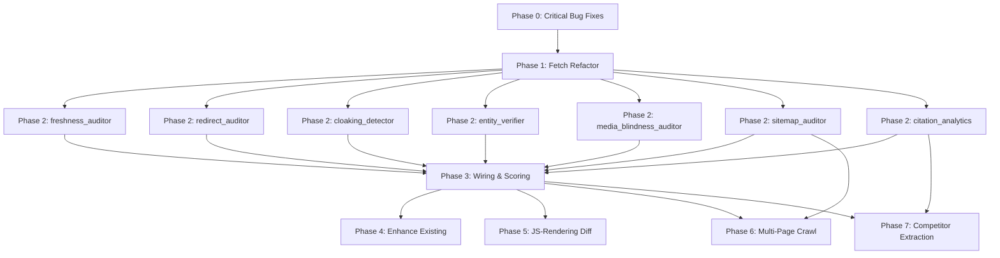

# DECISIONS_AND_TASKS.md

## SECTION A: DECISIONS REGISTER

### Architectural, Product, and Technical Decisions
- **D-001 RAG Decision:** RAG is ON (`rag_byok_integration.md`). At runtime, `router.py` resolves findings through deterministic lookup first, then RAG semantic search as enrichment. Manual review uses deterministic template selection.
- **D-002 Product Name:** Citeable AEOGEO platform.
- **D-003 Legacy Mappings:** Delete the legacy `check_code_mappings` fallback paths entirely. V2 JSON map is canonical.
- **D-004 Manual Review Design:** 4 phases, 11 expert-grade questions. Tiered depth: Express mode (4 questions, ~8 min) or Full Expert mode (all 11, ~25 min). State locked upon first submission.
- **D-005 Citation Truncation Fix:** `CitationObservation` enhanced to include `full_answer_text`. Update query functions (`_query_perplexity` and `_query_gemini_grounded`) to NOT truncate to 300 characters for manual review display.
- **D-006 Schema Claims Export:** Schema validator retains raw JSON-LD blocks and exports `schema_claims` for manual review display.
- **D-007 Frontend Approach:** No frontend build step. Add `manual_review.js` natively. Use `window.GuidedReview` pattern.
- **D-008 Wizard Progress Calc:** Progress tracked as `answered / shown_cards` instead of `answered / totalWizardCards` due to conditional questions.
- **D-009 Phase Ordering Constraint:** DO NOT add the caller logic for Phase 2 modules in `audit_orchestrator.py` until the Phase 3 wiring changes are merged, otherwise unmapped codes will crash synthesis.
- **D-010 LLM Prompt Approach:** The LLM narrates deterministic recommendations. It does not invent recommendations. Appended two instructions to synthesizer prompt.
- **D-011 UPSERT Strategy:** `manual_observations` API uses UPSERT logic based on `(run_id, question_id)` to allow users to update answers or resolve concurrent tab issues.
- **D-012 Backward Compat:** `GET /api/v1/audit/runs/{run_id}/full` queries `manual_observations` first. If empty, falls back to old `manual_verdicts`. Existing `/verdicts` POST is retained.
- **D-013 SSRF Policy:** Use strict URL validation, enforce scheme (http/https), block internal IP ranges, and set tight timeouts (using `safe_get`).
- **D-014 Ephemeral Disk Acknowledgment:** Acknowledge Render Free Tier wipes SQLite disk. Migration to PostgreSQL or attached disk required for production.
- **D-015 XSS Deferral:** Use robust HTML sanitizer (DOMPurify) instead of custom regex replacements for notes/claims.
- **D-016 Mode Locking:** UI locks the review mode (Express/Full) once the first observation is submitted.
- **D-017 ErrorCode consistency policy:** Unify string constants/enums. Add `PAGE_FETCH_FAILED`.
- **D-018 _extract_json_ld_blocks relocation:** Move `_extract_json_ld_blocks` to `areos/util/schema_utils.py` shared utility. The `_fetch_page` return type stays `tuple[str, int, str]` — do NOT add JSON-LD blocks to the return tuple. This avoids circular imports.
- **D-019 Memory limits:** Fetch truncates at 5MB limit. Full AI responses add ~15-30KB per run (SQLite is fine). Playwright Chromium may not fit on Render Free Tier; requires `AREOS_ENABLE_PLAYWRIGHT` gate.
- **D-020 Encoding handling:** Ensure `resp.encoding` is explicitly checked in `_fetch_page`. Fallback to `cchardet` or strict utf-8 with `errors='replace'`.
- **D-021 API timeout strategy:** Phase 6/7 use very strict internal timeouts (e.g. timeout=2 for multi-page). Maximum phase timeout 45s.
- **D-022 Terminology Bridge — Card ID System:** The codebase currently uses Study B claim IDs (C052, C053, C056, C058, C061, C062, C072, C073, C074, C077, C078, C079, C082, C090) AS check codes for manual review cards. These are stored in `FAMILY_BY_CARD_ID`, `CARD_GUIDANCE`, `check_code_to_knowledge_map.json` (mapping to KG-series records), instruction card files (`areos/instruction_cards/C052_*.md`), and `audit_orchestrator.py` card selection logic. The NEW manual review system uses different question IDs (A1_PROMPT_VALIDATION, B1_SCHEMA_HONESTY, B2_CONTENT_ANSWERABILITY, etc.). **Decision: The old C0xx card IDs are RETIRED for the wizard UI. The new question IDs (A1, B1, B2...) are the ONLY IDs the wizard uses. However, the `ObservationPayload.maps_to_claims` field bridges new→old by referencing which C0xx claims each question covers (e.g., B1 maps_to ["C054","C053"]). The KB entries for C052→KG-001 etc. are RETAINED — they still provide guidance text. The router resolves both formats.**
- **D-023 KB Schema Duality:** `check_code_to_knowledge_map.json` has TWO record shapes: automated codes use `{"guidance_record": "KT-xxx", "backing_records": [...]}`, while manual C0xx codes use `{"knowledge_ids": ["KG-xxx"], "priority": 5}`. **Decision: Do NOT unify the schemas now. The router already handles both. New Phase 2-7 codes use the automated format (`guidance_record` + `backing_records`). The C0xx entries keep their existing `knowledge_ids` format. The router's `resolve_guidance()` function must continue to handle both shapes.**
- **D-024 New KT-2xx vs Existing KG-series:** Phase 3 adds ~38 new KB mappings using KT-200→KT-238 IDs with the automated format. These coexist with KG-001→KG-014 (manual card guidance). **Decision: Both series persist. KT-2xx series = automated finding guidance. KG-series = manual review card guidance. No collision because automated check codes (CONTENT_STALE, CLOAKING_DETECTED) never overlap with manual card codes (C052, C053). They occupy separate namespaces in the same JSON file.**

## SECTION B: ATOMIC TASKS

### Phase 0: Bug Fixes
- **T-001** Goal: Fix MANUAL_REMEDIATION_TEXT NameError. Files: `areos/auditors/synthesis_engine.py`. Do: Replace lookup with `_load_remediation_text`, add `_MANUAL_REMEDIATION_TEXT` internal fallback dict. Boundary: Do not change manual finding logic. Checkpoint: `test_build_manual_recommendations_actionable`. Rollback: Revert `synthesis_engine.py`.
- **T-002** Goal: Fix REMEDIATION_TEXT NameError. Files: `areos/auditors/synthesis_engine.py`. Do: Replace `return REMEDIATION_TEXT` on empty with `return {}`. Boundary: Do not change dict loading logic. Checkpoint: `test_load_remediation_text_empty_kb`. Rollback: Revert `synthesis_engine.py`.
- **T-003** Goal: Fix Empty Priority Scores Fallback. Files: `areos/auditors/synthesis_engine.py`. Do: Hardcode `_BASELINE_PRIORITIES` in `_load_priority_scores` exception block. Boundary: Do not alter DB query. Checkpoint: `test_load_priority_scores_fallback`. Rollback: Revert `synthesis_engine.py`.
- **T-004** Goal: Fix Hardcoded API token. Files: `areos/kb/build_kb.py`. Do: Replace `os.environ.setdefault('AREOS_API_TOKEN', 'build_kb_token')` with `os.environ.get('AREOS_ADMIN_TOKEN', 'dev-build-kb')`. Note: env var intentionally renamed from AREOS_API_TOKEN to AREOS_ADMIN_TOKEN — verify no other code references the old name. Boundary: Do not change token usage. Checkpoint: Grep for `build_kb_token` fails. Rollback: Revert `build_kb.py`.
- **T-005** Goal: Fix claims_legacy rename Not Idempotent. Files: `areos/kb/build_kb.py`. Do: Add `DROP TABLE IF EXISTS claims_legacy` before renaming. Boundary: Do not change DB schema. Checkpoint: `test_claims_legacy_rename_idempotency`. Rollback: Revert `build_kb.py`.
- **T-006** Goal: Fix Exception Swallowing in Router. Files: `areos/kb/router.py`. Do: Catch `(json.JSONDecodeError, TypeError, KeyError)` and `ValueError` explicitly, log warnings, set `guidance=None`. Boundary: Do not change guidance parsing. Checkpoint: Assert warning logged on bad JSON. Rollback: Revert `router.py`.
- **T-007** Goal: Remove Empty _CHECK_CODE_MAPPINGS. Files: `areos/db/ingest_claims.py`, `areos/api/routers/audit.py`, `areos/auditors/findings_to_claims.py`. Do: Delete `_CHECK_CODE_MAPPINGS` and remove legacy DB fallback paths querying `check_code_mappings`. Replace references at `audit.py` lines 181, 258, 263, 487 with `wire_finding()` or V2 JSON map lookups. Boundary: Do not touch V2 mappings. Checkpoint: App boots without check_code_mappings references. Rollback: Revert affected files.
- **T-008** Goal: Fix AP-03 missing from audited_stages. Files: `areos/auditors/audit_orchestrator.py`. Do: Add `"AP-03"` to `audited_stages` list and JSON dumps. Boundary: Do not change other stages. Checkpoint: AP-03 is in list. Rollback: Revert list.
- **T-009** Goal: Remove Unused Import in synthesis_engine.py. Files: `areos/auditors/synthesis_engine.py`. Do: Remove `from areos.auditors.findings_to_claims import CHECK_CODE_TO_CLAIM_IDS`. Boundary: None. Checkpoint: Grep for import fails. Rollback: Revert file.
- **T-010** Goal: Fix Silent Swallowing in findings_to_claims.py. Files: `areos/auditors/findings_to_claims.py`. Do: Remove legacy fallback paths entirely. Boundary: None. Checkpoint: Grep for `except Exception: pass` in file fails. Rollback: Revert file.
- **T-011** Goal: Fix Silent Swallowing in synthesis_engine.py. Files: `areos/auditors/synthesis_engine.py`. Do: Log standard errors instead of `pass` on line 470. Boundary: Do not crash on error. Checkpoint: Logs emitted. Rollback: Revert file.
- **T-012** Goal: Fix Missing Timeout in Orchestrator schema fetch. Files: `areos/auditors/audit_orchestrator.py`. Do: Enforce timeouts in page fetch. Add try/except for `(KeyError, IndexError, TypeError)` around `sample_content` implicit structure parsing with warning log. Boundary: None. Checkpoint: Timeout triggers correctly; structural parse errors logged. Rollback: Revert file.
- **T-013** Goal: Fix List Comprehension variable shadowing. Files: `areos/api/routers/audit.py`. Do: Rename inner variable `f` to avoid shadowing. Boundary: None. Checkpoint: Linter passes. Rollback: Revert file.
- **T-014** Goal: Fix Inconsistent ErrorCode usages in orchestrator. Files: `areos/auditors/audit_orchestrator.py`, `areos/api/error_codes.py`. Do: Unify usage of ErrorCode enums and string codes. Add `PAGE_FETCH_FAILED` to ErrorCode enum in `error_codes.py`. Boundary: None. Checkpoint: Consistent ErrorCode references; `PAGE_FETCH_FAILED` exists in enum. Rollback: Revert changes.

### Phase 1: Page Fetch Refactor
- **T-101** Goal: Implement `_fetch_page`. Files: `areos/auditors/audit_orchestrator.py`. Do: Extract fetch logic into `_fetch_page(clean_domain: str, page_url: str) -> tuple[str, int, str]` returning `(page_html, redirect_hop_count, final_url)`. Handle `requests.exceptions.RequestException` and `ValueError` — return `("", 0, page_url)` on failure. Check timeouts and errors. Boundary: Do not change safe_get core. Checkpoint: `test_fetch_and_validate_schema_refactor`. Rollback: Revert refactor.
- **T-102** Goal: Implement `_extract_schema_claims`. Files: `areos/auditors/schema_validator.py`. Do: Create `_extract_schema_claims(blocks: list[dict]) -> list[dict]` that flattens JSON-LD blocks into dicts with keys `schema_type`, `field`, `value` for UI display. Boundary: Do not alter validation. Checkpoint: Function returns correct dict list with expected keys. Rollback: Revert file.
- **T-103** Goal: Refactor Orchestrator Flow. Files: `areos/auditors/audit_orchestrator.py`. Do: Call `_fetch_page` once, pass HTML to schema and content format auditors. Add extracted schema claims to output. If `_fetch_page` returns empty HTML, skip downstream content/freshness/media auditors and emit info-severity unverifiable findings instead. Boundary: Do not break existing auditor calls. Checkpoint: Orchestrator executes successfully with mocked HTML; empty HTML triggers unverifiable findings. Rollback: Revert orchestrator.
- **T-104** Goal: Update FormatAuditResult. Files: `areos/auditors/content_format_auditor.py`. Do: Add `extracted_lead_text: str = ""` to `FormatAuditResult` dataclass. Boundary: None. Checkpoint: Dataclass has field. Rollback: Revert file.

### Phase 2: 7 New Auditor Modules
- **T-201** Goal: Implement freshness_auditor.py. Files: `areos/auditors/freshness_auditor.py`. Do: Add `FreshnessIssue`, `FreshnessAuditResult`, and `audit_freshness(page_url: str, html: str, json_ld_blocks: list[dict]) -> FreshnessAuditResult:`. Boundary: Mechanical dates only. Checkpoint: `test_freshness_stale`. Rollback: Delete file.
- **T-202** Goal: Implement redirect_auditor.py. Files: `areos/auditors/redirect_auditor.py`. Do: Add `RedirectIssue`, `RedirectAuditResult`, and `audit_redirects_and_access(page_url: str, html: str, hop_count: int, final_url: str) -> RedirectAuditResult:`. Boundary: Access checks only. Checkpoint: `test_redirect_chain_long`. Rollback: Delete file.
- **T-203** Goal: Implement cloaking_detector.py. Files: `areos/auditors/cloaking_detector.py`. Do: Add `CloakingIssue`, `CloakingResult` (fields: `issues`, `browser_word_count: int = 0`, `bot_word_count: int = 0`, `missing_elements: list[str] = field(default_factory=list)`, `content_diff_summary: str = ""`), and `audit_cloaking(clean_domain: str, page_url: str, browser_html: str) -> CloakingResult:`. Fetch with GPTBot UA and diff. Boundary: Cloaking checks only. Checkpoint: `test_cloaking_detected`. Rollback: Delete file.
- **T-204** Goal: Implement entity_verifier.py. Files: `areos/auditors/entity_verifier.py`. Do: Add `EntityIssue`, `EntityAuditResult`, and `audit_entities(page_url: str, html: str, json_ld_blocks: list[dict]) -> EntityAuditResult:`. Verify sameAs and wikidata. Boundary: Entity links only. Checkpoint: `test_sameas_dead_link`. Rollback: Delete file.
- **T-205** Goal: Implement media_blindness_auditor.py. Files: `areos/auditors/media_blindness_auditor.py`. Do: Add `MediaIssue`, `MediaAuditResult`, and `audit_media_blindness(page_url: str, html: str) -> MediaAuditResult:`. Detect iframes, missing alt. Boundary: Media only. Checkpoint: `test_iframe_heavy`. Rollback: Delete file.
- **T-206** Goal: Implement sitemap_auditor.py. Files: `areos/auditors/sitemap_auditor.py`. Do: Add `SitemapIssue`, `SitemapAuditResult` (include `urls: list[str] = field(default_factory=list)`), and `audit_sitemap(clean_domain: str, robots_result) -> SitemapAuditResult:`. Parse sitemap.xml. Boundary: Sitemap parsing only. Checkpoint: `test_sitemap_missing`. Rollback: Delete file.
- **T-207** Goal: Enhance Citation Sampler. Files: `areos/auditors/citation_sampler.py`. Do: Update `CitationObservation` with `full_answer_text`. Update `_query_perplexity` and `_query_gemini_grounded` to NOT truncate `full_answer_text`. Boundary: Keep `raw_answer_snippet` for backwards compat. Checkpoint: Assert untruncated text stored. Rollback: Revert file.
- **T-208** Goal: Implement compute_citation_analytics. Files: `areos/auditors/citation_sampler.py`. Do: Add `def compute_citation_analytics(sample_result: CitationSampleResult) -> dict:` to calculate share_of_voice and competitor domains. Boundary: Analytics calculation only. Checkpoint: `test_share_of_voice`. Rollback: Revert file.

### Phase 3: KB Wiring & Scoring
- **T-301** Goal: Update LAYER_DEDUCTIONS. Files: `areos/auditors/scoring.py`. Do: Add Phase 2-6 deductions dict entries. Boundary: Do not alter scoring floor logic. Checkpoint: `test_score_floor_enforcement`. Rollback: Revert dict.
- **T-302** Goal: Update ACCESS_GATE. Files: `areos/auditors/scoring.py`. Do: Add CLOAKING_DETECTED (35), META_NOINDEX (15). Boundary: None. Checkpoint: Gates updated. Rollback: Revert dict.
- **T-303** Goal: Update Knowledge Map. Files: `areos/kb/check_code_to_knowledge_map.json`, `areos/kb/corpus/knowledge.jsonl`. Do: Add entries for all 39 codes mapping to KT-2xx series. Use automated format (`guidance_record` + `backing_records`). Append new KT-2xx guidance text records to `knowledge.jsonl`. Boundary: Maintain valid JSON. Checkpoint: `test_all_deductions_mapped`. Rollback: Revert JSON and JSONL.
- **T-304** Goal: Update ACTION_SNIPPETS. Files: `areos/auditors/audit_orchestrator.py`. Do: Add snippet strings for all check codes. Boundary: None. Checkpoint: `test_every_action_snippet_in_layers`. Rollback: Revert file.
- **T-305** Goal: Add unverifiable codes to mapping. Files: `areos/kb/check_code_to_knowledge_map.json`. Do: Map `SCHEMA_MISSING` → KT-200 (`{"guidance_record": "KT-200", "backing_records": ["KT-179"]}`), `SCHEMA_UNVERIFIABLE` → KT-201, `ROBOTS_UNVERIFIABLE` → KT-202, `LLMS_UNVERIFIABLE` → KT-203. Boundary: Maintain valid JSON. Checkpoint: All 4 codes resolve via router. Rollback: Revert JSON.

### Phase 4-7: Enhance Existing + Optional Modules
- **T-401** Goal: Enhance content format auditor. Files: `areos/auditors/content_format_auditor.py`. Do: Check if substantive content is in first 30% instead of first 3 blocks.
- **T-402** Goal: Enhance robots checker. Files: `areos/auditors/robots_checker.py`. Do: Extract `Sitemap:` directive URLs.
- **T-501** Goal: Implement Playwright auditor. Files: `areos/auditors/rendering_auditor.py`. Do: Add JS rendering diff, wrap in `try/except ImportError` for `sync_playwright`. After Phase 3 wiring merge, add caller block to `audit_orchestrator.py` gated by `AREOS_ENABLE_PLAYWRIGHT` env var.
- **T-502** Goal: Update dependencies. Files: `requirements.txt`, `render.yaml`. Do: Add optional Playwright installation gated by `AREOS_ENABLE_PLAYWRIGHT`.
- **T-601** Goal: Implement multipage crawl. Files: `areos/auditors/multipage_auditor.py`. Do: Crawl top 10 URLs from sitemap with strict 4s timeout per page. Add duplicate detection. After Phase 3 wiring merge, add caller block to `audit_orchestrator.py`. Risk: lifecycle doc flags this as scope creep — enforce strict timeouts to mitigate.
- **T-701** Goal: Implement competitor extraction. Files: `areos/auditors/competitor_analyzer.py`. Do: Fetch top 3 competitor homepages, run schema/content validation. After Phase 3 wiring merge, add caller block to `audit_orchestrator.py`. Risk: competitor scraping may trigger rate limits — enforce strict timeouts.

### Track B: Manual Review Redesign
- **T-B00** Goal: Terminology Bridge — Reconcile old C0xx card IDs with new A1/B1/B2 question IDs. Files: `areos/ui/guided_review.js`, `areos/kb/check_code_to_knowledge_map.json`, `areos/kb/corpus/knowledge.jsonl`. Do: (1) Replace `FAMILY_BY_CARD_ID` C0xx keys with new question IDs in guided_review.js. (2) Replace `CARD_GUIDANCE` C0xx entries with new A1/B1/B2 entries using the expert-grade question text from manual_review_product_design.md. (3) Verify `check_code_to_knowledge_map.json` C052→KG-001..C090→KG-014 entries are RETAINED (router still uses them for guidance text lookup when `ObservationPayload.maps_to_claims` references C0xx). (4) Document the duplicate: `knowledge.jsonl` has BOTH KT-160→KT-173 AND KG-001→KG-014 for the same 14 manual card guidance records — the KG-series are the ones actively referenced by the map, KT-series are referenced by relationships.jsonl. Do NOT delete either — they serve different resolution paths. (5) Handle the C054 vs C053 naming collision: Study B's `C054` (schema semantic honesty, `KT-072`) is a FACT record about automatability. The manual card for schema honesty is `C053` (`KG-002`) which is a GUIDANCE record. These are different knowledge types serving different purposes — no conflict, but document this mapping: manual review question B1_SCHEMA_HONESTY maps_to ["C054","C053"] meaning it covers BOTH the Study B judgment AND the existing card guidance. Boundary: Do NOT modify router.py resolve() logic. Do NOT delete any KG-series records. Do NOT change the dual-format schema in the JSON map. Checkpoint: (a) `guided_review.js` no longer references C052/C053/etc in FAMILY_BY_CARD_ID or CARD_GUIDANCE — grep must fail. (b) New A1/B1/B2 entries exist. (c) `check_code_to_knowledge_map.json` still contains all 14 C0xx→KG-xxx mappings. (d) App boots successfully. Rollback: Revert guided_review.js and check_code_to_knowledge_map.json.
- **T-B01** Goal: Create `manual_observations` table. Files: DB schema/migration. Do: Add EXACT SQL CREATE TABLE (see Section C) and index. Boundary: Keep `manual_verdicts` table. Checkpoint: DB migrates successfully, both tables coexist. Rollback: Drop table.
- **T-B02** Goal: Create ObservationPayload model. Files: `areos/api/routers/audit.py`. Do: Add `ObservationPayload` Pydantic class (see Section C). Boundary: None. Checkpoint: Model validates correctly. Rollback: Remove class.
- **T-B03** Goal: Implement `POST /observations`. Files: `areos/api/routers/audit.py`. Decorator: `@router.post("/audit/runs/{run_id}/observations")`. Signature: `def submit_observation(run_id: str, observation: ObservationPayload, conn=Depends(get_db))`. Auth: inherits standard `get_client_keys`. Do: (1) UPSERT logic on `(run_id, question_id)`. (2) Validate `severity` is one of `error/warning/info`. (3) If `question_id` starts with a conditional prefix (B3/C3/C4/C5/D1) but the condition is unmet, still UPSERT but add `unexpected_conditional: true` to `structured_data`. (4) Enforce mode locking: on first observation submission, write `review_mode` to `audit_runs` row; on subsequent submissions, reject if mode changed. Boundary: Do NOT modify `/verdicts` endpoint. Checkpoint: (a) UPSERT test passes — same (run_id, question_id) updates, not duplicates. (b) Mode lock test — second submission with different mode rejected. (c) Unexpected conditional test — B3 submitted without cloaking findings stores with flag. Rollback: Remove endpoint.
- **T-B04** Goal: Implement `GET /full-report`. Files: `areos/api/routers/audit.py`. Decorator: `@router.get("/audit/runs/{run_id}/full-report")`. Signature: `def get_unified_report(run_id: str, conn=Depends(get_db))`. Auth: inherits standard `get_client_keys`. Do: (1) Query `manual_observations` for run_id. (2) If empty, fall back to `manual_verdicts`. (3) Build 6-section unified response: `executive_diagnosis` (from D2 diagnosis_text + LLM narrative), `layer_1_access` (automated access findings), `layer_2_content_schema` (automated content/schema + B1/B2 observations inline), `layer_3_authority_citations` (automated authority/citation + C1/C2/C3/C4 observations inline), `fix_sequence` (week-by-week priority plan), `audit_metadata` (mode, engines tested, questions answered, confidence flags). (4) Each finding card tagged: `[AUTO]`, `[HUMAN]`, or `[AUTO + HUMAN CONFIRMED]`. (5) If zero observations, append caveat: "Confidence: Low. No manual qualitative verification performed." (6) In Express mode, for each question NOT shown, mark the relevant report section: "Confidence: Reduced — question [ID] skipped in Express mode." Boundary: Preserve existing `/full` endpoint. Checkpoint: (a) Unified report includes all 6 sections. (b) Legacy run with only manual_verdicts loads successfully. (c) Zero-observation run has caveat. (d) Express mode skipped questions have individual caveats. Rollback: Remove endpoint.
- **T-B05** Goal: Update Synthesis API. Files: `areos/api/routers/audit.py`. Do: (1) Make `/synthesize` pull from `manual_observations` as structured JSON, not flat verdict strings. (2) Format each observation as `human_review_notes` (see Section C format string). (3) For B2 answers, extract `structured_data.ideal_answer_sentence` → inject as `recommended_copy` in synthesis input. (4) For A1 answers where `prompt_match == "no"`, inject confidence caveat that prefixes ALL citation findings. (5) For B3 answers, apply severity modifier to existing cloaking findings (`intentional` → info, `unintentional` → error). (6) For C1 answers, map `error_type` to specific KB template: `wrong_products` → "Update schema description", `confuses_entity` → "Establish Wikidata entry", `outdated` → "Update date references". (7) For B1 answers, iterate `claims_verified` array — each false claim becomes a distinct remediation item: `honesty_gap` → "Remove X from schema", `page_gap` → "Add X to visible page". (8) For C2 answers, map `missing_element` to KB template: `no_bio` → "Add author bio", `unsourced` → "Cite primary sources". (9) For C3 answers, map `trend` to remediation: `diminishing` → "Create comparison page", `zero_click + high_impact` → "Add unique value proposition". (10) For C4 answers, map `gap_type` to remediation: `content_gap` → "Create [topic] page", `authority_gap` → "Digital PR campaign". (11) For C5 answers, inject: "Rewrite speakable text: remove visual references, shorten to <150 chars." (12) For D1 answers, inject: "Update llms.txt summary to: [user's rewritten text]." (13) Severity derivation: frontend computes severity from structured answers and saves to `ObservationPayload.severity`. Backend trusts the frontend value. Boundary: Do NOT change the 3-step LLM pipeline structure (Synthesizer → Red Team → Grounder). Checkpoint: (a) Synthesis includes human_review_notes formatted correctly. (b) B2 ideal sentence appears in output. (c) A1 caveat appears when prompt_match is "no". (d) B1 array produces multiple remediation items. Rollback: Revert endpoint.
- **T-B06** Goal: Update UI — 11 expert-grade questions. Files: `areos/ui/guided_review.js`, `areos/ui/studio.js`. Do: (1) Replace old CARD_GUIDANCE with 11 new questions matching manual_review_product_design.md exactly — each with `question`, `why`, `steps`, `structured_output` template, `maps_to_claims`. (2) Implement conditional logic — read automation results from `window.AreosContext.auditResult` to determine visibility: B3 shown ONLY if `auditResult.findings.some(f => f.check_code === 'CLOAKING_DETECTED' || f.check_code === 'CLOAKING_MINOR')`, C3 shown ONLY if `auditResult.citation_result.cited_count > 0`, C4 shown ONLY if `auditResult.citation_result.cited_count < auditResult.citation_result.total_prompts`, C5 shown ONLY if `auditResult.schema_result.speakable_found === true`, D1 shown ONLY if `auditResult.llms_result.llms_exists === true`. (3) Implement data pre-population: B1 displays `auditResult.schema_claims` (from T-102), B2 displays `auditResult.extracted_lead_text` (from T-104), C1 displays `auditResult.citation_result.full_responses` (from T-207) for all 3 engines side-by-side, C4 displays `auditResult.citation_analytics.competitor_domains` (from T-208). (4) Express mode: show ONLY B2, C1, C2, D2. Conditionals are SUPPRESSED in Express mode — they only appear in Full mode. Full mode: show all 11 minus unsatisfied conditionals. Lock mode on first submit via `window.AreosContext.reviewMode`. (5) Progress calc in `studio.js` `updateShieldProgress`: `shown_cards` = count of questions visible (based on mode + conditionals), progress = `answered / shown_cards`. (6) Synthesis trigger: when `completedWizardCards === shown_cards`, call `triggerPostWizardSynthesis()` hitting updated `/synthesize`. (7) Enforce incomplete audit lock: disable the wizard UI until `window.AreosContext.auditResult` is populated. (8) After `triggerPostWizardSynthesis()` fires, lock all input fields to prevent stale-synthesis race condition. Boundary: Do NOT create new JS files. Modify guided_review.js + studio.js only. Checkpoint: (a) Express mode shows exactly 4 questions (B2, C1, C2, D2) — no conditionals. (b) B3 hidden when no cloaking findings (Full mode). (c) B1 pre-populated with schema claims. (d) Progress updates correctly. (e) Synthesis triggers on completion. (f) Wizard disabled before auditResult loads. (g) Inputs locked after synthesis triggers. Rollback: Revert both JS files.
- **T-B07** Goal: Update LLM Prompt. Files: `areos/llm/synthesis_pipeline.py`. Do: (1) Append exactly 2 lines to `_DEFAULT_SYNTHESIZER_PROMPT` (see Section C). (2) In `_build_synthesizer_input`, format human observations as structured `human_review_notes` entries instead of flat verdict strings. Boundary: Do NOT change the 3-step pipeline (Synthesizer → Red Teamer → Grounder). Checkpoint: (a) Prompt contains rules 9 and 10. (b) Human diagnosis text from D2 appears as opening framing in synthesized output. Rollback: Revert file.

### Final Integration
- **T-INT01** Goal: Write Test Harness. Files: `tests/test_phase0_fixes.py`, `tests/test_phase1_fetch.py`, `tests/test_kb_parity_extended.py`, `tests/test_manual_review_api.py`, `tests/test_rendering_auditor.py`, `tests/test_multipage_auditor.py`, `tests/test_competitor_analyzer.py`. Do: Add exact test methods from master integration spec. Canonical test names: use DECISIONS_AND_TASKS.md checkpoint names (e.g., `test_load_priority_scores_fallback` not `test_priority_score_fallback`; `test_build_manual_recommendations_actionable` not `test_manual_remediation_no_crash`). Manual review API tests must include: (a) B1 data integrity UPSERT test, (b) Express mode trigger test, (c) Legacy `manual_verdicts` fallback test, (d) Unified report assembly test with all 6 sections.

## SECTION C: HARDCODED REFERENCE DATA

### _MANUAL_REMEDIATION_TEXT
```python
_MANUAL_REMEDIATION_TEXT = {
    "C052": ("Verify Render Asset Accessibility", "Check if critical JavaScript or CSS stylesheets are blocked by robots.txt rules or CDN challenges."),
    "C053": ("Evaluate Schema Semantic Honesty", "Inspect the JSON-LD blocks and compare them line-by-line with visible page text."),
    "C073": ("Causal Attribution for Missing Citations", "When a brand is omitted from Perplexity or Gemini summaries, investigate which layer failed."),
    "C077": ("Assess Brand Sentiment & Framing in AI Answers", "Analyze the framing of brand citations in generative answers."),
    "C090": ("Final Root Cause Diagnosis Narrative", "Ensure the overall audit report provides a coherent narrative linking technical failures to real business outcomes."),
    "DEFAULT": ("Expert Human Inspection Required", "Perform expert qualitative verification per the instruction card guidelines.")
}
```

### Priority scores fallback
```python
_BASELINE_PRIORITIES = {
    "CRAWLER_FULLY_BLOCKED": 1,
    "CLOAKING_DETECTED": 2,
    "EXTRACTABILITY_NONE": 2,
    "SCHEMA_MISSING": 3,
    "CITATION_NOT_OBSERVED": 4
}
# Unlisted check codes default to priority 10 (lowest urgency)
```

### LAYER_DEDUCTIONS
```python
# AP-01 Access
"REDIRECT_CHAIN_LONG":             ("access",    3),
"META_NOINDEX":                    ("access",    8),
"CLOAKING_DETECTED":               ("access",   10),
"AI_BOT_BLOCKED_HTTP":             ("access",    8),
"CLOAKING_MINOR":                  ("access",    3),
"SITEMAP_MISSING":                 ("access",    3),
"SITEMAP_EMPTY":                   ("access",    2),
"SITEMAP_NOT_IN_ROBOTS":           ("access",    1),
"SITEMAP_PAGES_UNREACHABLE":       ("access",    2),
# AP-02 Schema
"CANONICAL_MISMATCH":              ("schema",    4),
"CANONICAL_MISSING":               ("schema",    2),
"DATE_MISMATCH_SCHEMA_VS_VISIBLE": ("schema",    3),
"ENTITY_NAME_MISMATCH":            ("schema",    3),
"MULTI_PAGE_SCHEMA_GAPS":          ("schema",    3),
# AP-03 Content
"CONTENT_STALE":                   ("content",   4),
"NO_PUBLISHED_DATE":               ("content",   2),
"SITEMAP_NO_LASTMOD":              ("content",   2),
"IFRAME_HEAVY":                    ("content",   4),
"IMAGES_MISSING_ALT":              ("content",   3),
"VIDEO_NO_TRANSCRIPT":             ("content",   2),
"JS_CONTENT_DEPENDENCY":           ("content",   6),
"JS_CRITICAL_CONTENT_GATED":       ("content",   8),
"LAZY_LOAD_HIDDEN":                ("content",   2),
"HIDDEN_CONTENT_DEFAULT":          ("content",   3),
"MULTI_PAGE_FRESHNESS_ISSUE":      ("content",   3),
"MULTI_PAGE_THIN_CONTENT":         ("content",   3),
"NEAR_DUPLICATE_PAGES":            ("content",   4),
# AP-04 Citation
"CITATION_RATE_LOW":               ("citation", 15),
"SHARE_OF_VOICE_LOW":              ("citation", 10),
# AP-05 Authority
"SAMEAS_DEAD_LINK":                ("authority",  3),
"SAMEAS_MISSING":                  ("authority",  2),
"WIKIDATA_LINK_MISSING":           ("authority",  2),
# AP-06 Competitor (Phase 7)
"COMPETITOR_SCHEMA_ADVANTAGE":     ("competitor", 5),
"COMPETITOR_CONTENT_ADVANTAGE":    ("competitor", 5),
"COMPETITOR_DOMINATES":            ("competitor", 8),
```

### ACCESS_GATE Additions
```python
"CLOAKING_DETECTED":  35,
"META_NOINDEX":       15,
```

### ACTION_SNIPPETS
```python
"SCHEMA_MISSING": "<!-- Add foundational JSON-LD block -->\n<script type=\"application/ld+json\">\n{\n  \"@context\": \"https://schema.org\",\n  \"@type\": \"Organization\",\n  \"name\": \"Your Brand\"\n}\n</script>",
"SCHEMA_UNVERIFIABLE": "/* Ensure the page returns HTTP 200 and does not block the auditor's IP. */",
"ROBOTS_UNVERIFIABLE": "/* Ensure /robots.txt is accessible and returns HTTP 200. */",
"LLMS_UNVERIFIABLE": "/* Ensure /llms.txt is accessible if present. */",
"CONTENT_STALE": "<!-- Update schema dates -->\n\"dateModified\": \"2026-08-31T12:00:00Z\"",
"DATE_MISMATCH_SCHEMA_VS_VISIBLE": "<!-- Ensure visible date matches schema -->\n<p>Last updated: August 31, 2026</p>",
"NO_PUBLISHED_DATE": "<!-- Add date to schema -->\n\"datePublished\": \"2026-08-01\"",
"REDIRECT_CHAIN_LONG": "/* Update internal links to point directly to the final destination URL. */",
"CANONICAL_MISMATCH": "<link rel=\"canonical\" href=\"https://domain.com/exact-page\" />",
"CANONICAL_MISSING": "<link rel=\"canonical\" href=\"https://domain.com/exact-page\" />",
"META_NOINDEX": "<!-- Remove noindex tag if page should be cited -->\n<meta name=\"robots\" content=\"index, follow\">",
"CLOAKING_DETECTED": "/* Serve identical HTML payloads to GPTBot, Anthropic, and standard browsers. */",
"AI_BOT_BLOCKED_HTTP": "/* Whitelist AI User-Agents in WAF/Cloudflare rules. */",
"CLOAKING_MINOR": "/* Verify dynamic content injection does not strip core text for bots. */",
"SAMEAS_DEAD_LINK": "/* Remove or update broken sameAs URLs in schema. */",
"SAMEAS_MISSING": "\"sameAs\": [\"https://en.wikipedia.org/wiki/Brand\"]",
"ENTITY_NAME_MISMATCH": "/* Ensure schema 'name' exactly mirrors the visible H1 brand name. */",
"WIKIDATA_LINK_MISSING": "\"sameAs\": [\"https://www.wikidata.org/wiki/Q123456\"]",
"IFRAME_HEAVY": "/* Extract critical iframe text into native HTML elements. */",
"IMAGES_MISSING_ALT": "",
"VIDEO_NO_TRANSCRIPT": "<track kind=\"captions\" src=\"transcript.vtt\" srclang=\"en\" />",
"SITEMAP_MISSING": "/* Generate and host an XML sitemap at /sitemap.xml */",
"SITEMAP_EMPTY": "/* Populate sitemap with valid <url> entries. */",
"SITEMAP_NO_LASTMOD": "<lastmod>2026-08-31T12:00:00Z</lastmod>",
"SITEMAP_NOT_IN_ROBOTS": "Sitemap: https://domain.com/sitemap.xml",
"CITATION_RATE_LOW": "/* Increase high-DR referring domains and unambiguous schema density. */",
"SHARE_OF_VOICE_LOW": "/* Restructure content to directly answer intent-based questions better than competitors. */",
"JS_CONTENT_DEPENDENCY": "/* Implement Server-Side Rendering (SSR) for core content. */",
"JS_CRITICAL_CONTENT_GATED": "<!-- Move critical description into static HTML body -->",
"LAZY_LOAD_HIDDEN": "<!-- Ensure text content is not tied to scroll event listeners -->",
"HIDDEN_CONTENT_DEFAULT": "<!-- Make critical descriptions visible by default. -->",
"MULTI_PAGE_SCHEMA_GAPS": "/* Audit site templates to ensure schema injection on all major pages. */",
"MULTI_PAGE_FRESHNESS_ISSUE": "/* Schedule routine content audits and update modification dates. */",
"MULTI_PAGE_THIN_CONTENT": "/* Consolidate thin pages or expand them with substantive text. */",
"NEAR_DUPLICATE_PAGES": "/* Use canonical tags or merge duplicate pages. */",
"SITEMAP_PAGES_UNREACHABLE": "/* Remove 404/500 URLs from the XML sitemap. */",
"COMPETITOR_SCHEMA_ADVANTAGE": "/* Competitor has richer schema — match or exceed their structured data. */",
"COMPETITOR_CONTENT_ADVANTAGE": "/* Competitor has stronger content signals — expand depth and recency. */",
"COMPETITOR_DOMINATES": "/* Competitor dominates AI citation space — implement full AEOGEO remediation plan. */",
```

### manual_observations SQL
```sql
CREATE TABLE IF NOT EXISTS manual_observations (
    id INTEGER PRIMARY KEY AUTOINCREMENT,
    run_id TEXT NOT NULL,
    question_id TEXT NOT NULL,
    structured_data TEXT NOT NULL, -- JSON storing the exact answers
    severity TEXT NOT NULL,        -- error/warning/info
    diagnosis_text TEXT,           -- the human written rationale/notes
    submitted_at TEXT DEFAULT (datetime('now'))
);

CREATE INDEX IF NOT EXISTS idx_manual_observations_run ON manual_observations (run_id);
```

### ObservationPayload Pydantic Model
```python
class ObservationPayload(BaseModel):
    question_id: str
    maps_to_claims: list[str]
    structured_data: dict
    severity: str
    diagnosis_text: str = ""
```

### LLM Prompt Additions
```python
"9. If a human_diagnosis_text is provided, use it as the opening framing of your "
"narrative. Do not contradict or replace it — expand on it with supporting evidence "
"from the findings.\n"
"10. The structured remediation actions have already been determined. Your job is to "
"explain WHY each action matters, not to invent new actions.\n"
```

### human_review_notes Format String
```python
"human_review_notes": f"[HUMAN CONFIRMED] Question: {obs['question_id']} | Severity: {obs['severity']} | Diagnosis: {obs['diagnosis_text']} | Data: {json.dumps(obs['structured_data'])}"
```

## SECTION D: DEPENDENCY GRAPH AND PHASE GATES

### Dependency Graph (Mermaid)


### Phase Gates
- **Phase 0 Gate:** `python -m pytest tests/test_phase0_fixes.py -v` (Conditions: priority default fallback works, legacy paths removed, exception logging works, manual review remediation doesn't crash, build_kb.py must not use hardcoded fallback token).
- **Phase 1 Gate:** `python -m pytest tests/test_phase1_fetch.py -v` (Condition: fetch HTML exactly once and pass to auditors).
- **Phase 2 Gate:** `python -m pytest tests/test_freshness_auditor.py tests/test_redirect_auditor.py tests/test_cloaking_detector.py tests/test_entity_verifier.py tests/test_media_blindness.py tests/test_sitemap_auditor.py tests/test_citation_analytics.py -v` (Condition: modules return respective check codes).
- **Phase 3 Gate:** `python -m pytest tests/test_kb_parity_extended.py -v` (Condition: code parity between LAYER_DEDUCTIONS and check_code_to_knowledge_map).
- **Phase 4 Gate:** `python -m pytest tests/test_content_format_auditor.py tests/test_robots_checker.py -v` (Condition: enhanced auditors pass).
- **Phase 5 Gate:** `python -m pytest tests/test_rendering_auditor.py -v` (Condition: Only runs if `AREOS_ENABLE_PLAYWRIGHT` is set).
- **Phase 6 Gate:** `python -m pytest tests/test_multipage_auditor.py -v` (Condition: multipage crawl with duplicate detection works within timeouts).
- **Phase 7 Gate:** `python -m pytest tests/test_competitor_analyzer.py -v` (Condition: competitor extraction returns findings within timeouts).
- **Track B Gate:** `python -m pytest tests/test_manual_review_api.py -v` (Condition: observations CRUD, Express mode trigger, legacy fallback, unified report).
- **Final Gate:** `python -m pytest tests/ -v` (Condition: ALL tests pass).

### Phase Gate Failure Protocol (MANDATORY)

> **HARD RULE:** If a phase gate fails, the implementing agent MUST NOT attempt to fix it alone.
> It MUST deploy subagents. This is not optional. Skipping this protocol is a Karpathy Principle 1 violation (hiding confusion).

**When a gate command returns ANY failures:**

1. **STOP.** Do not proceed to the next phase. Do not attempt ad-hoc fixes.

2. **Log the failure** in `CHANGELOG.md` under the phase gate result section. Record:
   - Exact test names that failed
   - Full error output (tracebacks)
   - Which task IDs the failures trace back to

3. **Deploy 3 subagents simultaneously:**

   **Subagent A — Failure Diagnostician** (read-only, `research` type):
   - Read the failing test code and the source files it tests
   - Identify the root cause: is this a code bug, a test bug, a missing dependency, or an integration mismatch?
   - Report: exact root cause + which task introduced it + whether the fix is in the source or the test

   **Subagent B — Fix Strategist** (read-only, `research` type):
   - Read the root cause from Agent A
   - Read the rollback plan for the current phase
   - Propose exactly 2 strategies: (a) surgical fix (what to change, boundary, new checkpoint) (b) rollback + redo
   - Report: recommended strategy with justification

   **Subagent C — Regression Guardian** (read-only, `research` type):
   - Read ALL test files in `tests/`
   - Check if the proposed fix from Agent B would break any OTHER passing test
   - Report: safe/unsafe with list of at-risk tests

4. **Wait for all 3 subagents to report.** Cross-reference their findings.

5. **Execute the fix** using the recommended strategy. Touch ONLY the files identified.

6. **Re-run the gate command.** If it still fails, repeat from step 1 with fresh subagents.

7. **After the gate passes**, log the resolution in `CHANGELOG.md` and add any discoveries to `FORECAST.md` Section A.

### Rollback Plan
- **Phase 0:** Revert modifications in `synthesis_engine.py` and `router.py`.
- **Phase 1:** Revert `audit_orchestrator.py` to state before `_fetch_page` refactor. Restore `_fetch_and_validate_schema`.
- **Phase 2:** Delete new `*_auditor.py` modules. Remove imports from `audit_orchestrator.py`.
- **Phase 3:** Remove added keys from `LAYER_DEDUCTIONS` and revert `check_code_to_knowledge_map.json`.
- **Phase 6/7:** Remove `multipage_auditor.py` / `competitor_analyzer.py` and strip caller blocks at the end of `audit_orchestrator.py`.
- **Track B:** Drop `manual_observations` table. Revert `guided_review.js` and `studio.js`. Remove new API endpoints.

## SECTION E: ARCHITECTURAL RISKS AND MITIGATIONS

### Hostile Engineer Findings
1. **Missing `MANUAL_REMEDIATION_TEXT` (WILL_BREAK):** Fixed in Phase 0 via `_load_remediation_text` + fallback dict.
2. **Exception Swallowing in Router (WILL_DEGRADE):** Fixed in Phase 0 via explicit catch and log.
3. **Legacy `check_code_mappings` Dependency (WILL_BREAK):** Fixed in Phase 0 by deleting legacy fallback paths. V2 JSON is canonical.
4. **Citation Sampler Truncation (WILL_DEGRADE):** Fixed in Phase 2 via `full_answer_text`.
5. **Render Free Tier Ephemeral Disk (WILL_BREAK):** Acknowledged. Requires attached disk or PostgreSQL for production.
6. **SSRF Vulnerability (SECURITY):** Addressed via `safe_get` strict URL validation/timeouts.
7. **Race Condition - Manual Verdicts (ORDERING_VIOLATION):** Addressed via strict UPSERT and mode locking.
8. **XSS via Unescaped Notes/Claims (SECURITY):** Addressed via DOMPurify adoption (deferred frontend tech debt).

### Phase 1/2 Architecture Gaps
- **HTTP 403/429/503 timeouts:** `_fetch_page` catches and returns `""`, modules gracefully emit info findings.
- **Pages > 10MB memory OOM:** Pass `stream=True` to `safe_get` and truncate reading at 5MB.
- **Non-UTF-8 Encodings:** Check `resp.encoding`, fallback to strict utf-8 with `errors='replace'`.
- **Redirect Loops:** Caught by `safe_get` max_redirects limit -> returns `""`.
- **Concurrent DB Access (SQLite WAL):** Ensure SQLite connection has WAL mode enabled and timeout pragmas set high (e.g., 30s).
- **External API Rate Limiting:** Aggressively capture 429s in `citation_sampler` and trip the breaker.
- **Import Cycles (`_extract_json_ld_blocks`):** Moved to utility file or outputted from `_fetch_page`.
- **Memory Implications of Full AI Responses:** Acceptable 45KB per run size in SQLite.

### Phase 3/4 Data Integrity Gaps
- **Missing Mapping for SCHEMA_MISSING:** Added to `check_code_to_knowledge_map.json` -> KT-200.
- **Missing Action Snippets:** Added corresponding snippets for every code in `LAYER_DEDUCTIONS`.
- **Router Exception Swallowing (RISK-003):** Fixed in Phase 0.
- **Dimension Mismatch Re-embedding:** Update `_rag_search` to fall back to deterministic lookup or re-embed if dims clash.
- **Orphaned Knowledge Records:** Acceptable semantic enrichment per V2 design.

### Master Integration Gaps
- **Ordering Dependency in Phases 2 and 3:** Mitigated by strict phase gates. Do not integrate caller in Phase 2 until Phase 3 wiring is merged.
- **Timeout & Execution Duration:** Strict internal timeouts (timeout=2) for Phase 6/7 multi-page fetch.
- **Database Connection Pool:** Small, isolated write transactions at the end of the orchestrator.
- **API Response Size bloat:** Exposed selectively, legacy text maintained.
- **Schema Backward Compatibility:** UI uses `.get("key", "default")` to avoid crashing.
- **Circular Imports:** Enforced unidirectional dependencies.

### Terminology Bridge Risks (D-022, D-023, D-024)
- **Three ID namespaces in one JSON file:** `check_code_to_knowledge_map.json` contains automated check codes (SCREAMING_SNAKE → `{guidance_record: "KT-xxx"}`), manual card codes (C0xx → `{knowledge_ids: ["KG-xxx"]}`), and will gain Phase 2-7 codes (CONTENT_STALE → `{guidance_record: "KT-2xx"}`). Router `resolve()` must handle BOTH value schemas. **Risk: T-303 (adding 39 new entries) could break if it uses wrong schema format.** Mitigation: Use automated format (`guidance_record` + `backing_records`) for ALL new entries. Test that router resolves both old C0xx and new CONTENT_STALE entries.
- **Duplicate guidance records in knowledge.jsonl:** The 14 manual card guidance records exist TWICE: once as KT-160→KT-173 (canonical), once as KG-001→KG-014 (appended). The JSON map references KG-series. The relationships.jsonl references KT-series. **Risk: Updating one without the other creates inconsistency.** Mitigation: T-B00 documents this duality but does not resolve it (would require KB migration). Any guidance text updates must update both.
- **C054 naming collision:** Study B claim C054 = "schema semantic honesty" (FACT record, KT-072). Manual review card C053 = schema honesty check (GUIDANCE record, KG-002). These are different records serving different purposes (FACT about automatability vs. GUIDANCE for remediation). **Risk: `ObservationPayload.maps_to_claims` referencing "C054" would look up KT-072 (a FACT), not KG-002 (the GUIDANCE). B1_SCHEMA_HONESTY should map to ["C053","C054"] and the synthesis pipeline must handle both record types.** Mitigation: T-B00 explicitly documents this mapping. The `human_review_notes` format includes both IDs.
- **`build_kb.py` intermediate table:** `check_code_to_knowledge_map.json` is NOT read at runtime by router.py. It is loaded into `kb_check_code_map` SQLite table by `build_kb.py`. **Risk: Adding entries to JSON without re-running build_kb.py means they don't exist at query time.** Mitigation: Phase 3 gate test `test_all_deductions_mapped` must verify against the BUILT SQLite table, not just the JSON file.

### Track B Race Conditions & Product Logic Risks
- **Stale Synthesis Race (I-08):** If a user modifies an observation via UPSERT after `triggerPostWizardSynthesis()` fires, the synthesis output becomes stale. **Mitigation:** T-B06 locks all input fields after synthesis triggers. Re-synthesis is not automatically triggered on post-completion edits — user must explicitly re-trigger.
- **Express Mode Conditional Inflation (I-06):** If conditionals (B3, C3, C4, C5, D1) were shown in Express mode, it could balloon from 4 to 9 questions, breaking the ~8-minute product constraint. **Mitigation:** T-B06 suppresses ALL conditionals in Express mode. Conditionals only appear in Full mode.
