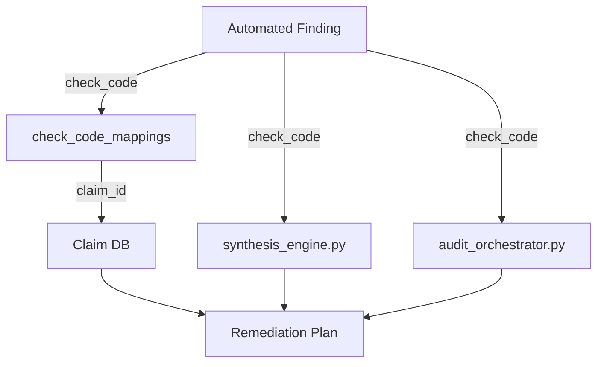

# Canonical Knowledge Investigation

## 1. Executive Summary
The knowledge system is currently fragmented across the SQLite `claims` table (213 claims) and hardcoded Python dictionaries (`REMEDIATION_TEXT`, `ACTION_SNIPPETS`, `MANUAL_REMEDIATION_TEXT`, `MANUAL_CARD_GUIDANCE`) in `synthesis_engine.py` and `audit_orchestrator.py`. The pipeline deterministically wires findings to claims via `check_code_mappings`, but many claims are unmapped and unreachable, while critical remediation logic is siloed in code.

## 2. Distributed Knowledge Inventory
- **areos.db (`claims` table):** 213 claims representing principles, research findings, and process notes.
- **areos.db (`check_code_mappings` table):** 36 mappings connecting 36 unique check codes to specific claims.
- **`synthesis_engine.py`:** Hardcodes 36 automated remediation titles/descriptions and 14 manual remediation texts. Also hardcodes priority scores.
- **`audit_orchestrator.py`:** Hardcodes 12 actionable snippet guides and 5 manual card guidance objects.

## 3. The 213 Claims — Full Classification Table
| claim_id | statement_summary | knowledge_type | topic | atomic? | mapped? | source_quality | notes |
|---|---|---|---|---|---|---|---|
| C001 | Defining business goals, KPIs, and which AI engines/queries ... | MIXED | AP-01 | True | False | LLM_GENERATED |  |
| C002 | Selecting which AI engines/surfaces are in scope (ChatGPT, P... | MIXED | AP-01 | True | False | LLM_GENERATED |  |
| C003 | Identifying the competitor set for benchmarking is partially... | MIXED | AP-01 | True | False | LLM_GENERATED |  |
| C004 | Provisioning access/credentials (Search Console, CMS, server... | MIXED | AP-01 | True | False | LLM_GENERATED |  |
| C005 | Prioritization of the remediation roadmap by business impact... | MIXED | AP-07 | True | False | LLM_GENERATED |  |
| C010 | Full-site crawling to build a page/URL inventory, and XML si... | MIXED | AP-03 | True | False | SECONDARY |  |
| C011 | Parsing robots.txt and flagging which named AI-crawler user-... | MIXED | AP-03 | True | False | SECONDARY |  |
| C012 | Deciding the *correct* robots.txt policy per crawler (e.g., ... | MIXED | AP-03 | True | False | LLM_GENERATED |  |
| C013 | robots.txt is a voluntary convention with no enforcement mec... | MIXED | AP-03 | False | False | SECONDARY |  |
| C014 | Cross-checking robots.txt directives against actual crawler ... | MIXED | AP-03 | True | False | SECONDARY |  |
| C015 | Verifying AI-crawler authenticity via reverse-DNS/IP-range c... | MIXED | AP-03 | True | False | LLM_GENERATED |  |
| C016 | Checking llms.txt / llms-full.txt existence, HTTP 200 status... | MIXED | AP-03 | True | False | LLM_GENERATED |  |
| C017 | An independent 300,000-domain study (SE Ranking) found llms.... | MIXED | AP-03 | False | False | SECONDARY |  |
| C018 | Search Engine Land reported 8 of 9 sites studied saw no meas... | MIXED | AP-03 | False | False | SECONDARY |  |
| C019 | Collecting and parsing server access logs to count AI-crawle... | MIXED | AP-03 | True | False | SECONDARY |  |
| C020 | Determining *why* specific pages are never crawled by AI bot... | MIXED | AP-03 | True | False | LLM_GENERATED |  |
| C021 | Checking CDN/WAF/bot-management rules (Cloudflare, Akamai) f... | MIXED | AP-03 | True | False | SECONDARY |  |
| C030 | Diffing raw HTML against a headless-browser-rendered DOM to ... | MIXED | AP-03 | True | False | SECONDARY |  |
| C031 | GPTBot, ClaudeBot, PerplexityBot, Meta's crawler, and ByteDa... | MIXED | AP-03 | False | False | SECONDARY |  |
| C032 | Deciding which *specific* pieces of JS-gated content (a pric... | MIXED | AP-03 | True | False | LLM_GENERATED |  |
| C033 | Testing lazy-loaded content, infinite scroll, accordions/tab... | MIXED | AP-03 | True | False | SECONDARY |  |
| C034 | Whether any given AI crawler renders JavaScript at all is as... | MIXED | AP-03 | True | False | LLM_GENERATED |  |
| C035 | Measuring raw page response time/timeout risk is mechanical;... | MIXED | AP-03 | True | False | LLM_GENERATED |  |
| C036 | Fetching pages with spoofed AI-crawler user-agent strings an... | MIXED | AP-03 | False | False | SECONDARY |  |
| C040 | Redirect-chain following, canonical-tag auditing, and HTTP s... | MIXED | AP-03 | True | False | SECONDARY |  |
| C041 | Duplicate/near-duplicate content detection (within-site and ... | MIXED | AP-03 | True | False | SECONDARY |  |
| C050 | Structural content checks — heading hierarchy (H1-H6), seman... | MIXED | AP-03 | True | True | SECONDARY |  |
| C051 | An analysis of ChatGPT citations (Kevin Indig, ~1.2-3M respo... | MIXED | AP-03 | False | True | SECONDARY |  |
| C052 | Determining whether a passage 'directly answers' a likely us... | MIXED | AP-03 | False | False | LLM_GENERATED |  |
| C053 | JSON-LD syntax validation (well-formed JSON, correct @type/@... | MIXED | AP-02 | True | False | SECONDARY |  |
| C054 | Verifying that structured-data *claims* semantically match t... | MIXED | AP-02 | True | True | LLM_GENERATED |  |
| C055 | Validating structured data against Google's Rich Results pol... | MIXED | AP-02 | True | False | SECONDARY |  |
| C056 | Extracting sameAs/@id links and cross-checking brand-entity ... | MIXED | AP-02 | True | False | SECONDARY |  |
| C057 | Named-entity extraction from site content, and comparing ext... | MIXED | AP-02 | True | True | SECONDARY |  |
| C058 | Detecting reliance on iframes, canvas/image-only text, or em... | MIXED | AP-03 | True | True | SECONDARY |  |
| C060 | Freshness/update-cadence checks — comparing published/modifi... | MIXED | AP-03 | True | False | SECONDARY |  |
| C061 | Content-type classification (definition/how-to/comparison/li... | MIXED | AP-03 | True | True | LLM_GENERATED |  |
| C062 | Assessing content depth, factual accuracy, first-hand expert... | MIXED | AP-04 | True | False | LLM_GENERATED |  |
| C070 | Detecting explicit AI-retrieval-blocking directives (e.g., m... | MIXED | AP-03 | False | False | SECONDARY |  |
| C071 | Executing a fixed prompt set repeatedly across AI engines (C... | MIXED | AP-05 | True | True | SECONDARY |  |
| C072 | Designing the actual prompt set — phrasing questions the way... | MIXED | AP-05 | True | False | LLM_GENERATED |  |
| C073 | Explaining or attributing *why* an LLM cited (or ignored) a ... | MIXED | AP-05 | True | True | LLM_GENERATED |  |
| C074 | Detecting hallucinations or factual inaccuracies in how a br... | MIXED | AP-05 | True | False | LLM_GENERATED |  |
| C075 | Once citation data is captured, computing citation frequency... | MIXED | AP-05 | True | False | SECONDARY |  |
| C076 | AI citations are highly volatile month-to-month: a large-sca... | MIXED | AP-05 | True | False | SECONDARY |  |
| C077 | Sentiment/framing analysis of brand mentions in AI answers (... | MIXED | AP-05 | True | False | SECONDARY |  |
| C078 | Determining whether an AI answer fully 'absorbs' a query (ze... | MIXED | AP-05 | True | False | LLM_GENERATED |  |
| C079 | Auditing 'speakable' schema / voice-answer readiness: markup... | MIXED | AP-02 | True | False | SECONDARY |  |
| C080 | Crawling competitor sites and mechanically comparing their s... | MIXED | AP-06 | True | False | SECONDARY |  |
| C081 | Backlink/mention profile pulls (via Ahrefs/Semrush/Moz-class... | MIXED | AP-06 | True | False | SECONDARY |  |
| C082 | Digital-PR / third-party-citation-gap analysis — understandi... | MIXED | AP-06 | True | False | LLM_GENERATED |  |
| C090 | Cross-referencing technical findings with citation-performan... | MIXED | AP-07 | True | False | LLM_GENERATED |  |
| C091 | Generating charts/dashboards and formatting the final report... | MIXED | AP-07 | True | False | LLM_GENERATED |  |
| C092 | Setting up ongoing monitoring/alerting on robots.txt, llms.t... | MIXED | AP-07 | True | False | LLM_GENERATED |  |
| C200 | Overview: Before anything can be crawled, a search engine mu... | MIXED | AP-03 | False | False | AUTHORITATIVE |  |
| C201 | Overview: Crawling is the automated fetching of previously-d... | MIXED | AP-03 | False | False | AUTHORITATIVE |  |
| C202 | Overview: The fetch stage is the literal HTTP transaction: D... | MIXED | AP-03 | False | False | AUTHORITATIVE |  |
| C203 | Overview: Rendering is the process by which a crawler constr... | MIXED | AP-03 | False | False | AUTHORITATIVE |  |
| C204 | Overview: Distinct from rendering (constructing the DOM), th... | MIXED | AP-03 | False | False | AUTHORITATIVE |  |
| C205 | Overview: This stage covers whether the crawler can successf... | MIXED | AP-03 | False | False | AUTHORITATIVE |  |
| C206 | Overview: Canonicalization is the process by which a search ... | MIXED | AP-03 | False | False | AUTHORITATIVE |  |
| C207 | Overview: Deduplication is closely related to but analytical... | MIXED | AP-03 | False | False | AUTHORITATIVE |  |
| C208 | Overview: Content extraction is the step where a search or A... | MIXED | AP-03 | False | False | AUTHORITATIVE |  |
| C209 | Entity recognition operates on the extracted DOM text (post-... | MIXED | AP-02 | False | False | AUTHORITATIVE |  |
| C210 | Google's Knowledge Graph is confirmed to draw from multiple ... | MIXED | AP-02 | False | False | AUTHORITATIVE |  |
| C211 | Google's documented guidance: use the `lang` attribute on th... | MIXED | AP-02 | False | False | AUTHORITATIVE |  |
| C212 | Google has confirmed the use of techniques like BERT (2019) ... | MIXED | AP-03 | False | False | AUTHORITATIVE |  |
| C213 | [Documented, general IR literature] Embedding-based retrieva... | MIXED | AP-03 | False | False | AUTHORITATIVE |  |
| C214 | Google has explicitly documented that crawling, rendering, a... | MIXED | AP-03 | False | False | AUTHORITATIVE |  |
| C215 | Google has confirmed that crawl frequency is influenced by h... | MIXED | AP-03 | False | False | AUTHORITATIVE |  |
| C216 | Google has published, at a high level, the categories of sys... | MIXED | AP-03 | False | False | AUTHORITATIVE |  |
| C217 | Google has stated that AI Overviews draw on the same web ind... | MIXED | AP-03 | False | False | AUTHORITATIVE |  |
| C218 | Google's AI Overviews are documented to include links to sup... | MIXED | AP-05 | False | False | AUTHORITATIVE |  |
| C219 | Google has documented that snippets are dynamically generate... | MIXED | AP-02 | False | False | AUTHORITATIVE |  |
| C220 | This is a generative step: an LLM synthesizes retrieved pass... | MIXED | AP-05 | False | False | AUTHORITATIVE |  |
| C250 | Technical explanation: URLs are discovered via: (a) links fr... | MIXED | AP-03 | True | False | AUTHORITATIVE |  |
| C251 | Official evidence: Google Search Central confirms sitemaps, ... | EVIDENCE | AP-03 | False | False | AUTHORITATIVE |  |
| C252 | Industry consensus: Orphan pages (no internal or external in... | MIXED | AP-03 | True | False | AUTHORITATIVE |  |
| C253 | Technical explanation: Googlebot maintains separate crawl an... | MIXED | AP-03 | False | False | AUTHORITATIVE |  |
| C254 | Official evidence: Google Search Central's crawling and inde... | EVIDENCE | AP-03 | True | False | AUTHORITATIVE |  |
| C255 | Industry consensus: Crawl budget is a meaningful constraint ... | MIXED | AP-03 | True | False | SECONDARY |  |
| C256 | Technical explanation: Governed by HTTP semantics: RFC 9110 ... | MIXED | AP-03 | False | False | AUTHORITATIVE |  |
| C257 | Official evidence: IETF RFC 9110/9113/9114 define the transp... | EVIDENCE | AP-03 | True | False | AUTHORITATIVE |  |
| C258 | Industry consensus: HTTP/2 and HTTP/3 are not direct ranking... | MIXED | AP-03 | True | False | SECONDARY |  |
| C259 | Technical explanation: Google explicitly operates a two-wave... | MIXED | AP-03 | False | False | AUTHORITATIVE |  |
| C260 | Official evidence: Google Search Central's "Understand the J... | EVIDENCE | AP-03 | True | False | AUTHORITATIVE |  |
| C261 | Industry consensus: The rendering queue historically introdu... | MIXED | AP-03 | True | False | SECONDARY |  |
| C262 | Technical explanation: Google's WRS executes JavaScript but ... | MIXED | AP-03 | False | False | AUTHORITATIVE |  |
| C263 | Official evidence: Google's "Fix JavaScript problems" docume... | EVIDENCE | AP-03 | True | False | AUTHORITATIVE |  |
| C264 | Industry consensus: Soft-404s introduced by client-side rout... | MIXED | AP-03 | True | False | AUTHORITATIVE |  |
| C265 | Technical explanation: Google explicitly instructs site owne... | MIXED | AP-03 | False | False | AUTHORITATIVE |  |
| C266 | Official evidence: developers.google.com/search/docs/crawlin... | EVIDENCE | AP-03 | True | False | AUTHORITATIVE |  |
| C267 | Industry consensus: Core Web Vitals are confirmed by Google ... | MIXED | AP-03 | True | False | AUTHORITATIVE |  |
| C268 | Technical explanation: Google uses a documented set of signa... | MIXED | AP-03 | False | False | AUTHORITATIVE |  |
| C269 | Official evidence: developers.google.com/search/docs/crawlin... | EVIDENCE | AP-03 | True | False | AUTHORITATIVE |  |
| C270 | Industry consensus: Conflicting canonicalization signals (e.... | MIXED | AP-03 | True | False | AUTHORITATIVE |  |
| C271 | Technical explanation: Search engines use content-similarity... | MIXED | AP-03 | False | False | AUTHORITATIVE |  |
| C272 | Official evidence: Google Search Essentials spam policies ex... | EVIDENCE | AP-03 | True | False | AUTHORITATIVE |  |
| C273 | Industry consensus: Large-scale duplicate content (thin affi... | MIXED | AP-03 | True | False | SECONDARY |  |
| C274 | Technical explanation: Google has never published its exact ... | MIXED | AP-03 | False | False | AUTHORITATIVE |  |
| C275 | Official evidence: WHATWG HTML Living Standard defines `<mai... | EVIDENCE | AP-03 | True | False | AUTHORITATIVE |  |
| C276 | Industry consensus: Content wrapped outside a clear semantic... | MIXED | AP-03 | True | False | AUTHORITATIVE |  |
| C277 | Entity recognition operates on the extracted DOM text (post-... | MIXED | AP-02 | True | False | AUTHORITATIVE |  |
| C278 | Google has confirmed the existence of the Knowledge Graph an... | MIXED | AP-02 | True | False | AUTHORITATIVE |  |
| C279 | Modern entity extraction pipelines combine Named Entity Reco... | MIXED | AP-02 | True | False | AUTHORITATIVE |  |
| C280 | Structured data (`sameAs`, `@id`, schema.org `Person`/`Organ... | MIXED | AP-02 | True | False | SECONDARY |  |
| C281 | Named entities (proper nouns) and their type (Person, Org, P... | MIXED | AP-02 | True | False | AUTHORITATIVE |  |
| C282 | Co-occurrence relationships between entities on a page... | MIXED | AP-02 | True | False | AUTHORITATIVE |  |
| C283 | Entity salience -- which entity is the primary subject vs. i... | MIXED | AP-02 | True | False | SECONDARY |  |
| C284 | Google's Knowledge Graph is confirmed to draw from multiple ... | MIXED | AP-02 | True | True | AUTHORITATIVE |  |
| C285 | Association requires (a) confident entity resolution (Stage ... | MIXED | AP-02 | True | False | SECONDARY |  |
| C286 | Google explicitly documents that structured data does not gu... | MIXED | AP-02 | True | False | AUTHORITATIVE |  |
| C287 | Google's documented guidance: use the `lang` attribute on th... | MIXED | AP-02 | True | False | AUTHORITATIVE |  |
| C288 | The deprecated `<meta http-equiv="content-language">` tag is... | MIXED | AP-02 | True | False | AUTHORITATIVE |  |
| C289 | `hreflang` is a separate mechanism (covered in Stage 17/Inte... | MIXED | AP-02 | True | False | AUTHORITATIVE |  |
| C290 | Google has confirmed the use of techniques like BERT (2019) ... | MIXED | AP-03 | True | False | AUTHORITATIVE |  |
| C291 | Passage-level indexing/ranking was confirmed by Google in 20... | MIXED | AP-03 | True | False | AUTHORITATIVE |  |
| C292 | Topical authority/depth (a site's overall coverage of a subj... | MIXED | AP-04 | True | True | SECONDARY |  |
| C293 | Google's publicly documented Search Quality Rater Guidelines... | MIXED | AP-04 | True | True | AUTHORITATIVE |  |
| C294 | [Documented, general IR literature] Embedding-based retrieva... | MIXED | AP-03 | True | False | AUTHORITATIVE |  |
| C295 | Google has confirmed using neural matching / embedding-style... | MIXED | AP-03 | True | False | AUTHORITATIVE |  |
| C296 | For AI systems that answer via retrieval-augmented generatio... | MIXED | AP-03 | True | False | SECONDARY |  |
| C297 | Chunking strategy (how a page is split for embedding) is a w... | MIXED | AP-03 | True | False | SECONDARY |  |
| C298 | Google has explicitly documented that crawling, rendering, a... | MIXED | AP-03 | True | False | AUTHORITATIVE |  |
| C299 | The `noindex` directive (via meta robots tag or `X-Robots-Ta... | MIXED | AP-03 | True | False | AUTHORITATIVE |  |
| C300 | Canonicalization (Stage 7, covered in Part 1) determines whi... | MIXED | AP-03 | True | False | AUTHORITATIVE |  |
| C301 | Google's index is understood to operate as a form of inverte... | MIXED | AP-03 | True | False | SECONDARY |  |
| C302 | Google has confirmed that crawl frequency is influenced by h... | MIXED | AP-03 | True | False | AUTHORITATIVE |  |
| C303 | Crawl budget (a documented Google concept) is explicitly sta... | MIXED | AP-03 | True | False | AUTHORITATIVE |  |
| C304 | `Last-Modified` and `ETag` HTTP headers are documented, stan... | MIXED | AP-03 | True | False | AUTHORITATIVE |  |
| C305 | XML sitemaps' `<lastmod>` field is documented by Google as a... | MIXED | AP-03 | True | False | AUTHORITATIVE |  |
| C306 | Google has published, at a high level, the categories of sys... | MIXED | AP-03 | True | False | AUTHORITATIVE |  |
| C307 | Manual actions (documented, visible in Search Console under ... | MIXED | AP-03 | True | False | AUTHORITATIVE |  |
| C308 | Algorithmic quality systems (Google has named several histor... | MIXED | AP-03 | True | False | AUTHORITATIVE |  |
| C309 | Google has stated that AI Overviews draw on the same web ind... | MIXED | AP-03 | True | False | AUTHORITATIVE |  |
| C310 | Google has documented that publishers can use the standard `... | MIXED | AP-03 | True | True | AUTHORITATIVE |  |
| C311 | For third-party AI systems (OpenAI's ChatGPT Search, Perplex... | MIXED | AP-03 | True | False | AUTHORITATIVE |  |
| C312 | OpenAI documents `GPTBot`, `OAI-SearchBot`, and `ChatGPT-Use... | MIXED | AP-03 | False | False | AUTHORITATIVE |  |
| C313 | Perplexity has publicly documented its `PerplexityBot` user-... | MIXED | AP-03 | True | False | AUTHORITATIVE |  |
| C314 | Microsoft documents `Bingbot` (which also feeds Copilot) wit... | MIXED | AP-03 | True | False | AUTHORITATIVE |  |
| C315 | Google's AI Overviews are documented to include links to sup... | MIXED | AP-05 | True | False | AUTHORITATIVE |  |
| C316 | Perplexity is documented to display numbered inline citation... | MIXED | AP-05 | True | False | AUTHORITATIVE |  |
| C317 | ChatGPT Search / ChatGPT with browsing is documented to show... | MIXED | AP-05 | True | False | AUTHORITATIVE |  |
| C318 | The exact algorithm determining which of several retrieved/e... | MIXED | AP-05 | True | False | SECONDARY |  |
| C319 | Google has documented that snippets are dynamically generate... | MIXED | AP-02 | False | False | AUTHORITATIVE |  |
| C320 | The `<meta name="description">` tag is documented as one inp... | MIXED | AP-02 | True | False | AUTHORITATIVE |  |
| C321 | `nosnippet`, `max-snippet:[number]`, and `data-nosnippet` (a... | MIXED | AP-02 | True | False | AUTHORITATIVE |  |
| C322 | This is a generative step: an LLM synthesizes retrieved pass... | MIXED | AP-05 | True | False | AUTHORITATIVE |  |
| C323 | Google has stated AI Overviews are generated using Gemini mo... | MIXED | AP-05 | True | False | AUTHORITATIVE |  |
| C324 | The internal weighting of which retrieved sources' phrasing/... | MIXED | AP-05 | True | False | SECONDARY |  |
| C325 | After implementing 'Fixed llms.txt H1 heading: added '# Mad ... | OUTCOME | STAGE-99 | False | False | SECONDARY |  |
| C326 | After implementing 'Fixed llms.txt H1 heading: added '# Mad ... | OUTCOME | STAGE-99 | False | False | SECONDARY |  |
| C327 | After implementing 'Fixed llms.txt H1 heading: added '# Mad ... | OUTCOME | STAGE-99 | False | False | SECONDARY |  |
| C328 | After implementing 'Fixed llms.txt H1 heading: added '# Mad ... | OUTCOME | STAGE-99 | False | False | SECONDARY |  |
| CLM-001 | Google's FAQ rich-result (expandable Q&A dropdown) stopped a... | MIXED | AP-02 | True | False | AUTHORITATIVE |  |
| CLM-002 | Search Console's FAQ rich-result report and Rich Results Tes... | MIXED | AP-02 | True | False | AUTHORITATIVE |  |
| CLM-003 | Search Console **API** support for FAQ rich-result data is s... | MIXED | AP-02 | True | False | AUTHORITATIVE |  |
| CLM-004 | The SERP feature's removal and FAQPage schema's continued us... | MIXED | AP-02 | True | False | AUTHORITATIVE |  |
| CLM-005 | `FAQPage` remains a technically valid Schema.org type and Go... | MIXED | AP-02 | True | False | AUTHORITATIVE |  |
| CLM-006 | Google's own AI-features documentation states there are **no... | MIXED | AP-03 | False | False | AUTHORITATIVE |  |
| CLM-007 | **SPLIT 2026-07-28 — this row now covers citation-*volume* o... | MIXED | AP-02 | False | False | SECONDARY |  |
| CLM-008 | Google published its first dedicated resource for optimizing... | MIXED | AP-01 | False | False | AUTHORITATIVE |  |
| CLM-009 | Google reported AI Mode surpassed 1 billion monthly users an... | MIXED | AP-01 | False | False | AUTHORITATIVE |  |
| CLM-010 | AI Overview / generative-answer citation selection appears t... | MIXED | AP-05 | True | False | SECONDARY |  |
| CLM-011 | A matched-control study (1,885 pages that added JSON-LD sche... | MIXED | AP-05 | False | False | SECONDARY |  |
| CLM-012 | A separate cross-platform study (730 citations, 75 queries, ... | MIXED | AP-05 | False | False | SECONDARY |  |
| CLM-013 | Plain Google organic rank position is a strong, largely sche... | MIXED | AP-05 | True | False | SECONDARY |  |
| CLM-014 | One narrow exception found: pages with attribute-rich `Produ... | MIXED | AP-02 | True | False | SECONDARY |  |
| CLM-015 | Numerous vendor-blog uplift figures circulate (BrightEdge "4... | MIXED | AP-05 | False | False | SECONDARY |  |
| CLM-016 | LLMs can parse question/answer structure directly from raw H... | MIXED | AP-03 | True | False | SECONDARY |  |
| CLM-017 | There is no official confirmation from OpenAI, Google, or An... | MIXED | AP-05 | True | False | SECONDARY |  |
| CLM-018 | A named Microsoft employee (Fabrice Canel) stated on the rec... | MIXED | AP-02 | True | False | AUTHORITATIVE |  |
| CLM-019 | AI-related crawlers are increasingly split by function into ... | MIXED | AP-03 | False | False | AUTHORITATIVE |  |
| CLM-020 | "AEO" and "GEO" became formalized as distinct disciplines in... | MIXED | AP-01 | True | False | SECONDARY |  |
| CLM-021 | High-trust sources in this space include: platform first-par... | MIXED | AP-01 | False | False | SECONDARY |  |
| CLM-022 | Low-trust sources: anonymous "AI SEO guru" social posts, ven... | MIXED | AP-09 | False | False | SECONDARY |  |
| CLM-023 | GPTBot, ChatGPT-User, and OAI-SearchBot are officially docum... | MIXED | AP-03 | False | False | AUTHORITATIVE |  |
| CLM-024 | GPTBot, OAI-SearchBot, and ChatGPT-User respect `robots.txt`... | MIXED | AP-03 | True | False | AUTHORITATIVE |  |
| CLM-025 | ClaudeBot, Claude-User, and Claude-SearchBot are documented ... | MIXED | AP-03 | True | False | AUTHORITATIVE |  |
| CLM-026 | Googlebot is Google's primary indexing crawler (JS-rendering... | MIXED | AP-03 | True | False | AUTHORITATIVE |  |
| CLM-027 | PerplexityBot (indexing) and Perplexity-User (user-initiated... | MIXED | AP-03 | True | False | AUTHORITATIVE |  |
| CLM-028 | Applebot-Extended is a `robots.txt` control directive (not a... | MIXED | AP-03 | True | False | AUTHORITATIVE |  |
| CLM-029 | **No comprehensive, official ByteDance documentation exists ... | MIXED | AP-03 | False | False | SECONDARY |  |
| CLM-030 | CCBot (Common Crawl) is documented at commoncrawl.org/ccbot ... | MIXED | AP-03 | True | False | AUTHORITATIVE |  |
| CLM-031 | Meta-ExternalAgent has no single easily-discoverable, dedica... | MIXED | AP-03 | False | False | AUTHORITATIVE |  |
| CLM-032 | Repeated sampling ("cited in N of 10 runs") remains the prac... | MIXED | AP-05 | True | False | SECONDARY |  |
| CLM-033 | No model found a validated, widely-deployed replacement for ... | MIXED | AP-05 | False | False | SECONDARY |  |
| CLM-034 | Known limitations of repeated sampling: high run-to-run vari... | MIXED | AP-05 | True | False | SECONDARY |  |
| CLM-035 | **Profound**: positioned as an enterprise-tier platform (rep... | MIXED | AP-09 | False | False | SECONDARY |  |
| CLM-036 | **Otterly.AI**: budget-tier (~$29/mo, consistent across Clau... | MIXED | AP-09 | False | False | SECONDARY |  |
| CLM-037 | **AthenaHQ**: prompt-level visibility, competitor benchmarki... | MIXED | AP-09 | False | False | SECONDARY |  |
| CLM-038 | **Peec AI**: tracks a user-selected subset of engines (repor... | MIXED | AP-09 | False | False | SECONDARY |  |
| CLM-039 | **Ayzeo**: positions itself as monitoring *plus* an optimiza... | MIXED | AP-09 | False | False | SECONDARY |  |
| CLM-040 | **Scrunch AI**: reported all-engine coverage on every plan (... | MIXED | AP-09 | False | False | SECONDARY |  |
| CLM-041 | **Knowatoa**: emphasizes *how* AI describes a brand (sentime... | MIXED | AP-09 | False | False | SECONDARY |  |
| CLM-042 | No independent (non-vendor, non-competitor) audit of **any**... | MIXED | AP-09 | False | False | SECONDARY |  |
| CLM-043 | OpenAI's, Perplexity's, and Google's consumer-facing Terms o... | MIXED | AP-08 | False | False | AUTHORITATIVE |  |
| CLM-044 | Google's *general consumer* ToS (governing Search-as-a-produ... | MIXED | AP-08 | False | False | SECONDARY |  |
| CLM-045 | Gemini's/Google's API Additional Terms prohibit reverse-engi... | MIXED | AP-08 | False | False | AUTHORITATIVE |  |
| CLM-046 | Vendors offering citation-tracking tools generally advise cu... | MIXED | AP-08 | False | False | SECONDARY |  |
| CLM-047 | JavaScript-dependent content is a high-impact, largely binar... | MIXED | AP-03 | False | False | SECONDARY |  |
| CLM-048 | `robots.txt` AI-crawler blocking is a binary gate directly d... | MIXED | AP-03 | True | False | AUTHORITATIVE |  |
| CLM-049 | Content freshness is one of the better-evidenced *weighting*... | MIXED | AP-03 | False | False | SECONDARY |  |
| CLM-050 | Content structure / "answerable chunks" (clear, extractable ... | MIXED | AP-03 | False | False | SECONDARY |  |
| CLM-051 | **CONTRADICTED rank position** for robots.txt/AI-crawler blo... | MIXED | AP-03 | False | False | AUTHORITATIVE |  |
| CLM-052 | **CONTRADICTED rank position and even direction** for schema... | MIXED | AP-02 | False | False | SECONDARY |  |
| CLM-053 | JavaScript rendering is ranked as a top-tier, high-confidenc... | MIXED | AP-03 | False | False | SECONDARY |  |
| CLM-054 | Backlinks and domain authority show **weak-to-moderate** cor... | MIXED | AP-04 | False | False | SECONDARY |  |
| CLM-055 | Page speed / Core Web Vitals is the **least evidence-backed*... | MIXED | AP-03 | False | False | SECONDARY |  |
| CLM-056 | "Domain Authority" as a specific proprietary **Moz metric** ... | MIXED | AP-04 | False | False | AUTHORITATIVE |  |
| CLM-057 | **NEW CLAIM — split out of CLM-007/CLM-052 on 2026-07-28 per... | MIXED | AP-02 | False | False | AUTHORITATIVE | Stage 2 flag |
| M001 | The task specified synthesizing '6 independent LLMs,' but on... | PROCESS_NOTE | AP-01 | False | False | AUTHORITATIVE |  |
| M002 | Of the five models, only ChatGPT's transcript contains inlin... | PROCESS_NOTE | AP-01 | True | False | AUTHORITATIVE |  |
| M003 | ChatGPT repeatedly cites a tool called 'aeo.js' (aeojs.org) ... | MIXED | AP-09 | False | False | AUTHORITATIVE |  |
| M004 | Qwen is the only model that explicitly and upfront disclosed... | PROCESS_NOTE | AP-01 | True | False | AUTHORITATIVE |  |
| M005 | Qwen's enumeration is the most granular (200 numbered tasks)... | PROCESS_NOTE | AP-01 | True | False | LLM_GENERATED |  |
| M006 | ChatGPT's own transcript, across its 45 phases, independentl... | PROCESS_NOTE | AP-01 | True | False | SECONDARY |  |

## 4. Knowledge Types Found
- **PROCESS_NOTE**: Notes about audit workflows and tool existence.
- **MIXED**: General principles often mixing rationale and guidance.
- **EVIDENCE**: Research findings and system behaviors.
- **IMPLEMENTATION_TECHNIQUE**: Action snippets currently stuck in code rather than DB.
- **GUIDANCE**: Remediation text and instruction cards.

## 5. Claims ↔ Hardcoded Remediation Reconciliation
- Hardcoded implementations like `CRAWLER_FULLY_BLOCKED` map to `C050`, but the actual remediation steps (e.g. "Unblock AI Crawler in robots.txt") live in `synthesis_engine.py`.
- The relationship is mostly **CLAIM_BACKED**: the code provides the *how*, while the DB claim provides the *why*.
- **Contradiction/Disconnect**: Claims like `C016` or `C019` have no check codes mapped. 

## 6. Current Knowledge Graph

## 7. Provenance Analysis
Most claims are marked `is_client_evidence=1`, sourced from external URLs, and rated via a tiered vocabulary (e.g., `T1` to `T5`, `official-platform-docs`). 
The hardcoded code snippets have *no* provenance attached.

## 8. Atomicity Analysis
Many claims are compound (e.g., combining "what happens", "why it happens", and "how to fix it"). The natural unit should separate the **Principle/Rationale** from the **Actionable Guidance**.

## 9. Duplication & Overlap
Multiple check codes map to the same claims (e.g., 6 codes map to `C050`, 5 codes map to `C054`). 
Knowledge is duplicated because the DB claim says "Schema is important" and the Python code repeats "Fix Schema" across 5 different check codes.

## 10. Contradictions & Tensions
- The DB acts as a "Knowledge Base", but cannot tell a user *how* to fix anything.
- The Python code tells users *how* to fix things, but cannot be updated without a code deployment.
- Manual cards use their `card_id` as the `claim_id` in code, bypassing the mapping table completely.

## 11. Knowledge Gaps
- **Missing IMPLEMENTATION_TECHNIQUEs in DB:** All concrete fixes are in code.
- **Missing PROMPT instructions in DB:** The synthesis prompts are hardcoded as fallbacks if `synthesis_prompts` table fails.

## 12. Knowledge Reuse Analysis
Hardcoded `ACTION_SNIPPETS` are tightly coupled to specific check codes and cannot be reused across different but related checks without duplication in Python.

## 13. Check-Code Coupling
Knowledge is heavily coupled to check codes. If a check code changes or a new one is added, Python files must be modified. 

## 14. What Is Good Today
- Deterministic mapping via `check_code_mappings`.
- Strict QA gating (`qa_gate.py`) ensuring no rejected claims are used.
- LLM Pipeline isolation from direct DB access.

## 15. What Is Problematic Today
- Remediation guidance and snippets are hardcoded in Python.
- Manual card mappings bypass the deterministic `check_code_mappings` table.
- Priority scores are hardcoded in Python (`PRIORITY_SCORES`).
- 213 claims exist, but only a fraction are mapped.

## 16. Proposed Conceptual Knowledge Model
- **Concept (The 'Why')**: A core principle or research finding (formerly `claims`).
- **Remediation (The 'What/How')**: Specific guidance, titles, and snippets (formerly hardcoded in Python).
- **Mapping**: Links Check Codes to Concept + Remediation.

## 17. Canonical Knowledge Definition
Canonical Knowledge should encompass all rules, principles, remediation steps, UI guidance strings, and prioritization logic required to interpret a finding, formulate a plan, and guide the user.

## 18. What Should Stay Separate
- Execution logic (how to parse robots.txt)
- The synthesis LLM mechanics (how the LLM is called, prompt templates can be DB, but API logic is code)
- Severity computation algorithms.

## 19. Stage 3 Requirements
1. Migrate `REMEDIATION_TEXT`, `ACTION_SNIPPETS`, `MANUAL_REMEDIATION_TEXT`, and `MANUAL_CARD_GUIDANCE` to the database.
2. Migrate `PRIORITY_SCORES` to the database.
3. Update `synthesis_engine.py` and `audit_orchestrator.py` to query the database for remediation text and snippets instead of using hardcoded dictionaries.
4. Normalize the mapping so manual cards also use `check_code_mappings`.

## 20. Final Answer: What Should the Knowledge Itself Be?
The knowledge system should be a unified database schema containing Principles (Claims), Remediations (Guidance & Snippets), and Priorities, entirely decoupling the knowledge content from the application execution logic.
