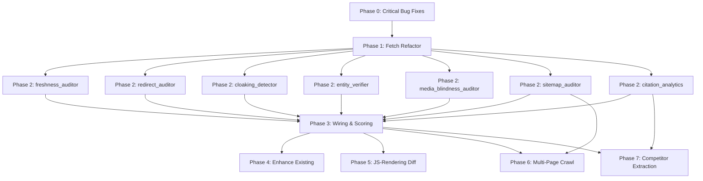

# Master Integration Spec & Master Test Harness

## A. Dependency Graph

The execution of the automation expansion must follow a strict Directed Acyclic Graph (DAG) to prevent broken states, circular dependencies, and unmapped check codes.



### Dependency Details

- **Phase 0 (Bug Fixes)**
  - *Depends on:* Nothing.
  - *Creates/Modifies:* `synthesis_engine.py`, `build_kb.py`, `router.py`, `ingest_claims.py`.
  - *Enables:* Safe execution of synthesis and manual review pipelines without `NameError` crashes; stable RAG lookups.
- **Phase 1 (Fetch Refactor)**
  - *Depends on:* Phase 0.
  - *Creates/Modifies:* `audit_orchestrator.py` (`_fetch_page`, `_validate_schema_from_html`).
  - *Enables:* True HTML evaluation for `content_format_auditor` and provides the raw `page_html` needed by all Phase 2 modules, preventing redundant network requests.
- **Phase 2 (New Modules)**
  - *Depends on:* Phase 1.
  - *Creates/Modifies:* 7 new `*_auditor.py` files in `areos/auditors/`, modifies `citation_sampler.py`.
  - *Enables:* The generation of ~28 new check codes.
- **Phase 3 (Wiring & Scoring)**
  - *Depends on:* Phase 2.
  - *Creates/Modifies:* `scoring.py`, `check_code_to_knowledge_map.json`, `audit_orchestrator.py` (integration).
  - *Enables:* Synthesis engine to map the new check codes from Phase 2 into actual remediation plans.
- **Phase 4 (Enhance Existing)**
  - *Depends on:* Phase 3.
  - *Creates/Modifies:* `content_format_auditor.py`, `robots_checker.py`.
- **Phase 5 (JS-Rendering Optional)**
  - *Depends on:* Phase 3.
  - *Creates/Modifies:* `rendering_auditor.py`, `requirements.txt`, `render.yaml`.
- **Phase 6 (Multi-Page Crawl)**
  - *Depends on:* Phase 2 (sitemap_auditor) & Phase 3.
  - *Creates/Modifies:* `multipage_auditor.py`.
- **Phase 7 (Competitor Extraction)**
  - *Depends on:* Phase 2 (citation_analytics) & Phase 3.
  - *Creates/Modifies:* `competitor_analyzer.py`, `citation_sampler.py`.

---

## B. Phase Gates

Before proceeding to the next phase, the following EXACT test commands must pass.

### Phase 0 Gate
```bash
python -m pytest tests/test_phase0_fixes.py -v
```
**Condition:** `_load_priority_scores` must return the baseline defaults on DB failure, legacy `check_code_mappings` paths must be removed, exception swallowing in `router.py` must log appropriately, `build_kb.py` must not use a hardcoded fallback token, and manual review remediation must not crash.

### Phase 1 Gate
```bash
python -m pytest tests/test_phase1_fetch.py -v
```
**Condition:** Orchestrator must fetch HTML exactly once and pass it to schema and content format auditors.

### Phase 2 Gate
```bash
python -m pytest tests/test_freshness_auditor.py tests/test_redirect_auditor.py tests/test_cloaking_detector.py tests/test_entity_verifier.py tests/test_media_blindness.py tests/test_sitemap_auditor.py tests/test_citation_analytics.py -v
```
**Condition:** Each module must return its respective check codes correctly.

### Phase 3 Gate
```bash
python -m pytest tests/test_kb_parity_extended.py -v
```
**Condition:** Every check code added in Phase 2 must exist in `LAYER_DEDUCTIONS` and `check_code_to_knowledge_map.json`.

---

## C. Master Regression Suite

### `tests/test_phase0_fixes.py`
```python
import pytest
from pathlib import Path
from areos.auditors.synthesis_engine import _load_priority_scores, _build_manual_recommendations
from areos.auditors.manual_findings_template import ManualFinding

def test_priority_score_fallback():
    # Provide a fake path to force a DB error
    scores = _load_priority_scores(Path("/does/not/exist.db"))
    assert scores["CRAWLER_FULLY_BLOCKED"] == 1
    assert scores["CITATION_NOT_OBSERVED"] == 4

def test_manual_remediation_no_crash(tmp_path):
    # Simulates CRITICAL-001 fix
    finding = ManualFinding(
        card_id="C052",
        verdict="fail",
        severity="error",
        notes="JS blocked rendering completely"
    )
    # This should not raise a NameError for MANUAL_REMEDIATION_TEXT
    recs, rejected = _build_manual_recommendations([finding], tmp_path)
    assert len(recs) == 1
    assert recs[0].check_code == "C052"
    assert recs[0].severity == "error"
```

### `tests/test_phase1_fetch.py`
```python
import pytest
from areos.auditors.audit_orchestrator import _fetch_and_validate_schema

def test_fetch_and_validate_schema_refactor(monkeypatch):
    # Mock safe_get
    class MockResponse:
        status_code = 200
        text = '<html><body><script type="application/ld+json">{"@type": "Organization", "name": "Test"}</script></body></html>'
    monkeypatch.setattr("areos.auditors.audit_orchestrator.safe_get", lambda *args, **kwargs: MockResponse())
    
    findings = _fetch_and_validate_schema("example.com", "https://example.com")
    assert any(f["code"] == "ANSWER_FORMAT_GOOD" for f in findings)
```

### `tests/test_kb_parity_extended.py`
```python
import pytest
import json
from pathlib import Path

def test_all_deductions_mapped():
    from areos.auditors.scoring import LAYER_DEDUCTIONS
    map_path = Path("areos/kb/check_code_to_knowledge_map.json")
    
    with open(map_path, "r") as f:
        kb_map = json.load(f)
        
    for code in LAYER_DEDUCTIONS.keys():
        assert code in kb_map, f"Code {code} is scored but missing from KB mapping!"
```

### `tests/test_manual_review_api.py`
```python
import pytest
from fastapi.testclient import TestClient
from areos.main import app

client = TestClient(app)

def test_post_observation():
    # Assuming NEW-4 implementation
    payload = {
        "question_id": "B1_SCHEMA_HONESTY",
        "maps_to_claims": ["C054", "C053"],
        "structured_data": {"claims_verified": []},
        "severity": "error",
        "diagnosis_text": "Schema completely detached from reality."
    }
    response = client.post("/api/v1/audit/runs/test-run/observations", json=payload)
    # The exact response code depends on implementation, but should not be 404
    assert response.status_code in (200, 201)
```

---

## D. Rollback Plan

- **Phase 0 Failure:** Revert modifications in `synthesis_engine.py` and `router.py`. No DB schema changes are introduced here.
- **Phase 1 Failure:** Revert `audit_orchestrator.py` to its state before the `_fetch_page` refactor. Restore `_fetch_and_validate_schema`.
- **Phase 2 Failure:** Delete the newly created `*_auditor.py` modules. Remove their imports from `audit_orchestrator.py`.
- **Phase 3 Failure:** Remove added keys from `LAYER_DEDUCTIONS` in `scoring.py` and revert `check_code_to_knowledge_map.json`.
- **Phase 6/7 Failure:** These are entirely additive. Remove `multipage_auditor.py` / `competitor_analyzer.py` and strip the caller blocks at the end of `audit_orchestrator.py`.

---

## E. Integration Gaps & Risk Mitigation

1. **Ordering Dependency in Phases 2 and 3:**
   *Gap:* If Phase 2 modules are integrated into `audit_orchestrator.py` *before* Phase 3 wires them to the KB, the orchestrator will emit check codes (e.g., `CONTENT_STALE`) that are absent from `kb_check_code_map`. Synthesis will mark these as `UNMAPPED` and reject them.
   *Mitigation:* DO NOT add the caller logic in `audit_orchestrator.py` until the Phase 3 wiring changes are merged.

2. **Timeout & Execution Duration:**
   *Gap:* The orchestrator (`run_orchestrated_audit`) runs synchronously. The base audit takes ~3.5s. Adding multi-page crawling (10 pages × 4s) + cloaking fetches (2 UAs) + competitor fetches (3 pages) can push execution past 30–60 seconds, triggering HTTP gateway timeouts (e.g., 504 Gateway Timeout).
   *Mitigation:* For Phase 6 and 7, use very strict internal timeouts (e.g. `timeout=2` for multi-page). Ultimately, the orchestrator needs to be moved to async or a background task queue (utilizing the `jobs` table in `schema.sql`). 

3. **Database Connection Pool (Concurrent Access):**
   *Gap:* The SQLite WAL mode supports concurrent reads, but writes (e.g., `audit_runs` INSERT, `changelog` triggers) will lock. Long-running orchestrator functions that hold write transactions can cause `database is locked` errors under load.
   *Mitigation:* Write transactions (`write_as(conn, ...)` blocks) are already small and isolated at the end of the orchestrator. Do not expand the transaction scope to cover network calls. 

4. **API Response Size:**
   *Gap:* Pushing full AI responses (Data Contract 4), competitor data, and schema claims into `automated_findings` JSON will dramatically bloat the `audit_runs.automated_findings` TEXT column and the API response size, causing sluggish UI load times and large memory footprint.
   *Mitigation:* Consider truncating `raw_output` strictly in the `findings` table. `full_answer_text` should be selectively exposed.

5. **Schema Backward Compatibility:**
   *Gap:* Existing JSON in `audit_runs.automated_findings` does not contain the new keys (like `extracted_lead_text`). The frontend UI for Manual Review must use `.get("key", "default")` to avoid crashing when rehydrating legacy audit runs.

6. **Circular Imports:**
   *Gap:* Ensure `audit_orchestrator.py` imports from auditors, but auditor modules do not import from `audit_orchestrator.py`. Shared helper functions (like `_extract_json_ld_blocks`) must reside in a shared utility or remain in the orchestrator without being imported backward.
